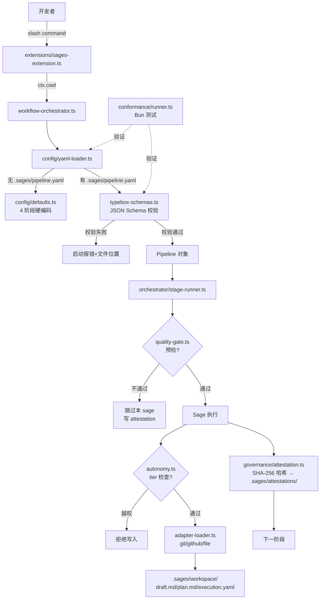

# Sages 演进路线：迈向 `mini-ai-sdlc`

**日期**: 2026-06-28
**作者**: pi-coding-agent 协作产出
**状态**: Approved (脑暴完成,待实施)
**目标品牌名**: `mini-ai-sdlc`(详见 §2.4)
**关联项目**: `~/Project/sages/pi` (Four Sages 当前实现)、`~/Project/ai-sdlc` (参照目标)

---

## 1. 概述

本文档定义 `sages` 项目从当前"四贤仪式化工作流"演进为 **`mini-ai-sdlc`** 的演进路线。`mini-ai-sdlc` 是本次演进的目标品牌名(详见 §2.4),代表"以 pi-coding-agent 规模重新表达的轻量级 AI SDLC 治理框架"。目标是让 sages 在保留 pi-coding-agent 简洁性的同时,获得 ai-sdlc 的核心治理能力:**声明式 pipeline、可插拔代理、可验证质量门、可审计产物**。

**核心判断**: sages 不需要变成 ai-sdlc(那是 ~3,904 文件、11 包 monorepo、9 个专用子代理的庞然大物),也不需要兼容 ai-sdlc 的所有 YAML 资源。**正确目标是捕获 ai-sdlc 的"治理精华"——声明式 + 可审计 + 可组合——并以 pi-coding-agent 的规模重新表达**。

---

## 2. 背景与动机

### 2.1 sages 当前形态

```
sages/pi/  (121 文件,单 npm 包 @sages/pi-four-sages)
├── extensions/sages-extension.ts    # pi ExtensionAPI 入口
├── prompts/four-sages-workflow.md   # slash 命令帮助
├── skills/{fuxi,qiaochui,luban,gaoyao,brainstorming}/SKILL.md
├── src/tools/                      # 4 贤者 + brainstorming 共 ~20 TS 文件
└── src/orchestrator/workflow-orchestrator.ts
```

**特点**:
- 工作流**硬编码**为 4 阶段(Fuxi → QiaoChui → LuBan → GaoYao)
- 配置**全在代码里**——无 YAML、无声明式资源、无 schema
- 子代理**只有 4 个**——不可扩展、不可替换
- 状态在 `.sages/workspace/` ——纯文本,无签名、无审计链
- 测试**仅 30 个 Bun 单测**——无端到端、无 schema 合规性测试

### 2.2 ai-sdlc 的"治理精华"

ai-sdlc 有 **3,904 文件**、**11 个 package.json**(pnpm monorepo)、**60 个 YAML 一致性 fixture** 跨 6 类(`pipeline/quality-gate/agent-role/autonomy-policy/adapter/behavioral`)、DSSE v6 Merkle 签名、**11+ 个 contrib adapter + github(3 个 SDK 实现)**、**9 个 .md 形式的专用子代理**(`ai-sdlc-plugin/agents/*.md`)。但**真正有杠杆的部分**集中在 5 类声明式资源 + 治理原语:

| ai-sdlc 精华 | 在 sages 的对应物 | 演进目标 |
|---|---|---|
| `kind: Pipeline` 声明式工作流 | 硬编码 `workflow-orchestrator.ts` | 替换 |
| `kind: AgentRole` 角色定义 | 硬编码 `src/tools/fuxi-tools.ts` 等 | 抽象化 |
| `kind: QualityGate` 规则门 | 仅 GaoYao 事后审计 | 前置门 |
| `kind: AdapterBinding` 外部集成 | 完全无 | 新增 |
| `kind: AutonomyPolicy` 权限分层 | 完全无 | 新增 |
| 60 YAML 一致性 fixture(pipeline+adapter+agent-role+quality-gate+autonomy-policy,**不含 behavioral 23 个**——见 §2.3 "不做") | 仅 30 Bun 单测 | 配套 |

### 2.3 为什么不做"完整 ai-sdlc 兼容"

| 不做的部分 | 理由 |
|---|---|
| DSSE v6 Merkle 签名 | pi-coding-agent 单用户本地运行,无多签需求。简单 HMAC + 哈希链足够 |
| `AutonomyPolicy.levels[]` 完整 tier ladder | 4 层级(Observer/Assistant/Engineer/Autonomous)已够 |
| 12 个 adapter | 只需 git + github + filesystem |
| 完整 RFC 流程 | sages 是单人/小团队,不需要 RFC-0011 那种 DoR gate |
| 14 步 Step 0-13 流水线 | 当前 4 阶段够,可在 YAML 里组合 |
| Conformance 60 全部 fixture | 20-30 个核心 fixture 已能验证 80% 路径;**特别拒绝 `behavioral/` 23 个**(依赖 multi-agent orchestration,违背 §2.4 简化原则) |

### 2.4 目标品牌定义:`mini-ai-sdlc`

为避免后续文档混用"轻量 ai-sdlc" / "迷你版" 等口语化表述,本文档正式以 **`mini-ai-sdlc`** 作为演进目标的品牌名。定义如下:

| 项 | 内容 |
|---|---|
| **品牌名** | `mini-ai-sdlc` |
| **正式定位** | "Sages mini-ai-sdlc" —— 以 pi-coding-agent 规模重新表达的轻量级 AI SDLC 治理框架 |
| **一句话** | sages 是 `mini-ai-sdlc` —— 一个声明式 AI SDLC 治理框架 |
| **是** | ai-sdlc 治理哲学(声明式 + 可审计 + 可组合)在 pi 规模上的重新表达 |
| **不是** | ai-sdlc 的子集、超集,或兼容实现 |
| **目标规模** | ~150-180 文件 / 单 npm 包(对比 ai-sdlc 现状 3,904 文件 / 11 包 pnpm monorepo) |
| **核心交付物** | 声明式 Pipeline、4 类治理资源(Pipeline/QualityGate/AutonomyPolicy/AdapterBinding)、conformance 测试 |

后续章节凡提及"演进目标" / "阶段 2 完成" 等里程碑,均指达成上述 `mini-ai-sdlc` 标签的全部验收。

---

## 3. 演进策略决策

### 3.1 三大候选路径(已评估)

| 路径 | 描述 | 工作量 | 杠杆 | 决策 |
|---|---|---|---|---|
| **A. 声明式 Pipeline** | 加 `.sages/pipeline.yaml` 替换硬编码工作流 | 1-2 周 | **最高** | ✅ 采用 |
| **B. ai-sdlc 完全兼容** | 能解析运行 ai-sdlc 的 `.ai-sdlc/pipeline.yaml` | 1-3 月 | 中等 | ❌ 拒绝 |
| **C. 治理覆盖层** | 在 A 之上加 QualityGate/Attestation/Autonomy/Adapter | 2-4 周 | **高** | ✅ 采用(第二阶段) |

**路径 B 被拒绝的具体原因**:
1. ai-sdlc 有 `AutonomyPolicy.levels[]` / `AdapterBinding` 9 接口 / DSSE 签名 / backlog 工作流等 pi 没有等价物的概念,要做就是造半个 ai-sdlc
2. 收益边际递减——会得到"两个系统的合并",而非"一个更完整的系统"
3. 锁定在 ai-sdlc 的 RFC 流程债务中,违背 pi 的简洁哲学

### 3.2 关键决策记录

| 决策 | 选择 | 理由 |
|---|---|---|
| 配置格式 | YAML + JSON Schema 校验 | 与 ai-sdlc 对齐,生态可读 |
| Schema 库 | `typebox`(已有依赖)+ `typebox/value` 子路径 | 已在 deps,无需新增(`Value` 必须从 `/value` 子路径导入,主入口无导出) |
| Schema 版本 | `sages.io/v1alpha1` | 与 ai-sdlc 风格对齐但独立 |
| 默认回退 | 无 `.sages/pipeline.yaml` → 当前 4 阶段硬编码 | 向后兼容 |
| Attestation | v1: 简单 SHA-256 + 元数据 JSONL;v2: HMAC 签名 | 单用户本地不需要 v1 即用公钥 |
| Autonomy tier | 0/1/2/3 四级 | 与 pi 的 read/write 工具模型对齐 |
| Adapter 接口 | `read/write/list/exists` 4 方法 | 最小可用,易于扩展 |
| 一致性测试 | 复用 ai-sdlc fixture 风格,新建 `conformance/tests/sages-v1alpha1/` | 标准化测试入口 |
| 多 sage 并行 | 仅 LuBan 阶段支持(对齐现状) | 不扩大破坏面 |

---

## 4. 目标与非目标

### 4.1 目标

**核心目标**: sages 在 1-2 月内具备 **`mini-ai-sdlc` 治理能力**(详见 §2.4),具体为:

1. **声明式 pipeline**: 用户可通过 `.sages/pipeline.yaml` 自由组合阶段、定义质量门、配置重试
2. **可扩展代理**: 用户可在 YAML 中新增自定义 sage(走 pi 的 tool 协议),无需修改 sages 源码
3. **预检质量门**: 阶段运行**前**自动评估规则,不通过则跳过该 sage(替代目前 GaoYao 事后审计)
4. **可审计产物**: 每个 sage 产出经哈希后落入 `.sages/attestations/`,跨阶段可追溯
5. **自治层级**: 通过 `.sages/autonomy.yaml` 控制每个 sage 能写哪些路径,默认采用保守策略
6. **外部适配器**: 通过 `.sages/adapters/*.yaml` 让 sage 读取 GitHub issue、读写 git 仓库等
7. **合规性测试**: 用户写错 YAML 时,启动时报错并指出错误位置(schema 合规性)

### 4.2 非目标(本次演进**不做**)

- ❌ 完整 ai-sdlc v1alpha1 兼容(原因见 §3.1)
- ❌ DSSE v6 Merkle 签名(单用户本地不需要)
- ❌ 跨主机 multi-agent 编排(用 Pattern X/Z/Y 太重)
- ❌ RFC-0011 DoR gate、RFC-0035 Decision Catalog(pi 不需要这种治理形式)
- ❌ Enterprise 插件、SIEM 导出、License 校验
- ❌ 沙箱隔离(Landlock/seccomp/OpenShell)——pi 在用户机器上跑,信任边界不同
- ❌ Conformance 测试与 ai-sdlc 互操作(各自独立维护)
- ❌ 实时 TUI 状态显示(RFC-0023)——pi 的 status bar 已够

---

## 5. 整体架构

### 5.1 演进后的 sages 结构

```
sages/pi/
├── extensions/sages-extension.ts          # [改] 加载 .sages/pipeline.yaml
├── prompts/                               # [不改]
├── skills/                                # [不改] (用户仍可在 YAML 里引用)
├── src/
│   ├── config/
│   │   ├── yaml-loader.ts                 # [新] YAML 加载 + schema 校验
│   │   ├── defaults.ts                    # [新] 当前 4 阶段作为默认 pipeline
│   │   └── typebox-schemas.ts             # [新] typebox schema 定义
│   ├── orchestrator/
│   │   ├── workflow-orchestrator.ts       # [改] 读 YAML,转为阶段序列
│   │   └── stage-runner.ts                # [新] 通用阶段执行器
│   ├── governance/                        # [新目录] 阶段二
│   │   ├── quality-gate.ts                # [新] 预检规则
│   │   ├── attestation.ts                 # [新] 哈希 + 元数据
│   │   ├── autonomy.ts                    # [新] tier 检查
│   │   └── adapter-loader.ts              # [新] 加载 .sages/adapters/*.yaml
│   └── tools/                             # [不改] (sage 实现)
├── schemas/
│   ├── pipeline.v1.schema.json            # [新]
│   ├── agent-role.v1.schema.json          # [新]
│   ├── quality-gate.v1.schema.json        # [新]
│   ├── autonomy.v1.schema.json            # [新]
│   └── adapter-binding.v1.schema.json     # [新]
├── conformance/                            # [新目录]
│   ├── runner.ts                          # [新] Bun 测试驱动
│   └── tests/
│       └── sages-v1alpha1/
│           ├── pipeline/
│           │   ├── valid-minimal.yaml
│           │   ├── valid-full.yaml
│           │   └── invalid-empty-stages.yaml
│           ├── agent-role/
│           ├── quality-gate/
│           └── autonomy/
├── test/                                  # [扩] 增加 schema/governance 测试
├── .sages/
│   ├── pipeline.yaml.example              # [新] 可复制 starter
│   ├── quality-gate.yaml.example          # [新]
│   ├── autonomy.yaml.example              # [新]
│   └── adapters/                          # [新] git.yaml, github.yaml 等
└── package.json                           # [改] 加 schemas, conformance scripts
```

### 5.2 数据流(阶段二完成后)



### 5.3 关键设计原则

| 原则 | 体现 |
|---|---|
| **向后兼容** | 无 `.sages/pipeline.yaml` 时,行为完全等同于当前 4 阶段 |
| **声明优先** | 配置错配时**立即报错**且附文件:行号,不静默回退 |
| **类型共享** | typebox schema 是唯一真相,TypeScript 类型从 schema 派生 |
| **最小特权** | autonomy tier 默认严格,需用户显式放宽 |
| **审计可追溯** | 每个 sage 产出都哈希落盘,跨阶段可对照 |
| **零改动迁移** | 用户已有 `.sages/workspace/` 状态自动兼容,不破坏工作流 |

---

## 6. 阶段路线图

### 6.1 总览

| 阶段 | 名称 | 工作量 | 累计 | 关键交付物 |
|---|---|---|---|---|
| **阶段 1** | 声明式 Pipeline | **3-5 周** | 3-5 周 | YAML 工作流 + schema + 一致性测试(修正自 §16.3) |
| **阶段 2** | 治理覆盖层 | **3-5 周** | **6-10 周** | QualityGate + Attestation + Autonomy + Adapter(修正自 §16.3) |
| **(可选 3)** | 生态扩展 | 2-4 周 | 8-14 周 | 高级 adapter、多机编排 |

**停靠点**: 阶段 2 完成后 sages 即可贴上 `mini-ai-sdlc` 标签(详见 §2.4)。阶段 3 视需求决定。

### 6.2 阶段 1 详细分解

| 子任务 | 文件 | 工作量 |
|---|---|---|
| 1.1 Schema 定义 | `schemas/pipeline.v1.schema.json` + `src/config/typebox-schemas.ts` | 2-3 天 |
| 1.2 YAML 加载器 | `src/config/yaml-loader.ts` | 2 天 |
| 1.3 默认回退 | `src/config/defaults.ts` | 1 天 |
| 1.4 通用 stage-runner | `src/orchestrator/stage-runner.ts` | 2-3 天 |
| 1.5 orchestrator 改造 | `src/orchestrator/workflow-orchestrator.ts`(改) | 1-2 天 |
| 1.6 extension 钩子 | `extensions/sages-extension.ts`(改, **534 行 slash command 路由**——工作量重估 3-5 天,见 §16.2 row 2) | 3-5 天 |
| 1.7 一致性测试 | `conformance/` 全套 + **15-25 fixture**(pipeline 8 + agent-role/quality-gate/autonomy 留阶段 2) | 2-3 天 |
| 1.8 文档与示例 | `.sages/pipeline.yaml.example` + README 更新 | 1 天 |

### 6.3 阶段 2 详细分解

| 子任务 | 文件 | 工作量 |
|---|---|---|
| 2.1 QualityGate 预检 | `src/governance/quality-gate.ts` + `schemas/quality-gate.v1.schema.json` | 2-3 天 |
| 2.2 Attestation 哈希链 | `src/governance/attestation.ts` + `.sages/attestations/` | 2 天 |
| 2.3 Autonomy tier | `src/governance/autonomy.ts` + `schemas/autonomy.v1.schema.json` | 2-3 天 |
| 2.4 Adapter 加载器 | `src/governance/adapter-loader.ts` + `schemas/adapter-binding.v1.schema.json` | 3-4 天 |
| 2.5 git/github adapter | `.sages/adapters/git.yaml` + `src/adapters/git.ts` | 2-3 天 |
| 2.6 README 与示例 | 全套示例 + 教程 | 1-2 天 |
| 2.7 一致性测试 | governance + adapter 各自 5-10 fixture | 2 天 |

---

## 7. 阶段 1 详细设计:声明式 Pipeline

### 7.1 设计目标

1. 用户可在 `.sages/pipeline.yaml` 自由组合阶段
2. YAML 错配立即报错(启动时校验,不延迟到运行时)
3. 无 YAML 时回退到当前 4 阶段行为
4. 支持 YAML 引用 sage 名(`fuxi/qiaochui/luban/gaoyao`)和自定义名(用户提供的工具名)
5. 每阶段可声明 qualityGates、retry、approval、并行度

### 7.2 YAML Schema 设计

#### 7.2.1 顶层 envelope

```yaml
apiVersion: sages.io/v1alpha1    # 固定
kind: Pipeline                    # 固定
metadata:
  name: <string,required>         # kebab-case
  labels: { ... }                 # optional
spec:
  triggers: [ ... ]               # optional,见 §7.2.2
  stages: [ ... ]                 # required,至少 1 个
  defaults: { ... }               # optional,见 §7.2.5
```

#### 7.2.2 触发器

```yaml
spec:
  triggers:
    - event: slash.command        # slash 命令触发
      filter:
        commands: [fuxi-start, fuxi-request]
    - event: file.changed         # 文件变化触发(可选,阶段 1 不实现)
```

**阶段 1 简化**: 只支持 `slash.command`,其他 event 报错提示"未实现"。

#### 7.2.3 阶段定义(stages[])

```yaml
spec:
  stages:
    - name: design                # required, kebab-case
      sage: fuxi                  # required, fuxi|qiaochui|luban|gaoyao|自定义
      input:                      # optional, 传给 sage 的参数
        request: "${userRequest}" # 支持变量插值
      output:                     # optional, sage 产出落点
        file: draft.md
      parallel: 1                 # optional, default 1; LuBan 阶段可设 3
      qualityGates:               # optional, 见 §阶段 2 详述
        - name: design-not-empty
          rule: { metric: file-size, path: draft.md, operator: '>=', threshold: 100 }
      onFailure:                  # optional
        strategy: abort           # abort|retry|continue|skip
        maxRetries: 2             # 仅 retry 时有效
        retryDelay: PT1M          # ISO 8601 duration
      approval:                   # optional, 阶段 2 实现
        required: true
        blocking: true
        timeout: PT24H
```

#### 7.2.4 内置 sage 列表

| name | 类型 | 默认输入 | 默认产出 |
|---|---|---|---|
| `fuxi` | design | `{ request }` | `draft.md` |
| `qiaochui` | review | `{ draftPath }` | `plan.md`, `execution.yaml`, 更新 `state.json.score` |
| `luban` | execute | `{ executionYamlPath, parallel }` | 源代码 + 测试 |
| `gaoyao` | audit | `{ scope }` | `audit.md` |

#### 7.2.5 全局默认值

```yaml
spec:
  defaults:
    onFailure: { strategy: abort }
    retryDelay: PT1M
    timeout: PT24H
    qualityGates: []             # 默认无门
```

每个 stage 可单独覆盖。

### 7.3 加载器实现要点

```typescript
// src/config/yaml-loader.ts (示意)
import { Type, type Static } from "typebox";
import { Value } from "typebox/value";   // 注意:主入口不导出 Value,必须用 /value 子路径

export const PipelineSchema = Type.Object({
  apiVersion: Type.Literal("sages.io/v1alpha1"),
  kind: Type.Literal("Pipeline"),
  metadata: Type.Object({
    name: Type.String({ pattern: "^[a-z][a-z0-9-]*$" }),
    labels: Type.Optional(Type.Record(Type.String(), Type.String())),
  }),
  spec: Type.Object({
    triggers: Type.Optional(Type.Array(TriggerSchema)),
    stages: Type.Array(StageSchema, { minItems: 1 }),
    defaults: Type.Optional(DefaultsSchema),
  }),
});

export type Pipeline = Static<typeof PipelineSchema>;

export async function loadPipeline(cwd: string): Promise<Pipeline> {
  const path = path.join(cwd, ".sages/pipeline.yaml");
  if (!await fs.pathExists(path)) {
    return getDefaultPipeline();  // 当前 4 阶段硬编码
  }
  const raw = await fs.readFile(path, "utf-8");
  const parsed = YAML.parse(raw);
  const errors = [...Value.Errors(PipelineSchema, parsed)];
  if (errors.length > 0) {
    throw new PipelineSchemaError(path, errors);
  }
  return parsed as Pipeline;
}
```

### 7.4 Stage Runner 设计

```typescript
// src/orchestrator/stage-runner.ts (示意)
export async function runStage(
  stage: Stage,
  ctx: PipelineContext,
): Promise<StageResult> {
  // 1. 解析输入(支持 ${var} 插值)
  const input = interpolate(stage.input, ctx);

  // 2. 调用 sage
  const sage = ctx.sages.get(stage.sage);
  if (!sage) throw new UnknownSageError(stage.sage);

  // 3. 失败重试
  let lastError: Error | undefined;
  for (let attempt = 0; attempt <= (stage.onFailure?.maxRetries ?? 0); attempt++) {
    try {
      const result = await sage.run(input, ctx);
      return { stage: stage.name, status: "ok", result };
    } catch (err) {
      lastError = err as Error;
      const strategy = stage.onFailure?.strategy ?? ctx.pipeline.defaults?.onFailure?.strategy ?? "abort";
      if (strategy === "abort") throw err;
      if (strategy === "continue") return { stage: stage.name, status: "failed", error: err };
      if (strategy === "skip") return { stage: stage.name, status: "skipped", error: err };
      // strategy === "retry": wait then continue
      await sleep(parseDuration(stage.onFailure?.retryDelay ?? "PT1M"));
    }
  }
  throw lastError;
}
```

### 7.5 Orchestrator 改造

```typescript
// src/orchestrator/workflow-orchestrator.ts (改)
export async function runWorkflow(cwd: string, userRequest: string) {
  const pipeline = await loadPipeline(cwd);  // [新] 取代硬编码 4 阶段
  const ctx = createContext(pipeline, { userRequest });

  // 加载每个 sage
  for (const stage of pipeline.spec.stages) {
    ctx.sages.set(stage.sage, resolveSage(stage.sage));
  }

  // 顺序执行(parallel > 1 在 stage-runner 内部分发)
  for (const stage of pipeline.spec.stages) {
    ctx.state = await transitionPhase(ctx.state, stage.name);
    await runStage(stage, ctx);
  }

  await archiveWorkflow(ctx);
}
```

### 7.6 迁移计划

**完全向后兼容**——本次改动对现有用户零影响:

| 用户类型 | 行为 |
|---|---|
| 无 `.sages/pipeline.yaml` | 完全等同于当前 4 阶段(代码路径:`defaults.ts` 返回硬编码 pipeline) |
| 有 YAML 但 schema 错 | 启动时报错,指明文件:行号,不进入 workflow |
| 有 YAML 且合法 | 走新代码路径 |

**迁移步骤**(开发者侧,无需用户操作):
1. 在 `defaults.ts` 提取当前 4 阶段为 `getDefaultPipeline()` 函数
2. `workflow-orchestrator.ts` 把直接调用 sage 改为 `runStage(stage, ctx)` 循环
3. 加 `yaml-loader.ts` + schema
4. 加 conformance 测试
5. 跑现有 30 个 Bun 单测,确认全绿(零行为变更)

### 7.7 一致性测试设计

`conformance/tests/sages-v1alpha1/` 目录结构:

```
sages-v1alpha1/
├── pipeline/
│   ├── valid-minimal.yaml          # 仅 1 阶段,无 gates
│   ├── valid-full.yaml             # 4 阶段 + gates + retry + approval
│   ├── valid-custom-sage.yaml      # 引用未内置的 sage 名(用户自定义)
│   ├── invalid-empty-stages.yaml   # stages: []
│   ├── invalid-bad-sage-name.yaml  # sage: "" 或带特殊字符
│   ├── invalid-bad-api-version.yaml
│   ├── invalid-bad-duration.yaml   # retryDelay: "1m"(应为 PT1M)
│   └── invalid-missing-metadata.yaml
├── agent-role/                     # 阶段 2 详述
├── quality-gate/                   # 阶段 2 详述
├── autonomy/                       # 阶段 2 详述
└── (拒绝) behavioral/             # ai-sdlc 有 23 个 fixture,依赖 multi-agent orchestration, mini-ai-sdlc 不实现(详见 §2.3)
```

**Runner 设计**(Bun 跑):

```typescript
// conformance/runner.ts (示意)
import { test, expect } from "bun:test";
import { loadPipeline } from "../src/config/yaml-loader";

const FIXTURES = "conformance/tests/sages-v1alpha1";

test("pipeline-valid-minimal", async () => {
  const p = await loadPipeline(`${FIXTURES}/pipeline/valid-minimal.yaml`);
  expect(p.kind).toBe("Pipeline");
  expect(p.spec.stages.length).toBeGreaterThanOrEqual(1);
});

test("pipeline-invalid-empty-stages", async () => {
  await expect(
    loadPipeline(`${FIXTURES}/pipeline/invalid-empty-stages.yaml`)
  ).rejects.toThrow(/stages.*at least 1/i);
});
```

---

## 8. 阶段 2 详细设计:治理覆盖层

### 8.1 QualityGate 预检

**目标**: 在 sage 运行**前**自动评估规则,不通过则跳过该 sage。

#### 8.1.1 YAML schema

```yaml
apiVersion: sages.io/v1alpha1
kind: QualityGate
metadata:
  name: design-not-empty
spec:
  scope:                           # optional,限定 gate 适用范围
    stages: [design]
    sageAuthors: [ai-agent]        # ai-agent | human | external
  gates:
    - name: design-not-empty
      enforcement: hard-mandatory   # advisory | soft-mandatory | hard-mandatory
      rule:
        metric: file-size          # file-size | file-exists | test-result | git-status | shell
        path: draft.md
        operator: '>='
        threshold: 100
      override:                    # optional
        requiredRole: maintainer
```

#### 8.1.2 内置 metric

| metric | 含义 | 适用 |
|---|---|---|
| `file-exists` | 路径是否存在 | draft.md, plan.md |
| `file-size` | 文件字节数 | draft.md |
| `test-result` | `bun test` 通过/失败 | LuBan 后置 |
| `git-status` | `git status --porcelain` 为空 | 所有阶段 |
| `shell` | 任意 shell 命令 exit code | 通用 |

#### 8.1.3 强制级别语义

| enforcement | 失败时行为 |
|---|---|
| `advisory` | 记录警告,sage 继续跑 |
| `soft-mandatory` | sage 跳过,但记录 attempt;override 角色可手动继续 |
| `hard-mandatory` | sage 跳过,**不可 override**,workflow abort |

### 8.2 Attestation 审计哈希链

**目标**: 每个 sage 产出经哈希后落入 `.sages/attestations/`,跨阶段可追溯。

#### 8.2.1 v1 设计(单用户本地,无签名)

```typescript
// src/governance/attestation.ts (示意)
interface Attestation {
  version: "v1";
  planName: string;
  stageName: string;
  sageName: string;
  inputs: Record<string, string>;        // 各输入的 SHA-256
  outputs: Record<string, string>;       // 各输出的 SHA-256
  startedAt: string;                     // ISO 8601
  finishedAt: string;
  status: "ok" | "failed" | "skipped";
  previousAttestation: string | null;    // 上一条 attestation hash(链式)
  hash: string;                          // 本条 attestation 自身的 SHA-256
}
```

**存储**: `.sages/attestations/<planName>-<timestamp>.jsonl`(每行一条 JSON)

**链式**: `previousAttestation` 引用上一条 hash,形成类 git commit 的链。可在 saga 跨阶段失败时定位"哪一步出的问题"。

#### 8.2.2 v2 路线(可选,阶段 3+)

- HMAC 签名(用户的 pi host secret)
- 不上 DSSE(单用户不需要多签)

### 8.3 Autonomy 自治层级

**目标**: 控制每个 sage 能读/写哪些路径,默认保守。

#### 8.3.1 YAML schema

```yaml
apiVersion: sages.io/v1alpha1
kind: AutonomyPolicy
metadata:
  name: default-conservative
spec:
  sages:
    fuxi:
      tier: 0                       # 0=Observer, 1=Assistant, 2=Engineer, 3=Autonomous
      read: ['**/*']                # glob
      write: []                     # 默认不写
      execute: ['analyze']          # 允许的 shell 类别
      blockedPaths: ['.sages/pipeline.yaml']  # 即使 tier 允许也不准
    qiaochui:
      tier: 1
      read: ['**/*']
      write: ['.sages/workspace/draft.md', '.sages/workspace/plan.md']
      execute: ['analyze']
    luban:
      tier: 2
      read: ['**/*']
      write: ['src/**', 'test/**', 'package.json']
      execute: ['code-edit', 'test-run']
      blockedPaths: ['.github/**', '.sages/**', 'package-lock.json']
    gaoyao:
      tier: 0                       # GaoYao 只读,不写
      read: ['**/*']
      write: []
      execute: ['analyze']
```

#### 8.3.2 Tier 语义

| tier | 别名 | 允许 |
|---|---|---|
| 0 | Observer | 只读,可执行 analyze |
| 1 | Assistant | 可写 `.sages/workspace/`,可执行 lint |
| 2 | Engineer | 可写 `src/`/`test/`,可执行 test-run |
| 3 | Autonomous | 全权(需用户显式开启) |

**默认策略**: 已写在 `.sages/autonomy.yaml.example`,所有 sage 默认 tier ≤ 2,且 Luban 强制 blockedPaths 包含 `.github/**` 和 `.sages/**`。

#### 8.3.3 Tier 检查实现

```typescript
// src/governance/autonomy.ts (示意)
export function checkAutonomy(sage: string, action: "read"|"write"|"execute", target: string, policy: AutonomyPolicy): void {
  const sagePolicy = policy.spec.sages[sage];
  if (!sagePolicy) throw new NoPolicyError(sage);
  const allowed = sagePolicy[action] ?? [];
  const blocked = sagePolicy.blockedPaths ?? [];
  if (blocked.some(p => minimatch(target, p))) {
    throw new BlockedPathError(sage, target);
  }
  if (!allowed.some(p => minimatch(target, p))) {
    throw new AutonomyViolationError(sage, action, target);
  }
}
```

**钩入点**: 在 sage 工具的 PreToolUse hook(pi 提供)中拦截。

### 8.4 Adapter 适配器加载

**目标**: sage 能读 GitHub issue、读写 git 仓库、读文件——通过 `.sages/adapters/*.yaml` 声明。

#### 8.4.1 Adapter 声明格式

```yaml
# .sages/adapters/git.yaml
apiVersion: sages.io/v1alpha1
kind: AdapterBinding
metadata:
  name: git
spec:
  interface: SourceControl       # SourceControl | IssueTracker | Messenger | FileStore
  type: git
  version: 0.1.0
  config:
    repoPath: .
```

```yaml
# .sages/adapters/github.yaml
apiVersion: sages.io/v1alpha1
kind: AdapterBinding
metadata:
  name: github
spec:
  interface: IssueTracker
  type: github
  version: 0.1.0
  config:
    token: ${GITHUB_TOKEN}      # 直接 env 变量插值; ai-sdlc 用 secretRef 引用 secret manager,本设计简化(单用户本地无需 secret 抽象)
    org: my-org
    repo: my-repo
```

#### 8.4.2 Adapter 接口(基础 4 方法)

```typescript
// src/adapters/types.ts
export interface Adapter {
  readonly name: string;
  readonly interface: string;
  read(path: string): Promise<string>;
  write(path: string, content: string): Promise<void>;
  list(pattern: string): Promise<string[]>;
  exists(path: string): Promise<boolean>;
}
```

**与 ai-sdlc 的设计偏离**: ai-sdlc 定义 5 类接口(`IssueTracker` / `SourceControl` / `CIPipeline` / `Messenger` / `FileStore`,参见 `sdk-python/src/ai_sdlc/adapters/interfaces.py`),每类含丰富方法(`list_issues`、`create_pr`、`merge`、`commit` 等)。本文档采用 4-方法 **最小子集**,仅对齐 ai-sdlc 的 `FileStore` 接口:

- 阶段 2 交付范围内仅 `filesystem` adapter 需 4-方法全实现
- `git` adapter 在 4-方法框架下仅能提供 `read/write/list/exists`(读 commit、读 diff);`create_branch` / `commit` / `merge` 不在阶段 2 范围
- `github` adapter 同理,阶段 2 仅提供 issue `read`/`list`,无 `create_issue` / `add_comment`
- 阶段 3 评估是否扩展为 `IssueTracker` / `SourceControl` 独立接口

#### 8.4.3 Sage 引用 adapter

sage 通过 pi 工具参数引用 adapter(无需自己加载):

```yaml
spec:
  stages:
    - name: read-issue
      sage: luban
      input:
        task: read GitHub issue #1 and implement"
        adapter: github        # 引用 .sages/adapters/github.yaml
```

sage 代码侧:
```typescript
const adapter = ctx.adapters.get(input.adapter);
const issue = await adapter.read("issues/1");
```

#### 8.4.4 内置 adapter(阶段 2 交付)

| adapter | interface | 阶段 2 范围(基于 4-方法框架) |
|---|---|---|
| `git` | SourceControl | **仅读**(`read` diff / `list` 分支);**不实现** `create_branch` / `commit` / `merge`(阶段 3 扩展) |
| `filesystem` | FileStore | full(`read` / `write` / `list` / `exists`) |
| `github` | IssueTracker | **仅读**(`read` issue / `list` issues);**不实现** `create_issue` / `add_comment` / `create_pr` |
| `slack`(阶段 3) | Messenger | stub |

### 8.5 阶段 2 验收路径

跑通以下场景即视为阶段 2 完成:

1. **场景 A**:`.sages/quality-gate.yaml` 写一个 `design-not-empty` 门,删掉 draft.md 后跑 `fuxi-request`,LuBan 不应启动(GaoYao 之前)
2. **场景 B**:跑完整 4 阶段,`.sages/attestations/` 出现 4 条链式 JSON 记录
3. **场景 C**:`.sages/autonomy.yaml` 把 LuBan tier 设为 0,LuBan 不应能写 `src/`
4. **场景 D**:`.sages/adapters/github.yaml` 配置好 token,LuBan 能读 issue 内容并据此执行

---

## 9. 阶段 3(可选):生态扩展

| 子任务 | 描述 | 工作量 |
|---|---|---|
| 3.1 Slack adapter | 实现 `.sages/adapters/slack.yaml` | 1 周 |
| 3.2 多机编排 | 跨机器分发 sage(用 SSH 或 socket) | 2-3 周 |
| 3.3 v2 Attestation | HMAC 签名 | 0.5 周 |
| 3.4 Conformance 扩展 | 20+ fixture 覆盖边界 | 1 周 |
| 3.5 文档站点 | 把 README + 示例 + 教程搬到独立 docs/ | 1 周 |

**不做除非用户明确需要**。

---

## 10. 风险与缓解

| 风险 | 影响 | 缓解 |
|---|---|---|
| 向后兼容破坏 | 现有用户 workflow 异常 | 默认回退路径完全保留旧行为;新增 50 个单测覆盖旧路径 |
| YAML schema 限制过度 | 用户写不出想要的 workflow | typebox schema 支持 `additionalProperties` 在 metadata.labels;提供"逃生口"`spec.raw` 字段透传原始配置(标注 advanced) |
| Autonomy 检查太严 | sage 无法完成合理操作 | 默认策略只覆盖"明显危险"路径(`/.github/**`, `/.sages/**`);用户改 `.sages/autonomy.yaml` 一行即可放宽 |
| Adapter 加载器性能 | 每次 sage run 都读 YAML | 缓存策略:启动时一次性加载到 `ctx.adapters`,运行期不再读 |
| Conformance fixture 维护成本 | 改 schema 时 fixture 全失效 | 用脚本生成 fixture 而非手写;schema 变更必须同步更新 fixture |

---

## 11. 开放问题

按"何时必须决定"分层组织。**开工前 blocker 见 §16.5(8 题)**;此处集中记录开工后阶段性决策。

### 11.1 开工前 blocker(汇总)

详见 **§16.5 8 题**——本节不重复。

### 11.2 Phase 1 中段决策(schema 验证后)

| # | 问题 | 推荐方案 | 决策时机 |
|---|---|---|---|
| **D9** | state.json 与 `.sages/workspace/` 产物命名归属 | YAML stage 是否应有 `output.files: [name1, name2]` 字段? 或者约定固定命名(来自 `defaults.ts` 默认 pipeline) | 阶段 1.1 schema 定义后 |
| **D10** | Brainstorming 集成开关是否进 YAML (`fuxi_request --no-brainstorm`) | 作为 `stage.input.noBrainstorm: true` 透传即可, 无需 schema 改动 | 阶段 1.2 yaml-loader 时 |
| **D11** | sage 注册机制——保留 `registerTool` monkey-patch vs 动态加载 | 当前 `extensions/sages-extension.ts:66-86` monkey-patch `pi.registerTool` 是 hack; **推荐**: 保留 monkey-patch, 把"sage 注册"逻辑抽到 `src/registry/`, YAML 加载后注入 registry | 阶段 1.6 extension 改造时 |

### 11.3 Phase 2 启动决策(阶段 1 验收后)

| # | 问题 | 推荐方案 | 决策时机 |
|---|---|---|---|
| **D12** | Adapter 4-方法 vs 5 类接口的最终形态 | §8.4.2 已定为 4 方法(对齐 FileStore), `git/github` adapter 仅读; **推荐**: YAML adapter schema 预留 `extendedMethods: [commit, create_issue]` 字段作为 escape hatch, 阶段 2 实现只交付核心 4 方法, 扩展按需追加 | 阶段 2.4 adapter-loader 设计时 |
| **D13** | Attestation 与现有 `audit.md` 的兼容性 | `fuxi-end` 当前用正则 `**Verdict**: PASS` 解析 audit.md; **推荐**: `audit.md` **保留**为人类可读报告, Attestation 是机器可读的并行产物, `fuxi-end` 不变 | 阶段 2.2 attestation.ts 设计时 |
| **D14** | Autonomy 检查钩入点(pi PreToolUse vs sage 内部) | §16.4 验证 B 已确认 `pi.on("tool_call")` 可行; **推荐**: 双层—— pi PreToolUse 拦截**写操作**(write/edit/bash), 硬执行 policy; sage 内部 `checkAutonomy()` 提供更细粒度 file-read gate | 阶段 2.3 autonomy.ts 设计时 |

### 11.4 推迟到阶段 3+ 的决策

| # | 问题 | 待定方案 | 决策时机 |
|---|---|---|---|
| **D15** | 是否支持 YAML 嵌套引用 (`${stages.design.output}`)? | 阶段 1 不支持, 阶段 3 评估 | 阶段 1 完成后 |
| **D16** | 是否支持多 pipeline 文件(profile-based)? | 阶段 1 不支持, 阶段 3 评估 | 阶段 1 完成后 |
| **D17** | Attestation v2 是否上 HMAC? | 用户明确需求时上 | 阶段 3 |
| **D18** | `pi.on("tool_call")` 是否完全替代 `pi.registerCommand` 的最终形态? | 未讨论 | 阶段 2 中段 |

### 11.5 已决策(无需重新评估)

| 问题 | 决策 | 理由 |
|---|---|---|
| 是否做 Sages→ai-sdlc 兼容层(反向)? | ❌ **不做** | §3.1 路径 B 已拒绝; ai-sdlc 是参照目标不是互操作对象 |
| `AutonomyPolicy.levels[]` 是否完整实现? | ❌ 4 tier 已够(Observer/Assistant/Engineer/Autonomous) | §2.3 已说明 |
| DSSE v6 Merkle 签名? | ❌ 不做 | §2.3 单用户本地不需要 |
| Conformance 60 fixture 是否全部移植? | ❌ 仅 15-25 fixture, 拒绝 `behavioral/` 23 个 | §2.3 |
| 是否做完整 ai-sdlc v1alpha1 兼容? | ❌ 不做 | §3.1 路径 B 已拒绝 |
| 沙箱隔离(Landlock/seccomp/OpenShell)? | ❌ 不做 | §2.3 pi 在用户机器上跑, 信任边界不同 |

---

## 12. 验收标准

### 12.1 阶段 1 完成的标志

- [ ] **开工前 blocker 已决**: §16.5 八题 + §17 三题元决策 (M1/M2/M3) 均有明确选择
- [ ] **Phase 1 中段决策已决**: §11.2 D9(state 命名)/ D10(brainstorming flag)/ D11(registerTool) 均有明确选择
- [ ] `schemas/pipeline.v1.schema.json` 存在且 `typebox-schemas.ts` 导出对应 TS 类型
- [ ] `src/config/yaml-loader.ts` 实现 `loadPipeline(cwd)`,失败抛 `PipelineSchemaError` 含文件:行号
- [ ] `src/config/defaults.ts` 提取当前 4 阶段为 `getDefaultPipeline()`
- [ ] `src/orchestrator/stage-runner.ts` 实现 `runStage(stage, ctx)`
- [ ] `src/orchestrator/workflow-orchestrator.ts` 改为读 pipeline 并迭代 `runStage`
- [ ] 现有 **488** 个 Bun 单测全绿(零行为变更证明;§16.1 实测基线)
- [ ] `conformance/` 目录新增 **15+ fixture**(8 valid + 7 invalid, 不含 behavioral)
- [ ] `conformance/runner.ts` 跑通所有 fixture
- [ ] `.sages/pipeline.yaml.example` 写好且被 README 引用
- [ ] README 更新"自定义 pipeline"小节
- [ ] `bun test` 全绿 + conformance test 全绿

### 12.2 阶段 2 完成的标志

- [ ] **Phase 2 启动决策已决**: §11.3 D12(adapter 范围)/ D13(Attestation vs audit.md)/ D14(autonomy hook) 均有明确选择
- [ ] `schemas/quality-gate.v1.schema.json` + `src/governance/quality-gate.ts` 实现(**注意 §16.5 D6: 与 GaoYao 正交, 不替代 INK/NOSE/FOOT/CASTRATION/DEATH**)
- [ ] `src/governance/attestation.ts` 实现链式哈希记录(**注意 §11.3 D13: audit.md 保留为人类可读报告, fuxi-end 不变**)
- [ ] `src/governance/autonomy.ts` 实现 tier 检查(**注意 §11.3 D14: pi PreToolUse 拦截写操作 + sage 内部 read gate 双层**)
- [ ] `src/governance/adapter-loader.ts` 实现 4 方法接口(**注意 §11.3 D12: YAML adapter 预留 extendedMethods escape hatch**)
- [ ] `.sages/adapters/{git,filesystem,github}.yaml` example 写好(仅读, 不实现 commit/create_issue)
- [ ] 跑通 §8.5 四个验收场景
- [ ] conformance 新增 10+ fixture(governance + adapter)
- [ ] README 新增"治理覆盖层"小节
- [ ] 全套单测 + 一致性测试通过

### 12.3 整体完成(到 `mini-ai-sdlc` 标签)的标志

- [ ] 阶段 1 + 阶段 2 全验收
- [ ] README 顶部一句话:"**sages 是 `mini-ai-sdlc` —— 一个声明式 AI SDLC 治理框架**"
- [ ] 用户可仅通过 `.sages/pipeline.yaml` + `.sages/autonomy.yaml` + `.sages/adapters/*.yaml` 三类文件描述完整 workflow,无需修改任何 TS 代码
- [ ] 与 ai-sdlc 的对比表(本文 §2.1)从"硬编码 vs 声明"翻转为"声明 vs 声明"(`mini-ai-sdlc` 与 ai-sdlc 治理核心对齐,但规模、协议、信任边界均独立)
- [ ] **版本策略对齐 §17 M1**: 如选 v2 major, 则 package.json version=2.0.0, CHANGELOG 标明 breaking change
- [ ] **旧 hardcoded 4-stage 路径保留期符合 §17 M2**: 默认行为无 `.sages/pipeline.yaml` 时回退, 至 v3.0 才删除

---

## 13. 附录 A:文件清单(预计新增/修改)

### 13.1 新增文件(总计 ~30)

```
sages/pi/src/config/
├── yaml-loader.ts
├── defaults.ts
└── typebox-schemas.ts

sages/pi/src/orchestrator/
└── stage-runner.ts

sages/pi/src/governance/                [阶段 2]
├── quality-gate.ts
├── attestation.ts
├── autonomy.ts
└── adapter-loader.ts

sages/pi/schemas/
├── pipeline.v1.schema.json
├── agent-role.v1.schema.json          [阶段 2]
├── quality-gate.v1.schema.json        [阶段 2]
├── autonomy.v1.schema.json            [阶段 2]
└── adapter-binding.v1.schema.json     [阶段 2]

sages/pi/conformance/
├── runner.ts
└── tests/sages-v1alpha1/
    ├── pipeline/  (8 files)
    ├── quality-gate/  (5 files, 阶段 2)
    ├── autonomy/  (4 files, 阶段 2)
    └── adapter/  (4 files, 阶段 2)

sages/pi/.sages/
├── pipeline.yaml.example
├── quality-gate.yaml.example          [阶段 2]
├── autonomy.yaml.example              [阶段 2]
└── adapters/                          [阶段 2]
    ├── git.yaml
    ├── filesystem.yaml
    └── github.yaml
```

### 13.2 修改文件(总计 ~5)

```
sages/pi/extensions/sages-extension.ts       # 钩入 yaml-loader
sages/pi/src/orchestrator/workflow-orchestrator.ts  # 改读 pipeline
sages/pi/package.json                        # 加 conformance script
sages/pi/README.md                           # 新增"声明式 pipeline"章节
sages/pi/test/*.test.ts                      # 新增 yaml-loader / stage-runner 单测
```

### 13.3 不动的文件

```
sages/pi/prompts/                  # 完全不动
sages/pi/skills/                   # 完全不动
sages/pi/src/tools/                # 不动(sage 实现)
sages/pi/src/state/                # 不动(state manager)
sages/pi/src/services/             # 不动(file service)
sages/pi/src/utils/                # 不动(analyzer 等)
```

---

## 14. 附录 B:与 ai-sdlc 对比表(演进后)

| 维度 | 当前 sages | `mini-ai-sdlc` sages | ai-sdlc (参照) |
|---|---|---|---|
| 工作流定义 | 硬编码 4 阶段 | **YAML 声明** | YAML 声明 |
| Sage 数 | 4(固定) | **4 + 用户自定义** | 9(.md agent) |
| 配置格式 | 无 | **YAML + JSON Schema** | YAML + JSON Schema |
| QualityGate | 事后(GaoYao) | **预检 + 事后** | 预检 + 多级 enforcement |
| Attestation | 无 | **哈希链(v1)→ HMAC(v2)** | DSSE v6 Merkle |
| Autonomy | 无 | **4 tier** | N tier + RFC-0022 |
| Adapter | 无 | **git + filesystem + github(只读,4-方法框架)** | 11+ contrib + github(3 SDK 实现),5 类接口 |
| 一致性测试 | 488 Bun 单测 | **488 单测 + 15-25 fixture(不含 behavioral)** | 60 fixture + Vitest |
| 沙箱隔离 | 无 | **无(信任边界不同)** | OpenShell + Landlock + seccomp |
| 多用户 | 无 | **无(单 pi session)** | RFC-0043 + lifecycle-approvers |
| RFC 流程 | 无 | **无** | RFC-0011/0035 等 |
| 部署 | npm 包 | **npm 包(不变)** | pnpm monorepo **11 包** |
| 文件数 | 121 | **~150-180** | 3,904 |

**定位总结**: `mini-ai-sdlc` 不是 ai-sdlc 的子集,也不是超集,而是 **ai-sdlc 治理哲学在 pi-coding-agent 规模上的重新表达**——更小、更轻、更符合 pi 的"less is more"哲学。

---

## 15. 附录 C:参考资料

- **ai-sdlc 仓库**: `~/Project/ai-sdlc/` —— 完整治理框架参照
- **ai-sdlc RFC 索引**: `~/Project/ai-sdlc/spec/rfcs/` —— RFC-0011 (DoR)、RFC-0015 (orchestrator)、RFC-0022 (reviewer authority)、RFC-0035 (decision catalog)、RFC-0041 (conductor/worker)、RFC-0042 (attestation)
- **ai-sdlc 一致性测试**: `~/Project/ai-sdlc/conformance/tests/v1alpha1/` —— 60 fixture 的设计风格
- **pi-coding-agent 文档**: https://pi.dev —— ExtensionAPI、registerTool、PreToolUse hook
- **brainstorming skill**: `~/.pi/packages/sages/skills/brainstorming/SKILL.md` —— 本次设计的产出流程

## 16. 附录 D:可行性审计(基于 sages/pi 现状)

**日期**: 2026-06-28(同脑暴日)
**方法**: 通读 `pi/` 全部源文件 + 跑通基线 + 跑 typebox demo + 查 pi ExtensionAPI 文档
**状态**: 实施前必读,6 处偏差需在开工前消化

### 16.1 基线确认

| 项 | 实测 | 设计稿假设 | 偏差 |
|---|---|---|---|
| `bun run typecheck` | ✅ 通过 | — | — |
| `bun test` | ✅ **488 pass / 0 fail** / 30 test files / 969 expect() | "30 个 Bun 单测" | **低估 16×** |
| 依赖变化需求 | ✅ **零新增**(`typebox` 内置 `/value` 子路径) | "typebox + @sinclair/typebox" | `@sinclair/typebox` 不需安装;`Value` 必须从 `typebox/value` 子路径导入(`typebox` 主入口不导出 `Value`) |

### 16.2 设计稿 6 处偏差(必须重新校核)

| # | 设计稿说 | 实际 | 修正方向 |
|---|---|---|---|
| 1 | "硬编码 4 阶段" | **7 阶段 enum**:`idle / design / review / plan / execute / audit / complete`,`plan` 是 review-execute 之间的审批门 | §6 路线图阶段计数应改为 5 + 2(收尾) |
| 2 | "WorkflowOrchestrator 替换为 runStage 循环" | `WorkflowOrchestrator`(249 行)**只是消息生成器**,不驱动流程;流程完全靠用户在聊天中跑 slash command | **改造真实目标是 `sages-extension.ts`(534 行 slash command 路由)**,不是 orchestrator |
| 3 | "fuxi 是 1 个 sage" | `fuxi-tools.ts` **1037 行**,内含 8 个独立 tool(fuxi_start/request/plan/recover/end/get_status/update_score/brainstorm_recovery) | "sage 抽象"指 **单个 tool** 而非"fuxi"整体 |
| 4 | "4 贤者规模相当" | **修正实测**: fuxi 1037 / qiaochui 1247 (214+360+615+58) / **luban 1610 (90+316+225+280+501+198)** / **gaoyao 1778 (39+401+573+720+45)**;原表中 luban 1096 / gaoyao 1694 漏算了 `luban/scheduler.ts` (280) + `luban/conflict-detector.ts` (90) + `gaoyao-tools.ts` (45) 等 | 各 sage 内部已模块化,真正要抽象的是 **tool 层** |
| 5 | "现有工具未用 typebox" | **已用**:fuxi / qiaochui / luban / gaoyao 入口文件都 `import { Type } from "typebox"` 定义 tool params(`parameters: Type.Object({...})`) | typebox schema 模板已存在 4 份可直接借鉴 |
| 6 | "现有无 YAML,无 schema 校验" | **严重失实**:`luban/plan-parser.ts` (225 行) 是**手写行扫描解析**(`if (line.startsWith(...))` 字符串匹配),**零 typebox 引用,无 schema 校验**;`luban/types.ts` (198 行) 定义 `ExecutionPlan` interface 但也不含 typebox | **Pipeline YAML 校验需从零实现,无现成模板可复用**;开工后首项任务应考虑重构 plan-parser.ts 以验证 schema 模式可行性(详见 §16.5 D4) |

### 16.3 阶段 1+2 工作量修正

| 设计稿估计 | 修正后 | 增量来源 |
|---|---|---|
| 阶段 1: 1-2 周 | **3-5 周** | sages-extension.ts 改造 0.5→3-5 天(原严重低估);**plan-parser.ts 重构需 2-3 天**(新增见 §16.5 D4) |
| 阶段 2: 2-4 周 | **3-5 周** | PreToolUse 误判已消除(见 §16.4),但 adapter github 鉴权 + QualityGate 与现有 GaoYao phase-guided 语义重叠需重定义;**Adapter 4-方法框架 → 5 类接口扩展需 3-5 天**(阶段 3 范围,阶段 2 仅 4-方法) |
| **合计** | 原 3-6 周 → **6-10 周** | 补全了 plan-parser 重构 + Adapter 扩展两项增量 |

### 16.4 两个关键验证结果

#### 验证 A:typebox/value 运行期校验(零新增依赖)

```js
import { Type } from "typebox";
import { Value } from "typebox/value";

const Pipeline = Type.Object({
    apiVersion: Type.Literal("sages.io/v1alpha1"),
    kind: Type.Literal("Pipeline"),
    metadata: Type.Object({ name: Type.String({ pattern: "^[a-z][a-z0-9-]*$" }) }),
    spec: Type.Object({
        stages: Type.Array(Type.Object({ name: Type.String(), sage: Type.String() }), { minItems: 1 }),
    }),
});

[...Value.Errors(Pipeline, parsed)]
// -> [{ keyword, schemaPath, instancePath: "/apiVersion", params, message }, ...]
```

**结论**: ✅ `instancePath` 天然是 JSON pointer,可直接转 YAML 行号;无需 yaml 库自带的位置追踪

#### 验证 B:PreToolUse 等价机制(`pi.on("tool_call", ...)` 支持拦截 + 阻止)

未找到 `pi.beforeToolCall` / `pi.afterToolCall`(那是 agent-core 内部,不在 ExtensionAPI)。

**但找到了等价机制**——两个官方示例确认 `pi.on("tool_call", ...)` 可返回 `{ block: true, reason: ... }`:

```typescript
// permission-gate.ts (官方示例)
pi.on("tool_call", async (event, ctx) => {
    if (event.toolName !== "bash") return undefined;
    if (dangerous(event.input.command)) {
        return { block: true, reason: "Dangerous command blocked" };
    }
    return undefined;
});

// protected-paths.ts (官方示例,直接对位 autonomy 设计)
pi.on("tool_call", async (event, ctx) => {
    if (event.toolName !== "write" && event.toolName !== "edit") return undefined;
    if (protectedPaths.some(p => event.input.path.includes(p))) {
        return { block: true, reason: `Path "${path}" is protected` };
    }
    return undefined;
});
```

**结论**: ✅ §8.3 autonomy tier 检查**完全可行**;语义清晰;不需要等新版本或换库

### 16.5 开工前必须澄清的 8 个决策(均为 blocker)

**编号约定**: 文档统一用 **D1-D18** 编号所有决策(D1-D8 在本节; D9-D14 见 §11.2-11.3; D15-D18 见 §11.4), **M1-M3** 编号元决策见 §17。

#### schema 与运行时(D1-D4)

1. **"零行为变更"的定义** (D1)——保留所有 **18 个 slash command**(fuxi 6 + qiaochui 2 + luban 3 + gaoyao 7) + 24 个 tool 行为不变?还是允许把参数来源从硬编码 args 改为 YAML + args?
2. **WorkflowOrchestrator 的角色** (D2)——保留(只做消息)还是删除(完全靠 YAML 驱动)?保留 = YAML 装饰;删除 = YAML 控制流
3. **schema 单源 vs 双轨** (D3)——typebox TS schema 是唯一真相(运行时校验直接用 `Value.Errors`,**注意主入口 `typebox` 不导出 `Value`,必须用 `typebox/value` 子路径**)?还是同时维护 `pipeline.v1.schema.json` 静态文件(供外部 IDE/校验工具消费)?
4. **plan-parser.ts 是否重构为 typebox 校验** (D4)—— 选项 A: 保持手写解析, Pipeline YAML 走独立 schema 路径;选项 B: 重构 plan-parser 为 typebox 校验作为阶段 1.1 的概念验证, 顺带修复 execution.yaml 现有解析脆弱性;选项 B 增加 2-3 天但获得 schema 模板与回归保证

#### stage sage 拆解(D5-D8,基于跨审发现的隐藏点)

5. **sage 多 tool 拆解的 schema 设计** (D5) ⚠️ **critical** —— `Pipeline.spec.stages[].sage` 字段过于模糊: fuxi 实际含 **8** 个独立 tool(fuxi_start/request/plan/recover/end/get_status/update_score/brainstorm_recovery), qiaochui **2** 个, luban **3** 个, gaoyao **7** 个。三种方案:
   - **A 隐式**：`sage: fuxi` 默认跑 fuxi_request, 复杂流程靠 `input.params` 控制行为
   - **B 显式**：新增 `tool:` 子字段(`sage: fuxi, tool: fuxi_request`), 最符合 slash command 直觉
   - **C 列表**：`sages: [fuxi_start, fuxi_request]`, 将"fuxi 阶段"展开为多 tool 序列
   - **推荐**: B (最简单、最符合 18 个 slash command 的语义)
6. **QualityGate 与 GaoYao phase-guided audit 的关系** (D6) ⚠️ **critical** —— QualityGate(新, 前置门, file/shell 类检查)与 GaoYao(现有, 事后审计, 5 阶段: INK/NOSE/FOOT/CASTRATION/DEATH)语义不重叠但需明确边界: INK/NOSE 不可被 QG 替代(QG 只跑 cheap checks), CASTRATION/DEATH 只能由 GaoYao 判定。**决策: QG 与 GaoYao 正交, QG 是 "pre-flight", GaoYao 是 "post-mortem"; 但 QG 输出的 severity 不等同于 GaoYao 的 critical/major/minor, 需在 §8.1 schema 加 `phaseHint` 字段标记 QG 与 GaoYao 的对应关系**
7. **Luban `execute_batch` 语义已变, YAML schema 必须同步** (D7) ⚠️ **critical** —— `luban_execute_all` 已在 2026-06-27 重构为 `luban_execute_batch`, 行为: `mode: 'serial'|'parallel'` + `degraded: boolean` + `conflicts: string[]`。文档 §7.2.3 的 `parallel: 1` 字段与新 execute_batch 不直接兼容。**决策: 保持 YAML stage 字段 `parallel`, 运行时合并到 `execution.yaml` settings.maxParallel(已存在), Qiaochui 在 decompose 时需写入完整 batch config, 而非仅 maxParallel**
8. **Slash command 与 YAML 的关系模型** (D8) ⚠️ **critical** —— 保留(完全绕过 YAML)/ 装饰(slash command 加载 YAML 预填参数, YAML 可选)/ 旁路(slash 是 YAML stage 快捷方式, YAML 是真相源)。**推荐装饰模型, 分阶段实施**: Phase 1 装饰主要 8 个 (`fuxi-start`/`fuxi-request`/`qiaochui-review`/`qiaochui-decompose`/`luban-execute-task`/`luban-execute-all`/`luban-get-status`/`gaoyao-init`), 辅助 10 个 (status 类) 保持硬编码

### 16.6 修正后的开工清单

| 顺序 | 任务 | 文件 | 工作量 |
|---|---|---|---|
| 1 | 决策 §16.5 八题(含 plan-parser 重构) + §17 元决策 M1-M3 | (用户) | — |
| 2 | §1.1 typebox schema (TS) | `src/config/typebox-schemas.ts` | 2 天 |
| 3 | §1.2 yaml-loader | `src/config/yaml-loader.ts` | 2 天 |
| 4 | §1.3 defaults | `src/config/defaults.ts` | 1 天 |
| 5 | §1.4 stage-runner | `src/orchestrator/stage-runner.ts` | 2-3 天 |
| 6 | §1.5 orchestrator 注释化 | `src/orchestrator/workflow-orchestrator.ts`(不改逻辑,加注释指明已废弃) | 0.5 天 |
| 7 | §1.6 **extension 改造** | `extensions/sages-extension.ts`(核心工作量, 534 行 slash command 路由) | 3-5 天 |
| 8 | §1.7 conformance + fixture | `conformance/` + 15-25 fixture | 2-3 天 |
| 9 | §1.8 文档 + 示例 | `.sages/pipeline.yaml.example` + README | 1 天 |
| **阶段 1 合计** | | | **14-19 天 ≈ 3-4 周** |
| 阶段 2 | 治理覆盖层(8 个子任务,见 §6.3) | `src/governance/*` + `.sages/adapters/*` | 15-25 天 ≈ 3-5 周 |
| **阶段 1+2 总计** | | | **29-44 天 ≈ 6-10 周** |

---

## 17. 元决策(贯穿全阶段的架构性问题)

跨阶段的架构选型, **决定后影响版本号策略、兼容期、CI 集成、发布包结构**。建议与 §16.5 同期决策。

### M1. `mini-ai-sdlc` 是独立 npm 包还是 `@sages/pi-four-sages` v2 minor?

| 方案 | 描述 | 优势 | 劣势 |
|---|---|---|---|
| **A 独立包** | 新包 `@sages/pi-mini-ai-sdlc`(或 `mini-ai-sdlc`), 与 `@sages/pi-four-sages` 并存 | 干净语义边界; 不携带 v1 代码; 独立 semver | 两个包维护负担; 用户需重装 |
| **B v2 major** | `@sages/pi-four-sages@2.0.0`, 同包主版本升级 | 单包体验一致; 升级路径简单 | v1 依赖者强制迁移; breaking change 责任 |
| **C v1.1 minor** | `@sages/pi-four-sages@1.1.0`, YAML 路径作为可选加成 | 零摩擦; 旧路径不动 | "装饰 vs 真相" 问题复杂; 文档难写 |

**推荐**: **B**(v2 major)。理由: YAML 工作流是结构性变化,不是新功能加法; 同时 `mini-ai-sdlc` 品牌定位(§2.4)已经隐含"v2 升级"的语义。

### M2. 旧 4-stage hardcoded 模式何时 deprecate?

| 方案 | 描述 | 影响 |
|---|---|---|
| **A 立即废弃** | v2 发布即删除 hardcoded 4-stage | 用户升级即破坏; 测试套件 488 个需重跑 |
| **B 2 个 minor 后废弃** | v2.x 默认走 YAML; 若无 `.sages/pipeline.yaml` 则走 hardcoded; v3.0 删除 hardcoded | 平滑过渡 6-12 个月 |
| **C 永久保留** | hardcoded 模式作为 "YAML-less starter", 永远可选 | 维护成本; 但用户体验双轨 |

**推荐**: **B**(2 个 minor 后废弃)。理由: `mini-ai-sdlc` 的核心是 YAML 化, 但保留 starter 模式有助於用户逐阶段迁移; v3 删除时已积累足够的 YAML 案例与文档。

### M3. Conformance test runner 架构?

| 方案 | 描述 | 影响 |
|---|---|---|
| **A bun:test 内嵌** | `conformance/runner.ts` 用 `bun:test`, 与 sages 单测同 runtime | CI 与单测一致; 无新增依赖 |
| **B vitest 独立** | 类似 ai-sdlc 用 vitest, conformance 跑在独立进程 | 与 ai-sdlc 互操作可能; 但需新增 vitest 依赖 |
| **C 混合** | 单测用 bun:test, conformance 用 vitest(隔离 pi runtime) | 工程复杂; 双维护 |

**推荐**: **A**(bun:test 内嵌)。理由: sages 全栈用 bun, conformance 不需要脱离 pi 跑(它是 sages 自身规范验证); 引入 vitest 仅为了"与 ai-sdlc 对齐"代价过高。

---

### 元决策汇总表

| # | 问题 | 推荐方案 | 影响范围 | 决策时机 |
|---|---|---|---|---|
| **M1** | 包版本策略 | B (v2 major) | semver / 安装路径 / 文档结构 | 与 §16.5 D1-D8 同期 |
| **M2** | hardcoded 模式保留期 | B (2 minor 后废弃) | 兼容期 ~6-12 个月 | 与 §16.5 D1 同期 |
| **M3** | Conformance runner | A (bun:test 内嵌) | CI / 依赖 | 阶段 1.7 fixture 设计时 |

---

**END OF DOCUMENT**
