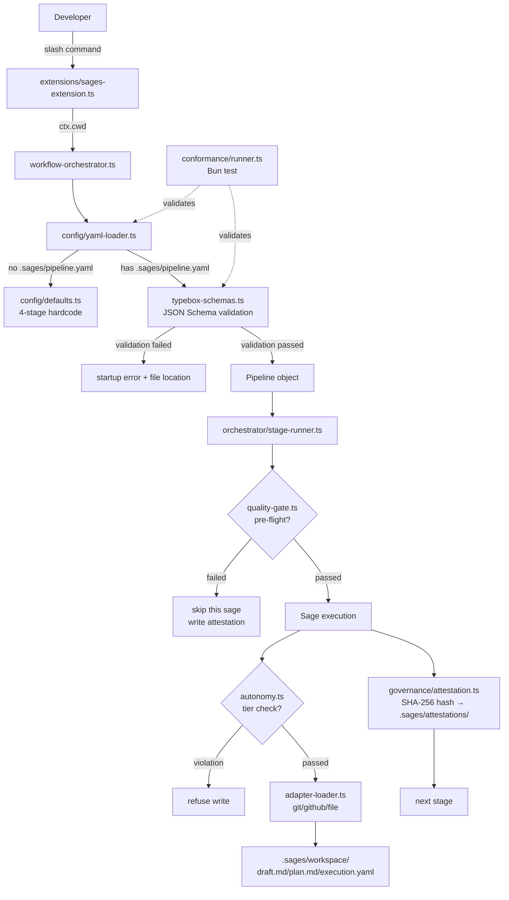

# Sages Evolution Roadmap: Toward `mini-ai-sdlc`

**Date**: 2026-06-28
**Author**: produced collaboratively by pi-coding-agent
**Status**: Approved (brainstorming complete, pending implementation)
**Target brand name**: `mini-ai-sdlc` (see §2.4)
**Related projects**: `~/Project/sages/pi` (current Four Sages implementation), `~/Project/ai-sdlc` (reference target)

---

## 1. Overview

This document defines the evolution roadmap for the `sages` project from its current "Four Sages ritualized workflow" to **`mini-ai-sdlc`**. `mini-ai-sdlc` is the target brand name for this evolution (see §2.4), representing "a lightweight AI SDLC governance framework re-expressed at pi-coding-agent scale". The goal is to give sages the core governance capabilities of ai-sdlc while preserving pi-coding-agent's simplicity: **declarative pipelines, pluggable agents, verifiable quality gates, auditable artifacts**.

**Core judgment**: sages does not need to become ai-sdlc (that is a ~3,904-file, 11-package monorepo with 9 dedicated sub-agents), nor does it need to be compatible with all of ai-sdlc's YAML resources. **The right goal is to capture ai-sdlc's "governance essence" — declarative + auditable + composable — and re-express it at pi-coding-agent scale**.

---

## 2. Background and motivation

### 2.1 sages' current form

```
sages/pi/  (121 files, single npm package @sages/pi-four-sages)
├── extensions/sages-extension.ts    # pi ExtensionAPI entry point
├── prompts/four-sages-workflow.md   # slash command help
├── skills/{fuxi,qiaochui,luban,gaoyao,brainstorming}/SKILL.md
├── src/tools/                      # 4 sages + brainstorming, ~20 TS files total
└── src/orchestrator/workflow-orchestrator.ts
```

**Characteristics**:
- The workflow is **hardcoded** to 4 stages (Fuxi → QiaoChui → LuBan → GaoYao)
- Configuration is **all in code** — no YAML, no declarative resources, no schema
- There are **only 4 sub-agents** — not extensible, not replaceable
- State lives in `.sages/workspace/` — plain text, no signatures, no audit chain
- Tests are **only 30 Bun unit tests** — no end-to-end, no schema conformance tests

### 2.2 ai-sdlc's "governance essence"

ai-sdlc has **3,904 files**, **11 package.json files** (pnpm monorepo), **60 YAML conformance fixtures** across 6 categories (`pipeline/quality-gate/agent-role/autonomy-policy/adapter/behavioral`), DSSE v6 Merkle signatures, **11+ contrib adapters + github (3 SDK implementations)**, **9 dedicated sub-agents in .md form** (`ai-sdlc-plugin/agents/*.md`). But the parts with **real leverage** concentrate in 5 categories of declarative resources + governance primitives:

| ai-sdlc essence | sages counterpart | Evolution goal |
|---|---|---|
| `kind: Pipeline` declarative workflow | hardcoded `workflow-orchestrator.ts` | replace |
| `kind: AgentRole` role definitions | hardcoded `src/tools/fuxi-tools.ts` etc. | abstract |
| `kind: QualityGate` rule gates | only GaoYao post-hoc audit | pre-flight gates |
| `kind: AdapterBinding` external integrations | none at all | add |
| `kind: AutonomyPolicy` permission tiers | none at all | add |
| 60 YAML conformance fixtures (pipeline+adapter+agent-role+quality-gate+autonomy-policy, **excluding the 23 behavioral ones** — see §2.3 "what we won't do") | only 30 Bun unit tests | match |

### 2.3 Why not "full ai-sdlc compatibility"

| Not doing | Reason |
|---|---|
| DSSE v6 Merkle signatures | pi-coding-agent runs locally for a single user; no multi-signature need. Simple HMAC + hash chain is enough |
| Full `AutonomyPolicy.levels[]` tier ladder | 4 tiers (Observer/Assistant/Engineer/Autonomous) are enough |
| 12 adapters | only need git + github + filesystem |
| Full RFC process | sages is single-person/small-team; doesn't need RFC-0011-style DoR gates |
| 14-step Step 0-13 pipeline | the current 4 stages are enough; can be composed in YAML |
| All 60 conformance fixtures | 20-30 core fixtures already validate 80% of paths; **explicitly reject the 23 `behavioral/` fixtures** (they depend on multi-agent orchestration, contradicting the §2.4 simplification principle) |

### 2.4 Target brand definition: `mini-ai-sdlc`

To avoid later documents mixing informal phrasings like "lightweight ai-sdlc" / "mini version", this document formally adopts **`mini-ai-sdlc`** as the brand name for the evolution target. Defined as follows:

| Item | Content |
|---|---|
| **Brand name** | `mini-ai-sdlc` |
| **Formal positioning** | "Sages mini-ai-sdlc" — a lightweight AI SDLC governance framework re-expressed at pi-coding-agent scale |
| **One-liner** | sages is `mini-ai-sdlc` — a declarative AI SDLC governance framework |
| **Is** | ai-sdlc's governance philosophy (declarative + auditable + composable) re-expressed at pi scale |
| **Is not** | a subset, superset, or compatible implementation of ai-sdlc |
| **Target size** | ~150-180 files / single npm package (vs ai-sdlc's current 3,904 files / 11-package pnpm monorepo) |
| **Core deliverables** | declarative Pipeline, 4 categories of governance resources (Pipeline/QualityGate/AutonomyPolicy/AdapterBinding), conformance tests |

All later references to milestones such as "evolution target" / "phase 2 complete" mean meeting all acceptance criteria for the `mini-ai-sdlc` label above.

---

## 3. Evolution strategy decisions

### 3.1 Three candidate paths (evaluated)

| Path | Description | Effort | Leverage | Decision |
|---|---|---|---|---|
| **A. Declarative Pipeline** | add `.sages/pipeline.yaml` to replace the hardcoded workflow | 1-2 weeks | **Highest** | ✅ Adopt |
| **B. Full ai-sdlc compatibility** | able to parse and run ai-sdlc's `.ai-sdlc/pipeline.yaml` | 1-3 months | Medium | ❌ Reject |
| **C. Governance overlay** | add QualityGate/Attestation/Autonomy/Adapter on top of A | 2-4 weeks | **High** | ✅ Adopt (phase 2) |

**Specific reasons path B was rejected**:
1. ai-sdlc has concepts pi has no equivalent for — `AutonomyPolicy.levels[]` / 9 AdapterBinding interfaces / DSSE signatures / backlog workflows — implementing it would mean building half of ai-sdlc
2. Diminishing returns — you'd get "a merger of two systems", not "one more complete system"
3. Locked into ai-sdlc's RFC process debt, contradicting pi's simplicity philosophy

### 3.2 Key decision records

| Decision | Choice | Reason |
|---|---|---|
| Config format | YAML + JSON Schema validation | aligned with ai-sdlc, ecosystem-readable |
| Schema library | `typebox` (existing dependency) + `typebox/value` subpath | already in deps, no new addition needed (`Value` must be imported from the `/value` subpath; the main entry does not export it) |
| Schema version | `sages.io/v1alpha1` | aligned with ai-sdlc style but independent |
| Default fallback | no `.sages/pipeline.yaml` → current 4-stage hardcode | backward compatible |
| Attestation | v1: simple SHA-256 + metadata JSONL; v2: HMAC signing | single-user local doesn't need public-key crypto at v1 |
| Autonomy tier | 4 levels 0/1/2/3 | aligned with pi's read/write tool model |
| Adapter interface | `read/write/list/exists` 4 methods | minimal viable, easy to extend |
| Conformance tests | reuse ai-sdlc fixture style, new `conformance/tests/sages-v1alpha1/` | standardized test entry point |
| Parallel sages | only LuBan stage supports it (aligned with current state) | don't widen the blast radius |

---

## 4. Goals and non-goals

### 4.1 Goals

**Core goal**: sages gains **`mini-ai-sdlc` governance capabilities** (see §2.4) within 1-2 months, specifically:

1. **Declarative pipeline**: users can freely compose stages, define quality gates, and configure retries via `.sages/pipeline.yaml`
2. **Extensible agents**: users can add custom sages in YAML (via pi's tool protocol) without modifying sages source
3. **Pre-flight quality gates**: rules are evaluated automatically **before** a stage runs; failure skips that sage (replacing the current GaoYao post-hoc audit)
4. **Auditable artifacts**: every sage output is hashed and lands in `.sages/attestations/`, traceable across stages
5. **Autonomy tiers**: `.sages/autonomy.yaml` controls which paths each sage can write; conservative by default
6. **External adapters**: `.sages/adapters/*.yaml` lets sages read GitHub issues, read/write git repos, etc.
7. **Conformance tests**: when users write invalid YAML, startup fails with the error location (schema conformance)

### 4.2 Non-goals (NOT doing in this evolution)

- ❌ Full ai-sdlc v1alpha1 compatibility (reason in §3.1)
- ❌ DSSE v6 Merkle signatures (not needed for single-user local)
- ❌ Cross-host multi-agent orchestration (Pattern X/Z/Y too heavy)
- ❌ RFC-0011 DoR gate, RFC-0035 Decision Catalog (pi doesn't need this form of governance)
- ❌ Enterprise plugins, SIEM export, License validation
- ❌ Sandbox isolation (Landlock/seccomp/OpenShell) — pi runs on the user's machine; trust boundary differs
- ❌ Conformance test interop with ai-sdlc (each maintained independently)
- ❌ Real-time TUI status display (RFC-0023) — pi's status bar is enough

---

## 5. Overall architecture

### 5.1 sages structure after the evolution

```
sages/pi/
├── extensions/sages-extension.ts          # [modified] load .sages/pipeline.yaml
├── prompts/                               # [unchanged]
├── skills/                                # [unchanged] (users can still reference them in YAML)
├── src/
│   ├── config/
│   │   ├── yaml-loader.ts                 # [new] YAML loading + schema validation
│   │   ├── defaults.ts                    # [new] current 4 stages as default pipeline
│   │   └── typebox-schemas.ts             # [new] typebox schema definitions
│   ├── orchestrator/
│   │   ├── workflow-orchestrator.ts       # [modified] read YAML, convert to stage sequence
│   │   └── stage-runner.ts                # [new] generic stage executor
│   ├── governance/                        # [new dir] phase 2
│   │   ├── quality-gate.ts                # [new] pre-flight rules
│   │   ├── attestation.ts                 # [new] hashing + metadata
│   │   ├── autonomy.ts                    # [new] tier checks
│   │   └── adapter-loader.ts              # [new] load .sages/adapters/*.yaml
│   └── tools/                             # [unchanged] (sage implementations)
├── schemas/
│   ├── pipeline.v1.schema.json            # [new]
│   ├── agent-role.v1.schema.json          # [new]
│   ├── quality-gate.v1.schema.json        # [new]
│   ├── autonomy.v1.schema.json            # [new]
│   └── adapter-binding.v1.schema.json     # [new]
├── conformance/                            # [new dir]
│   ├── runner.ts                          # [new] Bun test driver
│   └── tests/
│       └── sages-v1alpha1/
│           ├── pipeline/
│           │   ├── valid-minimal.yaml
│           │   ├── valid-full.yaml
│           │   └── invalid-empty-stages.yaml
│           ├── agent-role/
│           ├── quality-gate/
│           └── autonomy/
├── test/                                  # [expanded] add schema/governance tests
├── .sages/
│   ├── pipeline.yaml.example              # [new] copyable starter
│   ├── quality-gate.yaml.example          # [new]
│   ├── autonomy.yaml.example              # [new]
│   └── adapters/                          # [new] git.yaml, github.yaml etc.
└── package.json                           # [modified] add schemas, conformance scripts
```

### 5.2 Data flow (after phase 2 completes)


```mermaid
flowchart TB
    User[Developer] -->|slash command| Ext[extensions/sages-extension.ts]
    Ext -->|ctx.cwd| Orch[workflow-orchestrator.ts]

    Orch --> Loader[config/yaml-loader.ts]
    Loader -->|no .sages/pipeline.yaml| Default[config/defaults.ts<br/>4-stage hardcode]
    Loader -->|has .sages/pipeline.yaml| Schema[typebox-schemas.ts<br/>JSON Schema validation]
    Schema -->|validation failed| Error[startup error + file location]
    Schema -->|validation passed| Pipeline[Pipeline object]

    Pipeline --> Runner[orchestrator/stage-runner.ts]

    Runner --> G1{quality-gate.ts<br/>pre-flight?}
    G1 -->|failed| Skip[skip this sage<br/>write attestation]
    G1 -->|passed| Sage[Sage execution]

    Sage --> A1{autonomy.ts<br/>tier check?}
    A1 -->|violation| Refuse[refuse write]
    A1 -->|passed| Adapters[adapter-loader.ts<br/>git/github/file]

    Adapters --> Outputs[.sages/workspace/<br/>draft.md/plan.md/execution.yaml]
    Sage --> Attest[governance/attestation.ts<br/>SHA-256 hash → .sages/attestations/]
    Attest --> Next[next stage]

    Conformance[conformance/runner.ts<br/>Bun test] -.validates.-> Loader
    Conformance -.validates.-> Schema
```

### 5.3 Key design principles

| Principle | Manifestation |
|---|---|
| **Backward compatibility** | without `.sages/pipeline.yaml`, behavior is exactly the current 4 stages |
| **Declarative first** | misconfigured YAML errors **immediately** with file:line, no silent fallback |
| **Type sharing** | typebox schema is the single source of truth; TypeScript types derive from the schema |
| **Least privilege** | autonomy tiers are strict by default; users must explicitly relax |
| **Audit traceability** | every sage output is hashed to disk, comparable across stages |
| **Zero-change migration** | existing `.sages/workspace/` state remains compatible automatically; no workflow breakage |

---

## 6. Phase roadmap

### 6.1 Overview

| Phase | Name | Effort | Cumulative | Key deliverables |
|---|---|---|---|---|
| **Phase 1** | Declarative Pipeline | **3-5 weeks** | 3-5 weeks | YAML workflow + schema + conformance tests (corrected from §16.3) |
| **Phase 2** | Governance overlay | **3-5 weeks** | **6-10 weeks** | QualityGate + Attestation + Autonomy + Adapter (corrected from §16.3) |
| **(Optional 3)** | Ecosystem expansion | 2-4 weeks | 8-14 weeks | advanced adapters, multi-machine orchestration |

**Docking point**: after phase 2 completes, sages can be labeled `mini-ai-sdlc` (see §2.4). Phase 3 depends on demand.

### 6.2 Phase 1 detailed breakdown

| Subtask | Files | Effort |
|---|---|---|
| 1.1 Schema definitions | `schemas/pipeline.v1.schema.json` + `src/config/typebox-schemas.ts` | 2-3 days |
| 1.2 YAML loader | `src/config/yaml-loader.ts` | 2 days |
| 1.3 Default fallback | `src/config/defaults.ts` | 1 day |
| 1.4 Generic stage-runner | `src/orchestrator/stage-runner.ts` | 2-3 days |
| 1.5 Orchestrator rework | `src/orchestrator/workflow-orchestrator.ts` (modified) | 1-2 days |
| 1.6 Extension hooks | `extensions/sages-extension.ts` (modified, **534-line slash command routing** — effort re-estimated to 3-5 days, see §16.2 row 2) | 3-5 days |
| 1.7 Conformance tests | full `conformance/` suite + **15-25 fixtures** (8 pipeline + agent-role/quality-gate/autonomy deferred to phase 2) | 2-3 days |
| 1.8 Docs and examples | `.sages/pipeline.yaml.example` + README update | 1 day |

### 6.3 Phase 2 detailed breakdown

| Subtask | Files | Effort |
|---|---|---|
| 2.1 QualityGate pre-flight | `src/governance/quality-gate.ts` + `schemas/quality-gate.v1.schema.json` | 2-3 days |
| 2.2 Attestation hash chain | `src/governance/attestation.ts` + `.sages/attestations/` | 2 days |
| 2.3 Autonomy tier | `src/governance/autonomy.ts` + `schemas/autonomy.v1.schema.json` | 2-3 days |
| 2.4 Adapter loader | `src/governance/adapter-loader.ts` + `schemas/adapter-binding.v1.schema.json` | 3-4 days |
| 2.5 git/github adapter | `.sages/adapters/git.yaml` + `src/adapters/git.ts` | 2-3 days |
| 2.6 README and examples | full examples + tutorial | 1-2 days |
| 2.7 Conformance tests | 5-10 fixtures each for governance and adapters | 2 days |

---

## 7. Phase 1 detailed design: Declarative Pipeline

### 7.1 Design goals

1. Users can freely compose stages in `.sages/pipeline.yaml`
2. YAML misconfiguration errors immediately (validated at startup, not deferred to runtime)
3. Without YAML, fall back to the current 4-stage behavior
4. YAML can reference sage names (`fuxi/qiaochui/luban/gaoyao`) and custom names (user-provided tool names)
5. Each stage can declare qualityGates, retry, approval, and parallelism

### 7.2 YAML Schema design

#### 7.2.1 Top-level envelope

```yaml
apiVersion: sages.io/v1alpha1    # fixed
kind: Pipeline                    # fixed
metadata:
  name: <string,required>         # kebab-case
  labels: { ... }                 # optional
spec:
  triggers: [ ... ]               # optional, see §7.2.2
  stages: [ ... ]                 # required, at least 1
  defaults: { ... }               # optional, see §7.2.5
```

#### 7.2.2 Triggers

```yaml
spec:
  triggers:
    - event: slash.command        # slash command trigger
      filter:
        commands: [fuxi-start, fuxi-request]
    - event: file.changed         # file-change trigger (optional, not implemented in phase 1)
```

**Phase 1 simplification**: only `slash.command` is supported; other events error with "not implemented".

#### 7.2.3 Stage definitions (stages[])

```yaml
spec:
  stages:
    - name: design                # required, kebab-case
      sage: fuxi                  # required, fuxi|qiaochui|luban|gaoyao|custom
      input:                      # optional, parameters passed to the sage
        request: "${userRequest}" # variable interpolation supported
      output:                     # optional, where the sage output lands
        file: draft.md
      parallel: 1                 # optional, default 1; LuBan stage can be 3
      qualityGates:               # optional, detailed in §Phase 2
        - name: design-not-empty
          rule: { metric: file-size, path: draft.md, operator: '>=', threshold: 100 }
      onFailure:                  # optional
        strategy: abort           # abort|retry|continue|skip
        maxRetries: 2             # only valid for retry
        retryDelay: PT1M          # ISO 8601 duration
      approval:                   # optional, implemented in phase 2
        required: true
        blocking: true
        timeout: PT24H
```

#### 7.2.4 Built-in sage list

| name | type | default input | default output |
|---|---|---|---|
| `fuxi` | design | `{ request }` | `draft.md` |
| `qiaochui` | review | `{ draftPath }` | `plan.md`, `execution.yaml`, updates `state.json.score` |
| `luban` | execute | `{ executionYamlPath, parallel }` | source code + tests |
| `gaoyao` | audit | `{ scope }` | `audit.md` |

#### 7.2.5 Global defaults

```yaml
spec:
  defaults:
    onFailure: { strategy: abort }
    retryDelay: PT1M
    timeout: PT24H
    qualityGates: []             # no gates by default
```

Each stage can override individually.

### 7.3 Loader implementation notes

```typescript
// src/config/yaml-loader.ts (illustrative)
import { Type, type Static } from "typebox";
import { Value } from "typebox/value";   // note: the main entry does not export Value; the /value subpath is required

export const PipelineSchema = Type.Object({
  apiVersion: Type.Literal("sages.io/v1alpha1"),
  kind: Type.Literal("Pipeline"),
  metadata: Type.Object({
    name: Type.String({ pattern: "^[a-z][a-z0-9-]*$" }),
    labels: Type.Optional(Type.Record(Type.String(), Type.String())),
  }),
  spec: Type.Object({
    triggers: Type.Optional(Type.Array(TriggerSchema)),
    stages: Type.Array(StageSchema, { minItems: 1 }),
    defaults: Type.Optional(DefaultsSchema),
  }),
});

export type Pipeline = Static<typeof PipelineSchema>;

export async function loadPipeline(cwd: string): Promise<Pipeline> {
  const path = path.join(cwd, ".sages/pipeline.yaml");
  if (!await fs.pathExists(path)) {
    return getDefaultPipeline();  // current 4-stage hardcode
  }
  const raw = await fs.readFile(path, "utf-8");
  const parsed = YAML.parse(raw);
  const errors = [...Value.Errors(PipelineSchema, parsed)];
  if (errors.length > 0) {
    throw new PipelineSchemaError(path, errors);
  }
  return parsed as Pipeline;
}
```

### 7.4 Stage Runner design

```typescript
// src/orchestrator/stage-runner.ts (illustrative)
export async function runStage(
  stage: Stage,
  ctx: PipelineContext,
): Promise<StageResult> {
  // 1. resolve inputs (support ${var} interpolation)
  const input = interpolate(stage.input, ctx);

  // 2. invoke the sage
  const sage = ctx.sages.get(stage.sage);
  if (!sage) throw new UnknownSageError(stage.sage);

  // 3. retry on failure
  let lastError: Error | undefined;
  for (let attempt = 0; attempt <= (stage.onFailure?.maxRetries ?? 0); attempt++) {
    try {
      const result = await sage.run(input, ctx);
      return { stage: stage.name, status: "ok", result };
    } catch (err) {
      lastError = err as Error;
      const strategy = stage.onFailure?.strategy ?? ctx.pipeline.defaults?.onFailure?.strategy ?? "abort";
      if (strategy === "abort") throw err;
      if (strategy === "continue") return { stage: stage.name, status: "failed", error: err };
      if (strategy === "skip") return { stage: stage.name, status: "skipped", error: err };
      // strategy === "retry": wait then continue
      await sleep(parseDuration(stage.onFailure?.retryDelay ?? "PT1M"));
    }
  }
  throw lastError;
}
```

### 7.5 Orchestrator rework

```typescript
// src/orchestrator/workflow-orchestrator.ts (modified)
export async function runWorkflow(cwd: string, userRequest: string) {
  const pipeline = await loadPipeline(cwd);  // [new] replaces the hardcoded 4 stages
  const ctx = createContext(pipeline, { userRequest });

  // load each sage
  for (const stage of pipeline.spec.stages) {
    ctx.sages.set(stage.sage, resolveSage(stage.sage));
  }

  // execute sequentially (parallel > 1 is dispatched inside stage-runner)
  for (const stage of pipeline.spec.stages) {
    ctx.state = await transitionPhase(ctx.state, stage.name);
    await runStage(stage, ctx);
  }

  await archiveWorkflow(ctx);
}
```

### 7.6 Migration plan

**Fully backward compatible** — zero impact on existing users:

| User type | Behavior |
|---|---|
| No `.sages/pipeline.yaml` | exactly the current 4 stages (code path: `defaults.ts` returns the hardcoded pipeline) |
| Has YAML but schema-invalid | startup error pointing to file:line; workflow does not start |
| Has valid YAML | new code path |

**Migration steps** (developer side; no user action needed):
1. Extract the current 4 stages into a `getDefaultPipeline()` function in `defaults.ts`
2. `workflow-orchestrator.ts` replaces direct sage calls with a `runStage(stage, ctx)` loop
3. Add `yaml-loader.ts` + schema
4. Add conformance tests
5. Run the existing 30 Bun unit tests, confirm all green (zero behavior change)

### 7.7 Conformance test design

`conformance/tests/sages-v1alpha1/` directory structure:

```
sages-v1alpha1/
├── pipeline/
│   ├── valid-minimal.yaml          # 1 stage only, no gates
│   ├── valid-full.yaml             # 4 stages + gates + retry + approval
│   ├── valid-custom-sage.yaml      # references a non-built-in sage name (user custom)
│   ├── invalid-empty-stages.yaml   # stages: []
│   ├── invalid-bad-sage-name.yaml  # sage: "" or with special characters
│   ├── invalid-bad-api-version.yaml
│   ├── invalid-bad-duration.yaml   # retryDelay: "1m" (should be PT1M)
│   └── invalid-missing-metadata.yaml
├── agent-role/                     # detailed in phase 2
├── quality-gate/                   # detailed in phase 2
├── autonomy/                       # detailed in phase 2
└── (rejected) behavioral/          # ai-sdlc has 23 fixtures; they depend on multi-agent orchestration, which mini-ai-sdlc does not implement (see §2.3)
```

**Runner design** (Bun):

```typescript
// conformance/runner.ts (illustrative)
import { test, expect } from "bun:test";
import { loadPipeline } from "../src/config/yaml-loader";

const FIXTURES = "conformance/tests/sages-v1alpha1";

test("pipeline-valid-minimal", async () => {
  const p = await loadPipeline(`${FIXTURES}/pipeline/valid-minimal.yaml`);
  expect(p.kind).toBe("Pipeline");
  expect(p.spec.stages.length).toBeGreaterThanOrEqual(1);
});

test("pipeline-invalid-empty-stages", async () => {
  await expect(
    loadPipeline(`${FIXTURES}/pipeline/invalid-empty-stages.yaml`)
  ).rejects.toThrow(/stages.*at least 1/i);
});
```

---

## 8. Phase 2 detailed design: Governance overlay

### 8.1 QualityGate pre-flight

**Goal**: rules are evaluated automatically **before** the sage runs; failure skips that sage.

#### 8.1.1 YAML schema

```yaml
apiVersion: sages.io/v1alpha1
kind: QualityGate
metadata:
  name: design-not-empty
spec:
  scope:                           # optional, limits where the gate applies
    stages: [design]
    sageAuthors: [ai-agent]        # ai-agent | human | external
  gates:
    - name: design-not-empty
      enforcement: hard-mandatory   # advisory | soft-mandatory | hard-mandatory
      rule:
        metric: file-size          # file-size | file-exists | test-result | git-status | shell
        path: draft.md
        operator: '>='
        threshold: 100
      override:                    # optional
        requiredRole: maintainer
```

#### 8.1.2 Built-in metrics

| metric | meaning | applies to |
|---|---|---|
| `file-exists` | whether the path exists | draft.md, plan.md |
| `file-size` | file size in bytes | draft.md |
| `test-result` | `bun test` pass/fail | LuBan post-check |
| `git-status` | `git status --porcelain` empty | all stages |
| `shell` | exit code of any shell command | generic |

#### 8.1.3 Enforcement level semantics

| enforcement | behavior on failure |
|---|---|
| `advisory` | records a warning; the sage keeps running |
| `soft-mandatory` | sage skipped, but the attempt is recorded; an override role can manually continue |
| `hard-mandatory` | sage skipped, **no override**, workflow aborts |

### 8.2 Attestation audit hash chain

**Goal**: every sage output is hashed and lands in `.sages/attestations/`, traceable across stages.

#### 8.2.1 v1 design (single-user local, no signatures)

```typescript
// src/governance/attestation.ts (illustrative)
interface Attestation {
  version: "v1";
  planName: string;
  stageName: string;
  sageName: string;
  inputs: Record<string, string>;        // SHA-256 of each input
  outputs: Record<string, string>;       // SHA-256 of each output
  startedAt: string;                     // ISO 8601
  finishedAt: string;
  status: "ok" | "failed" | "skipped";
  previousAttestation: string | null;    // hash of the previous attestation (chained)
  hash: string;                          // SHA-256 of this attestation itself
}
```

**Storage**: `.sages/attestations/<planName>-<timestamp>.jsonl` (one JSON per line)

**Chaining**: `previousAttestation` references the previous hash, forming a git-commit-like chain. When a stage fails mid-run, you can locate "which step went wrong".

#### 8.2.2 v2 roadmap (optional, phase 3+)

- HMAC signing (user's pi host secret)
- No DSSE (single-user doesn't need multi-signature)

### 8.3 Autonomy tiers

**Goal**: control which paths each sage can read/write; conservative by default.

#### 8.3.1 YAML schema

```yaml
apiVersion: sages.io/v1alpha1
kind: AutonomyPolicy
metadata:
  name: default-conservative
spec:
  sages:
    fuxi:
      tier: 0                       # 0=Observer, 1=Assistant, 2=Engineer, 3=Autonomous
      read: ['**/*']                # glob
      write: []                     # no writes by default
      execute: ['analyze']          # allowed shell categories
      blockedPaths: ['.sages/pipeline.yaml']  # denied even if the tier allows
    qiaochui:
      tier: 1
      read: ['**/*']
      write: ['.sages/workspace/draft.md', '.sages/workspace/plan.md']
      execute: ['analyze']
    luban:
      tier: 2
      read: ['**/*']
      write: ['src/**', 'test/**', 'package.json']
      execute: ['code-edit', 'test-run']
      blockedPaths: ['.github/**', '.sages/**', 'package-lock.json']
    gaoyao:
      tier: 0                       # GaoYao is read-only, no writes
      read: ['**/*']
      write: []
      execute: ['analyze']
```

#### 8.3.2 Tier semantics

| tier | alias | allowed |
|---|---|---|
| 0 | Observer | read-only, may run analyze |
| 1 | Assistant | may write `.sages/workspace/`, may run lint |
| 2 | Engineer | may write `src/`/`test/`, may run test-run |
| 3 | Autonomous | full authority (must be explicitly enabled by the user) |

**Default policy**: already in `.sages/autonomy.yaml.example`; all sages default to tier ≤ 2, and LuBan's blockedPaths mandatorily includes `.github/**` and `.sages/**`.

#### 8.3.3 Tier check implementation

```typescript
// src/governance/autonomy.ts (illustrative)
export function checkAutonomy(sage: string, action: "read"|"write"|"execute", target: string, policy: AutonomyPolicy): void {
  const sagePolicy = policy.spec.sages[sage];
  if (!sagePolicy) throw new NoPolicyError(sage);
  const allowed = sagePolicy[action] ?? [];
  const blocked = sagePolicy.blockedPaths ?? [];
  if (blocked.some(p => minimatch(target, p))) {
    throw new BlockedPathError(sage, target);
  }
  if (!allowed.some(p => minimatch(target, p))) {
    throw new AutonomyViolationError(sage, action, target);
  }
}
```

**Hook point**: intercepted in the sage tools' PreToolUse hook (provided by pi).

### 8.4 Adapter loading

**Goal**: sages can read GitHub issues, read/write git repos, and read files — declared via `.sages/adapters/*.yaml`.

#### 8.4.1 Adapter declaration format

```yaml
# .sages/adapters/git.yaml
apiVersion: sages.io/v1alpha1
kind: AdapterBinding
metadata:
  name: git
spec:
  interface: SourceControl       # SourceControl | IssueTracker | Messenger | FileStore
  type: git
  version: 0.1.0
  config:
    repoPath: .
```

```yaml
# .sages/adapters/github.yaml
apiVersion: sages.io/v1alpha1
kind: AdapterBinding
metadata:
  name: github
spec:
  interface: IssueTracker
  type: github
  version: 0.1.0
  config:
    token: ${GITHUB_TOKEN}      # direct env-var interpolation; ai-sdlc uses secretRef to reference a secret manager, this design simplifies (single-user local needs no secret abstraction)
    org: my-org
    repo: my-repo
```

#### 8.4.2 Adapter interface (base 4 methods)

```typescript
// src/adapters/types.ts
export interface Adapter {
  readonly name: string;
  readonly interface: string;
  read(path: string): Promise<string>;
  write(path: string, content: string): Promise<void>;
  list(pattern: string): Promise<string[]>;
  exists(path: string): Promise<boolean>;
}
```

**Design deviation from ai-sdlc**: ai-sdlc defines 5 interface categories (`IssueTracker` / `SourceControl` / `CIPipeline` / `Messenger` / `FileStore`, see `sdk-python/src/ai_sdlc/adapters/interfaces.py`), each with rich methods (`list_issues`, `create_pr`, `merge`, `commit`, etc.). This document adopts a 4-method **minimal subset**, aligned only with ai-sdlc's `FileStore` interface:

- Within phase 2's delivery scope, only the `filesystem` adapter needs the full 4-method implementation
- Under the 4-method framework, the `git` adapter can only provide `read/write/list/exists` (read commits, read diffs); `create_branch` / `commit` / `merge` are out of phase 2 scope
- Same for the `github` adapter: phase 2 only provides issue `read`/`list`, no `create_issue` / `add_comment`
- Phase 3 evaluates whether to extend into standalone `IssueTracker` / `SourceControl` interfaces

#### 8.4.3 Sages reference adapters

Sages reference adapters via pi tool arguments (no self-loading needed):

```yaml
spec:
  stages:
    - name: read-issue
      sage: luban
      input:
        task: read GitHub issue #1 and implement"
        adapter: github        # references .sages/adapters/github.yaml
```

On the sage code side:
```typescript
const adapter = ctx.adapters.get(input.adapter);
const issue = await adapter.read("issues/1");
```

#### 8.4.4 Built-in adapters (phase 2 delivery)

| adapter | interface | phase 2 scope (4-method framework) |
|---|---|---|
| `git` | SourceControl | **read-only** (`read` diffs / `list` branches); **does not implement** `create_branch` / `commit` / `merge` (phase 3 extension) |
| `filesystem` | FileStore | full (`read` / `write` / `list` / `exists`) |
| `github` | IssueTracker | **read-only** (`read` issues / `list` issues); **does not implement** `create_issue` / `add_comment` / `create_pr` |
| `slack` (phase 3) | Messenger | stub |

### 8.5 Phase 2 acceptance paths

Phase 2 is considered complete when the following scenarios pass:

1. **Scenario A**: write a `design-not-empty` gate in `.sages/quality-gate.yaml`, delete draft.md, run `fuxi-request` — LuBan must not start (before GaoYao)
2. **Scenario B**: run the full 4 stages — `.sages/attestations/` contains 4 chained JSON records
3. **Scenario C**: set LuBan's tier to 0 in `.sages/autonomy.yaml` — LuBan must not be able to write `src/`
4. **Scenario D**: configure the token in `.sages/adapters/github.yaml` — LuBan can read the issue content and execute based on it

---

## 9. Phase 3 (optional): ecosystem expansion

| Subtask | Description | Effort |
|---|---|---|
| 3.1 Slack adapter | implement `.sages/adapters/slack.yaml` | 1 week |
| 3.2 Multi-machine orchestration | distribute sages across machines (via SSH or socket) | 2-3 weeks |
| 3.3 v2 Attestation | HMAC signing | 0.5 week |
| 3.4 Conformance expansion | 20+ fixtures covering edge cases | 1 week |
| 3.5 Docs site | move README + examples + tutorial to a standalone docs/ | 1 week |

**Not done unless the user explicitly needs it**.

---

## 10. Risks and mitigations

| Risk | Impact | Mitigation |
|---|---|---|
| Backward compatibility breakage | existing users' workflows break | the default fallback path fully preserves old behavior; add 50 unit tests covering the old path |
| YAML schema too restrictive | users can't express the workflow they want | typebox schema allows `additionalProperties` in metadata.labels; provide an "escape hatch" `spec.raw` field to pass through raw config (marked advanced) |
| Autonomy checks too strict | sages can't complete legitimate operations | default policy only covers "obviously dangerous" paths (`/.github/**`, `/.sages/**`); users relax it by changing one line in `.sages/autonomy.yaml` |
| Adapter loader performance | reads YAML on every sage run | caching strategy: load once into `ctx.adapters` at startup; no reads at runtime |
| Conformance fixture maintenance cost | schema changes invalidate all fixtures | generate fixtures with a script instead of hand-writing; schema changes must update fixtures in sync |

---

## 11. Open questions

Organized by "when a decision must be made". **Pre-work blockers in §16.5 (8 questions)**; this section records phased decisions to be made after work starts.

### 11.1 Pre-work blockers (summary)

See **§16.5's 8 questions** — not repeated here.

### 11.2 Mid-phase-1 decisions (after schema validation)

| # | Question | Recommended | Decision timing |
|---|---|---|---|
| **D9** | state.json and `.sages/workspace/` output naming/ownership | should YAML stages have an `output.files: [name1, name2]` field? Or use a fixed naming convention (from the `defaults.ts` default pipeline)? | after phase 1.1 schema definitions |
| **D10** | whether the Brainstorming integration toggle goes into YAML (`fuxi_request --no-brainstorm`) | pass through as `stage.input.noBrainstorm: true`; no schema change needed | at phase 1.2 yaml-loader |
| **D11** | sage registration mechanism — keep the `registerTool` monkey-patch vs dynamic loading | the current monkey-patch of `pi.registerTool` at `extensions/sages-extension.ts:66-86` is a hack; **recommended**: keep the monkey-patch, extract the "sage registration" logic into `src/registry/`, inject into the registry after YAML loading | at phase 1.6 extension rework |

### 11.3 Phase 2 kickoff decisions (after phase 1 acceptance)

| # | Question | Recommended | Decision timing |
|---|---|---|---|
| **D12** | final form of the Adapter 4-method vs 5-category interface | §8.4.2 already settles on 4 methods (aligned with FileStore); `git`/`github` adapters read-only; **recommended**: reserve an `extendedMethods: [commit, create_issue]` field in the YAML adapter schema as an escape hatch; phase 2 only delivers the core 4 methods, extensions appended on demand | at phase 2.4 adapter-loader design |
| **D13** | Attestation compatibility with the existing `audit.md` | `fuxi-end` currently parses audit.md with the regex `**Verdict**: PASS`; **recommended**: keep `audit.md` as the human-readable report; Attestation is a parallel machine-readable artifact; `fuxi-end` unchanged | at phase 2.2 attestation.ts design |
| **D14** | Autonomy check hook point (pi PreToolUse vs inside the sage) | §16.4 validation B confirmed `pi.on("tool_call")` works; **recommended**: two layers — pi PreToolUse intercepts **write operations** (write/edit/bash), enforcing the policy hard; the in-sage `checkAutonomy()` provides finer-grained file-read gates | at phase 2.3 autonomy.ts design |

### 11.4 Decisions deferred to phase 3+

| # | Question | Pending plan | Decision timing |
|---|---|---|---|
| **D15** | support YAML nested references (`${stages.design.output}`)? | not in phase 1; evaluate in phase 3 | after phase 1 |
| **D16** | support multiple pipeline files (profile-based)? | not in phase 1; evaluate in phase 3 | after phase 1 |
| **D17** | HMAC for Attestation v2? | only when the user has an explicit need | phase 3 |
| **D18** | does `pi.on("tool_call")` fully replace `pi.registerCommand` in the final form? | not discussed | mid-phase 2 |

### 11.5 Already decided (no re-evaluation needed)

| Question | Decision | Reason |
|---|---|---|
| Build a Sages→ai-sdlc compatibility layer (reverse direction)? | ❌ **No** | §3.1 path B already rejected; ai-sdlc is a reference target, not an interop target |
| Fully implement `AutonomyPolicy.levels[]`? | ❌ 4 tiers are enough (Observer/Assistant/Engineer/Autonomous) | explained in §2.3 |
| DSSE v6 Merkle signatures? | ❌ No | §2.3; single-user local doesn't need them |
| Port all 60 conformance fixtures? | ❌ only 15-25 fixtures; reject the 23 `behavioral/` ones | §2.3 |
| Full ai-sdlc v1alpha1 compatibility? | ❌ No | §3.1 path B already rejected |
| Sandbox isolation (Landlock/seccomp/OpenShell)? | ❌ No | §2.3; pi runs on the user's machine; trust boundary differs |

---

## 12. Acceptance criteria

### 12.1 Phase 1 completion signals

- [ ] **Pre-work blockers decided**: §16.5's eight questions + §17's three meta-decisions (M1/M2/M3) all have explicit choices
- [ ] **Mid-phase-1 decisions decided**: §11.2 D9 (state naming) / D10 (brainstorming flag) / D11 (registerTool) all have explicit choices
- [ ] `schemas/pipeline.v1.schema.json` exists and `typebox-schemas.ts` exports the corresponding TS types
- [ ] `src/config/yaml-loader.ts` implements `loadPipeline(cwd)`, throwing `PipelineSchemaError` with file:line on failure
- [ ] `src/config/defaults.ts` extracts the current 4 stages into `getDefaultPipeline()`
- [ ] `src/orchestrator/stage-runner.ts` implements `runStage(stage, ctx)`
- [ ] `src/orchestrator/workflow-orchestrator.ts` changed to read the pipeline and iterate `runStage`
- [ ] existing **488** Bun unit tests all green (proof of zero behavior change; §16.1 measured baseline)
- [ ] `conformance/` adds **15+ fixtures** (8 valid + 7 invalid, excluding behavioral)
- [ ] `conformance/runner.ts` runs all fixtures
- [ ] `.sages/pipeline.yaml.example` written and referenced by README
- [ ] README updated with a "custom pipeline" section
- [ ] `bun test` all green + conformance tests all green

### 12.2 Phase 2 completion signals

- [ ] **Phase 2 kickoff decisions decided**: §11.3 D12 (adapter scope) / D13 (Attestation vs audit.md) / D14 (autonomy hook) all have explicit choices
- [ ] `schemas/quality-gate.v1.schema.json` + `src/governance/quality-gate.ts` implemented (**note §16.5 D6: orthogonal to GaoYao; does not replace INK/NOSE/FOOT/CASTRATION/DEATH**)
- [ ] `src/governance/attestation.ts` implements chained hash records (**note §11.3 D13: audit.md stays as the human-readable report; fuxi-end unchanged**)
- [ ] `src/governance/autonomy.ts` implements tier checks (**note §11.3 D14: pi PreToolUse intercepts write operations + in-sage read gate, two layers**)
- [ ] `src/governance/adapter-loader.ts` implements the 4-method interface (**note §11.3 D12: YAML adapter reserves the extendedMethods escape hatch**)
- [ ] `.sages/adapters/{git,filesystem,github}.yaml` examples written (read-only; no commit/create_issue)
- [ ] the four §8.5 acceptance scenarios pass
- [ ] conformance adds 10+ fixtures (governance + adapter)
- [ ] README adds a "governance overlay" section
- [ ] full unit test + conformance test suite passes

### 12.3 Overall completion (reaching the `mini-ai-sdlc` label) signals

- [ ] phase 1 + phase 2 fully accepted
- [ ] README top one-liner: "**sages is `mini-ai-sdlc` — a declarative AI SDLC governance framework**"
- [ ] users can describe a complete workflow with only `.sages/pipeline.yaml` + `.sages/autonomy.yaml` + `.sages/adapters/*.yaml` — no TS code changes needed
- [ ] the comparison table with ai-sdlc (this document's §2.1) flips from "hardcoded vs declarative" to "declarative vs declarative" (`mini-ai-sdlc` and ai-sdlc align on the governance core, but scale, protocol, and trust boundary are independent)
- [ ] **version strategy aligned with §17 M1**: if v2 major is chosen, package.json version=2.0.0 and CHANGELOG marks the breaking change
- [ ] **legacy hardcoded 4-stage path retention follows §17 M2**: default behavior falls back when `.sages/pipeline.yaml` is absent; deleted only at v3.0

---

## 13. Appendix A: file inventory (expected new/modified)

### 13.1 New files (~30 total)

```
sages/pi/src/config/
├── yaml-loader.ts
├── defaults.ts
└── typebox-schemas.ts

sages/pi/src/orchestrator/
└── stage-runner.ts

sages/pi/src/governance/                [phase 2]
├── quality-gate.ts
├── attestation.ts
├── autonomy.ts
└── adapter-loader.ts

sages/pi/schemas/
├── pipeline.v1.schema.json
├── agent-role.v1.schema.json          [phase 2]
├── quality-gate.v1.schema.json        [phase 2]
├── autonomy.v1.schema.json            [phase 2]
└── adapter-binding.v1.schema.json     [phase 2]

sages/pi/conformance/
├── runner.ts
└── tests/sages-v1alpha1/
    ├── pipeline/  (8 files)
    ├── quality-gate/  (5 files, phase 2)
    ├── autonomy/  (4 files, phase 2)
    └── adapter/  (4 files, phase 2)

sages/pi/.sages/
├── pipeline.yaml.example
├── quality-gate.yaml.example          [phase 2]
├── autonomy.yaml.example              [phase 2]
└── adapters/                          [phase 2]
    ├── git.yaml
    ├── filesystem.yaml
    └── github.yaml
```

### 13.2 Modified files (~5 total)

```
sages/pi/extensions/sages-extension.ts       # hook into yaml-loader
sages/pi/src/orchestrator/workflow-orchestrator.ts  # modified to read pipeline
sages/pi/package.json                        # add conformance script
sages/pi/README.md                           # add "declarative pipeline" chapter
sages/pi/test/*.test.ts                      # add yaml-loader / stage-runner unit tests
```

### 13.3 Untouched files

```
sages/pi/prompts/                  # completely untouched
sages/pi/skills/                   # completely untouched
sages/pi/src/tools/                # untouched (sage implementations)
sages/pi/src/state/                # untouched (state manager)
sages/pi/src/services/             # untouched (file service)
sages/pi/src/utils/                # untouched (analyzer etc.)
```

---

## 14. Appendix B: comparison table with ai-sdlc (after the evolution)

| Dimension | Current sages | `mini-ai-sdlc` sages | ai-sdlc (reference) |
|---|---|---|---|
| Workflow definition | hardcoded 4 stages | **YAML declarative** | YAML declarative |
| Sage count | 4 (fixed) | **4 + user-defined** | 9 (.md agents) |
| Config format | none | **YAML + JSON Schema** | YAML + JSON Schema |
| QualityGate | post-hoc (GaoYao) | **pre-flight + post-hoc** | pre-flight + multi-level enforcement |
| Attestation | none | **hash chain (v1) → HMAC (v2)** | DSSE v6 Merkle |
| Autonomy | none | **4 tiers** | N tiers + RFC-0022 |
| Adapter | none | **git + filesystem + github (read-only, 4-method framework)** | 11+ contrib + github (3 SDK implementations), 5 interface categories |
| Conformance tests | 488 Bun unit tests | **488 unit tests + 15-25 fixtures (excluding behavioral)** | 60 fixtures + Vitest |
| Sandbox isolation | none | **none (trust boundary differs)** | OpenShell + Landlock + seccomp |
| Multi-user | none | **none (single pi session)** | RFC-0043 + lifecycle-approvers |
| RFC process | none | **none** | RFC-0011/0035 etc. |
| Deployment | npm package | **npm package (unchanged)** | pnpm monorepo **11 packages** |
| File count | 121 | **~150-180** | 3,904 |

**Positioning summary**: `mini-ai-sdlc` is not a subset of ai-sdlc, nor a superset — it is **ai-sdlc's governance philosophy re-expressed at pi-coding-agent scale** — smaller, lighter, and more in line with pi's "less is more" philosophy.

---

## 15. Appendix C: references

- **ai-sdlc repository**: `~/Project/ai-sdlc/` — full governance framework reference
- **ai-sdlc RFC index**: `~/Project/ai-sdlc/spec/rfcs/` — RFC-0011 (DoR), RFC-0015 (orchestrator), RFC-0022 (reviewer authority), RFC-0035 (decision catalog), RFC-0041 (conductor/worker), RFC-0042 (attestation)
- **ai-sdlc conformance tests**: `~/Project/ai-sdlc/conformance/tests/v1alpha1/` — the design style of the 60 fixtures
- **pi-coding-agent docs**: https://pi.dev — ExtensionAPI, registerTool, PreToolUse hook
- **brainstorming skill**: `~/.pi/packages/sages/skills/brainstorming/SKILL.md` — the output process of this design

## 16. Appendix D: feasibility audit (based on the current sages/pi)

**Date**: 2026-06-28 (same day as the brainstorming)
**Method**: read all source files under `pi/` + run the baseline + run the typebox demo + check the pi ExtensionAPI docs
**Status**: must-read before implementation; 6 deviations need to be digested before work starts

### 16.1 Baseline confirmation

| Item | Measured | Design-doc assumption | Deviation |
|---|---|---|---|
| `bun run typecheck` | ✅ passes | — | — |
| `bun test` | ✅ **488 pass / 0 fail** / 30 test files / 969 expect() | "30 Bun unit tests" | **underestimated 16×** |
| dependency changes needed | ✅ **zero new** (`typebox` has a built-in `/value` subpath) | "typebox + @sinclair/typebox" | `@sinclair/typebox` doesn't need to be installed; `Value` must be imported from the `typebox/value` subpath (the `typebox` main entry does not export `Value`) |

### 16.2 The 6 deviations in the design doc (must be re-checked)

| # | The design doc says | Reality | Correction direction |
|---|---|---|---|
| 1 | "hardcoded 4 stages" | **7-stage enum**: `idle / design / review / plan / execute / audit / complete`; `plan` is an approval gate between review and execute | §6 roadmap stage counts should be 5 + 2 (wrap-up) |
| 2 | "replace WorkflowOrchestrator with a runStage loop" | `WorkflowOrchestrator` (249 lines) **is only a message generator**; it does not drive the flow; the flow is entirely driven by the user running slash commands in chat | **the real rework target is `sages-extension.ts` (534-line slash command routing)**, not the orchestrator |
| 3 | "fuxi is 1 sage" | `fuxi-tools.ts` is **1037 lines**, containing 8 standalone tools (fuxi_start/request/plan/recover/end/get_status/update_score/brainstorm_recovery) | the "sage abstraction" means a **single tool**, not "fuxi" as a whole |
| 4 | "the 4 sages are comparable in size" | **corrected measurements**: fuxi 1037 / qiaochui 1247 (214+360+615+58) / **luban 1610 (90+316+225+280+501+198)** / **gaoyao 1778 (39+401+573+720+45)**; the original table's luban 1096 / gaoyao 1694 omitted `luban/scheduler.ts` (280) + `luban/conflict-detector.ts` (90) + `gaoyao-tools.ts` (45) etc. | each sage is already modularized internally; what really needs abstraction is the **tool layer** |
| 5 | "existing tools don't use typebox" | **they already do**: the fuxi / qiaochui / luban / gaoyao entry files all `import { Type } from "typebox"` to define tool params (`parameters: Type.Object({...})`) | 4 ready-made typebox schema templates can be borrowed directly |
| 6 | "no YAML, no schema validation today" | **seriously inaccurate**: `luban/plan-parser.ts` (225 lines) is a **hand-written line-scanning parser** (`if (line.startsWith(...))` string matching), **zero typebox references, no schema validation**; `luban/types.ts` (198 lines) defines the `ExecutionPlan` interface but also has no typebox | **Pipeline YAML validation must be implemented from scratch; no existing template to reuse**; the first task after kickoff should consider refactoring plan-parser.ts to validate the schema pattern's feasibility (see §16.5 D4) |

### 16.3 Phase 1+2 effort corrections

| Design-doc estimate | Corrected | Source of the increase |
|---|---|---|
| Phase 1: 1-2 weeks | **3-5 weeks** | sages-extension.ts rework 0.5→3-5 days (originally badly underestimated); **plan-parser.ts refactor needs 2-3 days** (new addition, see §16.5 D4) |
| Phase 2: 2-4 weeks | **3-5 weeks** | PreToolUse false positives eliminated (see §16.4), but github adapter auth + QualityGate's semantic overlap with the existing GaoYao phase-guided audit need redefinition; **Adapter 4-method framework → 5-category interface extension needs 3-5 days** (phase 3 scope; phase 2 is only 4-method) |
| **Total** | original 3-6 weeks → **6-10 weeks** | the two increments (plan-parser refactor + Adapter extension) filled in |

### 16.4 Two key validation results

#### Validation A: typebox/value runtime validation (zero new dependencies)

```js
import { Type } from "typebox";
import { Value } from "typebox/value";

const Pipeline = Type.Object({
    apiVersion: Type.Literal("sages.io/v1alpha1"),
    kind: Type.Literal("Pipeline"),
    metadata: Type.Object({ name: Type.String({ pattern: "^[a-z][a-z0-9-]*$" }) }),
    spec: Type.Object({
        stages: Type.Array(Type.Object({ name: Type.String(), sage: Type.String() }), { minItems: 1 }),
    }),
});

[...Value.Errors(Pipeline, parsed)]
// -> [{ keyword, schemaPath, instancePath: "/apiVersion", params, message }, ...]
```

**Conclusion**: ✅ `instancePath` is naturally a JSON pointer and can be converted directly to YAML line numbers; no need for the yaml library's own position tracking

#### Validation B: PreToolUse equivalent mechanism (`pi.on("tool_call", ...)` supports interception + blocking)

`pi.beforeToolCall` / `pi.afterToolCall` were not found (those are internal to agent-core, not in the ExtensionAPI).

**But an equivalent mechanism was found** — two official examples confirm `pi.on("tool_call", ...)` can return `{ block: true, reason: ... }`:

```typescript
// permission-gate.ts (official example)
pi.on("tool_call", async (event, ctx) => {
    if (event.toolName !== "bash") return undefined;
    if (dangerous(event.input.command)) {
        return { block: true, reason: "Dangerous command blocked" };
    }
    return undefined;
});

// protected-paths.ts (official example, directly maps to the autonomy design)
pi.on("tool_call", async (event, ctx) => {
    if (event.toolName !== "write" && event.toolName !== "edit") return undefined;
    if (protectedPaths.some(p => event.input.path.includes(p))) {
        return { block: true, reason: `Path "${path}" is protected` };
    }
    return undefined;
});
```

**Conclusion**: ✅ the §8.3 autonomy tier check is **fully feasible**; semantics are clear; no need to wait for a new version or switch libraries

### 16.5 The 8 decisions that must be clarified before work starts (all blockers)

**Numbering convention**: this document uniformly numbers all decisions **D1-D18** (D1-D8 in this section; D9-D14 in §11.2-11.3; D15-D18 in §11.4), and meta-decisions are numbered **M1-M3** in §17.

#### schema and runtime (D1-D4)

1. **Definition of "zero behavior change"** (D1) — keep all **18 slash commands** (fuxi 6 + qiaochui 2 + luban 3 + gaoyao 7) + 24 tools behaving identically? Or allow parameter sources to change from hardcoded args to YAML + args?
2. **WorkflowOrchestrator's role** (D2) — keep (message-only) or delete (fully YAML-driven)? Keep = YAML decoration; delete = YAML control flow
3. **Schema single-source vs dual-track** (D3) — is the typebox TS schema the single source of truth (runtime validation uses `Value.Errors` directly; **note the main `typebox` entry does not export `Value`; the `typebox/value` subpath is required**)? Or also maintain a static `pipeline.v1.schema.json` file (for external IDE/validation tools to consume)?
4. **Refactor plan-parser.ts to typebox validation?** (D4) — Option A: keep the hand-written parser; Pipeline YAML goes through a separate schema path. Option B: refactor plan-parser to typebox validation as the phase 1.1 proof of concept, incidentally fixing the existing execution.yaml parsing fragility. Option B costs 2-3 extra days but yields the schema template and regression guarantees.

#### stage sage decomposition (D5-D8, based on hidden points found in the cross-review)

5. **Schema design for multi-tool sage decomposition** (D5) ⚠️ **critical** — `Pipeline.spec.stages[].sage` is too vague: fuxi actually contains **8** standalone tools (fuxi_start/request/plan/recover/end/get_status/update_score/brainstorm_recovery), qiaochui **2**, luban **3**, gaoyao **7**. Three options:
   - **A implicit**: `sage: fuxi` runs fuxi_request by default; complex flows are controlled via `input.params`
   - **B explicit**: add a `tool:` subfield (`sage: fuxi, tool: fuxi_request`); best matches slash-command intuition
   - **C list**: `sages: [fuxi_start, fuxi_request]`, expanding the "fuxi stage" into a multi-tool sequence
   - **Recommended**: B (simplest, best matches the semantics of the 18 slash commands)
6. **QualityGate's relationship with GaoYao's phase-guided audit** (D6) ⚠️ **critical** — QualityGate (new, pre-flight, file/shell-style checks) and GaoYao (existing, post-hoc audit, 5 phases: INK/NOSE/FOOT/CASTRATION/DEATH) don't overlap semantically but the boundary must be explicit: INK/NOSE cannot be replaced by QG (QG only runs cheap checks); CASTRATION/DEATH can only be judged by GaoYao. **Decision: QG and GaoYao are orthogonal — QG is "pre-flight", GaoYao is "post-mortem"; but QG's output severity does not equal GaoYao's critical/major/minor, so the §8.1 schema needs a `phaseHint` field marking the QG↔GaoYao correspondence**
7. **Luban's `execute_batch` semantics have changed; the YAML schema must follow** (D7) ⚠️ **critical** — `luban_execute_all` was refactored to `luban_execute_batch` on 2026-06-27, with behavior: `mode: 'serial'|'parallel'` + `degraded: boolean` + `conflicts: string[]`. The `parallel: 1` field in §7.2.3 is not directly compatible with the new execute_batch. **Decision: keep the YAML stage field `parallel`, merge into `execution.yaml`'s settings.maxParallel at runtime (already exists); Qiaochui must write the full batch config at decompose time, not just maxParallel**
8. **Relationship model between slash commands and YAML** (D8) ⚠️ **critical** — preserve (completely bypass YAML) / decorate (slash commands load YAML to prefill parameters; YAML optional) / bypass (slash is a shortcut for YAML stages; YAML is the source of truth). **Recommended: the decorate model, implemented in phases**: Phase 1 decorates the main 8 (`fuxi-start`/`fuxi-request`/`qiaochui-review`/`qiaochui-decompose`/`luban-execute-task`/`luban-execute-all`/`luban-get-status`/`gaoyao-init`); the auxiliary 10 (status-type) stay hardcoded

### 16.6 Corrected kickoff checklist

| Order | Task | Files | Effort |
|---|---|---|---|
| 1 | decide the §16.5 eight questions (incl. plan-parser refactor) + §17 meta-decisions M1-M3 | (user) | — |
| 2 | §1.1 typebox schema (TS) | `src/config/typebox-schemas.ts` | 2 days |
| 3 | §1.2 yaml-loader | `src/config/yaml-loader.ts` | 2 days |
| 4 | §1.3 defaults | `src/config/defaults.ts` | 1 day |
| 5 | §1.4 stage-runner | `src/orchestrator/stage-runner.ts` | 2-3 days |
| 6 | §1.5 orchestrator deprecation annotations | `src/orchestrator/workflow-orchestrator.ts` (no logic change; add comments marking it deprecated) | 0.5 day |
| 7 | §1.6 **extension rework** | `extensions/sages-extension.ts` (core effort; 534-line slash command routing) | 3-5 days |
| 8 | §1.7 conformance + fixtures | `conformance/` + 15-25 fixtures | 2-3 days |
| 9 | §1.8 docs + examples | `.sages/pipeline.yaml.example` + README | 1 day |
| **Phase 1 total** | | | **14-19 days ≈ 3-4 weeks** |
| Phase 2 | governance overlay (8 subtasks, see §6.3) | `src/governance/*` + `.sages/adapters/*` | 15-25 days ≈ 3-5 weeks |
| **Phase 1+2 grand total** | | | **29-44 days ≈ 6-10 weeks** |

---

## 17. Meta-decisions (cross-phase architectural questions)

Cross-phase architectural choices whose **decision affects version-number strategy, compatibility period, CI integration, and release package structure**. Recommended to be decided at the same time as §16.5.

### M1. Is `mini-ai-sdlc` a standalone npm package or `@sages/pi-four-sages` v2 minor?

| Option | Description | Pros | Cons |
|---|---|---|---|
| **A standalone package** | a new package `@sages/pi-mini-ai-sdlc` (or `mini-ai-sdlc`) alongside `@sages/pi-four-sages` | clean semantic boundary; doesn't carry v1 code; independent semver | two-package maintenance burden; users must reinstall |
| **B v2 major** | `@sages/pi-four-sages@2.0.0`, major version bump in the same package | consistent single-package experience; simple upgrade path | v1 dependents forced to migrate; breaking-change responsibility |
| **C v1.1 minor** | `@sages/pi-four-sages@1.1.0`, YAML path as an optional addition | zero friction; old path untouched | "decoration vs truth" complexity; hard to document |

**Recommended**: **B** (v2 major). Reason: a YAML workflow is a structural change, not a feature addition; the `mini-ai-sdlc` brand positioning (§2.4) already implies a "v2 upgrade".

### M2. When should the old 4-stage hardcoded mode be deprecated?

| Option | Description | Impact |
|---|---|---|
| **A deprecate immediately** | delete the hardcoded 4-stage at v2 release | upgrading breaks users; the 488-test suite must be re-run |
| **B deprecate after 2 minors** | v2.x defaults to YAML; without `.sages/pipeline.yaml` falls back to hardcoded; v3.0 deletes hardcoded | smooth 6-12 month transition |
| **C keep forever** | hardcoded mode stays as a "YAML-less starter", always available | maintenance cost; but users get a dual-track experience |

**Recommended**: **B** (deprecate after 2 minors). Reason: the core of `mini-ai-sdlc` is YAML-ization, but keeping the starter mode helps users migrate stage by stage; by the v3 deletion, enough YAML cases and docs will have accumulated.

### M3. Conformance test runner architecture?

| Option | Description | Impact |
|---|---|---|
| **A embedded in bun:test** | `conformance/runner.ts` uses `bun:test`, same runtime as sages unit tests | CI consistent with unit tests; no new dependencies |
| **B standalone vitest** | like ai-sdlc, use vitest; conformance runs in a separate process | possible interop with ai-sdlc; but requires a new vitest dependency |
| **C hybrid** | unit tests use bun:test; conformance uses vitest (isolating the pi runtime) | engineering complexity; dual maintenance |

**Recommended**: **A** (embedded in bun:test). Reason: sages is full-stack Bun; conformance doesn't need to run outside pi (it validates sages' own spec); introducing vitest merely "to align with ai-sdlc" costs too much.

---

### Meta-decision summary table

| # | Question | Recommended | Scope of impact | Decision timing |
|---|---|---|---|---|
| **M1** | package version strategy | B (v2 major) | semver / install path / docs structure | same time as §16.5 D1-D8 |
| **M2** | hardcoded mode retention period | B (deprecate after 2 minors) | compatibility period ~6-12 months | same time as §16.5 D1 |
| **M3** | Conformance runner | A (embedded in bun:test) | CI / dependencies | at phase 1.7 fixture design |

---

**END OF DOCUMENT**
