# `pi-orchestrator` — Deep Dive

> **What this is.** A consolidated architecture + worked-example + GC timeline
> for `@sages/pi-orchestrator`, written after a full read of every orchestrator
> source file plus the `pi-tasks` machinery the orchestrator depends on.
> Target reader: a future contributor who has to modify the pipeline and needs
> to know which file owns what before touching anything.
>
> **Scope.** `pi-orchestrator/` (20 source files + scripts + skills + templates)
> and the `pi-tasks/` modules it depends on (`orchestrator-task.ts`,
> `reviewer-prompt.ts`, `workflow-handler.ts`, `workflow-graph.ts`,
> `task-feeder.ts`, `verdict-parser.ts`, `event-channels.ts`).
>
> **Out of scope.** `pi-subagents/` internals beyond the surface contract
> (5 subagent types + `AgentManager` singleton) and the LLM-facing prompt
> bodies (those live in `pi-subagents/src/agent-prompts/`).

---

## 1. What the orchestrator is (and is not)

The orchestrator is **layer 1 of three**:

| Layer | Package | Job |
|---|---|---|
| **Planning** | `pi-orchestrator` | Declare intent (`goal_contract_create`); run the canonical pipeline (`workflow_run`); break a user intent into a serial chain (`decompose_task`); control subagents in flight |
| **Tracking** | `pi-tasks` | Hold the task graph; spawn agents per cascade; route both `workflow_run`'s static graph and `decompose_task`'s linear chain through the same dependency-driven dispatch; emit `workflow:phase-complete` events for `workflow_run` |
| **Executing** | `pi-subagents` | One agent = one task. 11 default types covering search, plan, code, review, fix, merge, advisors |

The orchestrator's source is therefore **a slim shell over pi-tasks's
event bus**. It does not own the cascade, the spawn loop, or the task
store — it owns the **intent contract**, the **workflow:start emission**,
the **4-state verdict aggregation**, and the **soft-mode governance**.
Everything else is delegated.

---

## 2. Architecture (Mermaid)

```mermaid
flowchart TB
    subgraph Main["Main Agent (Sages orchestrator)"]
        GC["goal_contract_create<br/>(intent → goal.yaml + SHA-256 lock)"]
        WR["workflow_run<br/>(one-shot 4-phase pipeline runner)"]
        DC["decompose_task<br/>(linear chain T1→T2→…→TN)"]
        PIT["pi-tasks 7 tools<br/>(escape hatch: TaskCreate × N + TaskExecute)"]
    end

    subgraph FS[".pi/orchestrator/ filesystem state"]
        Goal["goal-{id}.yaml<br/>(+ _lock_hash)"]
        Workflow["workflow-{goal_id}.yaml<br/>(state, status, iterations, redesigns)"]
        Audit["audit-state-{id}.yaml<br/>(orchestrator watchdog fingerprint)"]
        Verdict["verdict-{task_id}.md<br/>(Reviewer's durable backup)"]
        Evidence["last-review-{goal_id}.md<br/>(MergerAdvisor input)"]
        Merge["merge-recommendation.md<br/>(MergerAdvisor output)"]
        Decompose["decompose-{id}.yaml<br/>(chain audit)"]
    end

    subgraph Events["Event bus (pi.events)"]
        WS["workflow:start<br/>(workflow_run → workflow-handler)"]
        WPC["workflow:phase-complete<br/>(workflow-handler → workflow_run)"]
        SC["subagents:completed<br/>(subagent → feeder + handler)"]
        SF["subagents:failed<br/>(subagent → feeder + handler)"]
        DRPC["tasks:rpc:decompose-materialize<br/>(decompose_task → pi-tasks listener)"]
    end

    subgraph Tasks["pi-tasks store + machinery"]
        WH["workflow-handler.ts<br/>subscribeWorkflow"]
        WF["task-feeder.ts<br/>registerTaskFeeder (unified)"]
        Graph["workflow-graph.ts<br/>buildStaticWorkflowGraph"]
        Fix["workflow-graph.ts<br/>buildFixTaskSpec"]
        Redesign["workflow-graph.ts<br/>buildRedesignImplementTaskSpec"]
        OT["orchestrator-task.ts<br/>createOrchestratorTask + WithReview"]
        RP["reviewer-prompt.ts<br/>buildReviewerDescription"]
        VP["verdict-parser.ts<br/>parseReviewerVerdict (4-state)"]
        Store[("TaskStore")]
    end

    subgraph Subagents["pi-subagents AgentManager (11 types)"]
        Explore["Explore (foreground, read-only)"]
        PlanComp["PlanCompiler (foreground)"]
        Dev["Developer (background, TDD, managed worktree)"]
        Rev["Reviewer (background, 5-dim, read-only)"]
        FixAgent["Fix (background, lean post-Review patch)"]
        MA["MergerAdvisor (background, advisory only)"]
        Adv["3× Advisor (background, audit peers)"]
    end

    Worktree["Managed worktree<br/>.pi/worktree/{goal_id}/{task}<br/>branch {goal_id}-implement"]

    GC --> Goal
    GC -. emits run:goal_created .-> Audit
    WR --> WS
    WR -. listens .-> WPC
    WR --> Workflow
    DC --> DRPC
    DC --> Decompose

    WS --> WH
    WPC -.-> WR
    Graph --> WH
    Fix --> WH
    Redesign --> WH
    OT --> WH
    OT --> DC
    RP --> OT
    VP --> WH

    WH --> Store
    WH -. emit .-> WPC
    WH -. writes .-> Evidence
    WH -. writes .-> Verdict
    WH --> WF

    WF --> SC
    WF --> SF
    WF --> Store

    SC -.-> WH
    SF -.-> WH

    WF --> Dev
    WF --> Rev
    WF --> FixAgent
    WF --> MA
    WF --> Adv
    WF --> Explore
    WF --> PlanComp

    Dev -. uses .-> Worktree
    FixAgent -. uses .-> Worktree
    MA -. writes .-> Merge
    MA -. reads .-> Evidence

    classDef ext fill:#e8f4ff,stroke:#3b82f6,color:#1e3a8a;
    classDef fs fill:#fef3c7,stroke:#f59e0b,color:#78350f;
    classDef evt fill:#fce7f3,stroke:#ec4899,color:#831843;
    classDef pt fill:#dcfce7,stroke:#22c55e,color:#14532d;
    classDef sa fill:#ede9fe,stroke:#8b5cf6,color:#4c1d95;
    class GC,WR,DC,PIT ext
    class Goal,Workflow,Audit,Verdict,Evidence,Merge,Decompose fs
    class WS,WPC,SC,SF,DRPC evt
    class WH,WF,Graph,Fix,Redesign,OT,RP,VP,Store pt
    class Explore,PlanComp,Dev,Rev,FixAgent,MA,Adv sa
```



---

## 3. The three paths

The orchestrator exposes **three pipelines**. The right choice depends on
the shape of the work, not its size.

### Path A — `workflow_run` (canonical)

**When**: the work produces production code that needs a review gate and
fits the 4-phase shape (Implement → Review ⇆ Fix → Merge).

```
goal_contract_create → .pi/orchestrator/goal-{id}.yaml
workflow_run(goal_path)
   ├─ emits workflow:start
   ├─ pi-tasks subscribeWorkflow builds static graph
   │     Implement + max_fix_iterations Reviews + Merge
   │     (default 3 → 5 tasks; Fix tasks created dynamically)
   ├─ spawns Implement
   ├─ loop until pipeline ends:
   │     Review emits verdict → dispatch Fix/Redesign or pause for clarification
   │     subagents:completed / subagents:failed → cascade via task-feeder
   ├─ emits workflow:phase-complete on every transition
   └─ resolves WorkflowRunOutput: status="success" | "blocked"
```

**Resolve conditions**:

| Condition | Status | `blocked_at` |
|---|---|---|
| Implement done + last Review CLEAN + Merge done | `success` | — |
| NEEDS_WORK iterations exhausted (`iterations_used >= max_fix_iterations`) | `blocked` | `review` |
| NEEDS_REDESIGN dispatches exhausted (`redesigns_used >= max_redesigns`) | `blocked` | `review` |
| Last Review NEEDS_CLARIFICATION (with `open_question`) | `blocked` | `review` |
| Implement / Fix / Review / Merge subagent crashed | `blocked` | matching phase |

**What you get**: 5-dimension review gate, auto Fix-iterations on
NEEDS_WORK, auto new-Implement on NEEDS_REDESIGN, NEEDS_CLARIFICATION
pause, `last-review-{goal_id}.md` evidence trail, managed worktree per
task, `workflow-{goal_id}.yaml` state file, live progress streaming
via `onUpdate`, watchdog against missing cascade, resume of paused
clarification.

### Path B — raw `TaskCreate × N + TaskExecute` (escape hatch)

**When**: the work does NOT fit the canonical pipeline — multi-package
coordination, conditional branches (diamond DAG), parallel tracks that
converge later, no review gate (tracking / investigation / doc-only),
or fire-and-forget that would block the orchestrator.

```
goal_contract_create (optional, for audit only)
TaskCreate × N with agentType, blocks, blockedBy, metadata
TaskExecute([first_task_id, ...])   # or one call per wave
```

**What you give up**: no `workflow:start` / `workflow:phase-complete`
events; NEEDS_WORK will NOT auto-spawn Fix; NEEDS_REDESIGN will NOT
auto-spawn a new Implement; NEEDS_CLARIFICATION will NOT pause; advisor
pairs will NOT run automatically; `last-review-{goal_id}.md` and
`verdict-{task_id}.md` will NOT be written; `workflow-{goal_id}.yaml`
will NOT be initialized.

If the work needs any of those, switch to `workflow_run`.

### Path C — `decompose_task` (linear chain)

**When**: a user-level intent (chat message) needs breaking into a
serial chain of orchestrator tasks; the chain is naturally serial; a
single R1 Reviewer auditing the cumulative diff is sufficient.

```
decompose_task({ user_task_id?, specs: [{ subject, description, ... } × N] })
   ├─ emits tasks:rpc:decompose-materialize over the event bus
   ├─ pi-tasks materializeDecomposeChain listener creates:
   │     T1 + R1 (via createOrchestratorTaskWithReview, R1 attached to T1)
   │     T2, T3, …, TN (via createOrchestratorTask, blockedBy T_{i-1})
   ├─ T1 spawned immediately
   ├─ unified task-feeder cascadeSpawn walks pending tasks with satisfied blockers
   └─ R1 audits the cumulative state at completion
```

**Design intent — "intent derives, doesn't gate"** (GC-2026-120 AC3):

The user task is the **intent record (seed/source)**, not a child task in the chain. It exists to record the user's high-level intent and seed the decomposition. Once decomposed into actionable sub-tasks, it has served its purpose. Concretely:

- **Directionality**: user intent → T1 → T2 → … → TN. The chain is the children; the user task is the parent/intent. Never the reverse.
- **User task auto-completes during materialize** (`pi-tasks/src/index.ts:565-575`). `materializeDecomposeChain` sets `userTask.status = "completed"` with `metadata.completed_via = "decomposition"` and `metadata.completed_at` set to an ISO timestamp, as part of the same atomic transaction that creates T1…TN. There is no agent to complete the user task; it auto-completes on decomposition.
- **T1 has no `blockedBy`** (line 530). The old contract `T1.blockedBy = [userTask.id]` deadlocked (userTask has no agent to run it, so T1 waited forever). The new contract is `blockedBy: []` so T1 runs immediately on creation.
- **Linkage via metadata, not blockedBy**: every chain task stamps `metadata.user_task_ref = userTask.id`. `traceUserTaskChain` in `pi-tasks/src/orchestrator-task.ts:216-230` walks `blockedBy[0]` backward through the chain. Each `Ti.blockedBy = [Ti-1]`; the user task is the origin (no blockedBy). The RPC reply includes `user_task_chain: [userTask.id, ...created.map(t => t.id)]` so callers can build the full provenance order when they need it.

**Why this matters**: an early reader might expect the decomposed chain to be appended after the user task via `blockedBy` (i.e., T1 should wait for userTask to complete, then run). That contract deadlocked. See GC-2026-120 for the full postmortem. The design is intentionally **intent derives, doesn't gate**: the user task is the seed that produces the chain, not a child that gets executed.

**What you give up**: no managed worktree per chain task (runs in cwd on
the active branch; R1 audits via `git log`); no NEEDS_REDESIGN / multiple
`Implement` rerolls (one-shot chain only); no auto-cascade from
`cfg.autoCascade` (the chain uses its own cascade path, GC-2026-113).

The RPC has a 30s timeout + 3 retries on timeout only (no retry on
listener-side errors). The retry is **not idempotent** — if the listener
processed the first attempt but the reply didn't make it back within
the timeout, the retry will issue a new `requestId` and the listener
will create a duplicate chain. See
`pi/docs/postmortem/GC-2026-decompose-task-retry.md` for the full
analysis (a follow-up GC against pi-tasks is needed for true
idempotency).

---

## 4. The 11 default agent types

| Type | Mode | Writes to | Use for |
|---|---|---|---|
| `Explore` | foreground | nothing | Bounded read-only search ("where is X?") |
| `PlanCompiler` | foreground | nothing | Compile a Planning Brief into an ordered plan |
| `Planner` | foreground | nothing (auto-spawned for `kind=intent` tasks) | Decompose user intent into specs |
| `Developer` | background | production code (managed worktree) | RED → GREEN → REFACTOR + commit discipline |
| `Fix` | background | production code (managed worktree, lean patch) | Post-Review patch; reads prior Review verdict from TaskGet |
| `Reviewer` | background | `.pi/orchestrator/verdict-{task_id}.md`, `last-review-{goal_id}.md` | 5-dim code review, emits 4-state verdict |
| `MergerAdvisor` | background | `.pi/orchestrator/merge-recommendation.md` | Single-workspace advisory merge — writes recommendation, NEVER executes `git merge` or `git push` |
| `Merger` | background | git (cross-workspace) | Cross-workspace merge commit + branch push (legacy DAG-synthesis path) |
| `DeveloperAdvisor` | background | `implement-advisor-{task_id}.md` | Audit peer for `Developer`; reads commit log + tests, never re-runs TDD |
| `ReviewerAdvisor` | background | `review-advisor-{task_id}.md` | Audit peer for `Reviewer`; reads verdict file, never re-runs review |
| `FixAdvisor` | background | `fix-advisor-{task_id}.md` | Audit peer for `Fix`; reads commit chain + findings, never re-applies changes |

**Critical constraints**:

- For code-write tasks (`Developer`, `Fix`),
  `enforceDeveloperManagedIsolationPolicy` applies at spawn time. The
  dispatcher REJECTS the spawn if no worktree isolation is provided.
- Advisor agents fire automatically **only** when tasks are created via
  `workflow_run`'s static graph (which sets `advisorAgentType` on each
  task). If you use raw `TaskCreate`, advisors do NOT fire unless you
  stamp `metadata.advisorAgentType` yourself.
- `MergerAdvisor` is the agent `workflow_run`'s Merge phase dispatches.
  It is strictly advisory — it writes a recommendation file, never
  executes `git merge` or `git push` against protected branches. Use
  `Merger` only for the legacy cross-workspace DAG-synthesis path.
- Legacy `isolation: "worktree"` string literal is REJECTED. Use the
  explicit managed-worktree object (`{ goal_id, task_id, mode }`) or
  `"current-workspace"`.
- `isolation: undefined` is REJECTED for any agent that writes code —
  every dispatch must name an explicit choice.

---

## 5. `workflow_run` deep-dive

The orchestrator's `workflow_run` tool is a **slim event-driven shim**
(GC-2026-path-B-swap collapsed 1060 lines → 1094 lines, but the *active*
logic is ~200 lines; the rest is type definitions and resolve-condition
helpers). The full lifecycle lives in three files:

| File | Role | Lines |
|---|---|---|
| `pi-orchestrator/src/workflow-run-tool.ts` | LLM-facing tool registration; thin wrapper around `executeWorkflowRun` | 76 |
| `pi-orchestrator/src/workflow-run.ts` | Event-driven shim: emits `workflow:start`, listens for `workflow:phase-complete`, aggregates into `WorkflowRunOutput` | 1094 |
| `pi-tasks/src/workflow-handler.ts` | Cascade subscriber: builds static graph, parses verdicts, dispatches Fix/Redesign, emits phase-complete | 843 |

### The event flow

```
workflow_run(goal_path)
   ├─ 1. Load goal contract (loadGoalContract → state-persistence)
   ├─ 2. NEEDS_CLARIFICATION resume check (GC-2026-102 V5)
   │        If previous state.status === "needs_clarification"
   │        AND options.clarification_answer !== undefined:
   │           Record answer in workflow-{id}.yaml
   │           Return success with clarification_answer_recorded
   │           (The cascade is NOT auto-resumed; orchestrator decides.)
   ├─ 3. Derive worktree path (.pi/worktree/{goal_id}/implement)
   │        and branch ({goal_id_lowercase}-implement)
   ├─ 4. Initialize workflow-{goal_id}.yaml (status: pending)
   ├─ 5. Emit workflow:start → pi-tasks subscribeWorkflow listener
   └─ 6. Subscribe to workflow:phase-complete, aggregate, resolve
            (10s watchdog against missing cascade — GC-2026-109 FU1a)
```

Inside `subscribeWorkflow`, on `workflow:start`:

1. `buildStaticWorkflowGraph(goal, opts)` → pure function, returns TaskSpec[]
2. For each spec: `createOrchestratorTask` (or `createMergeTask` for the
   merge task); replace `__review_task_id__` placeholders with real IDs in
   the description (the Reviewer reads this to know where to write
   `verdict-{task_id}.md`)
3. Wire blockedBy edges: resolve placeholders (`__implement__`,
   `__review_N__`, `__merge__`) to real task IDs
4. `feed.maybeAutoSpawn(implement, { worktreePath })` — spawn the first
   task. The unified task-feeder populates the shared `agentTaskMap`.

On `subagents:completed`:

1. Look up the task by `agentId` via the shared `agentTaskMap`
2. Dispatch paired advisor sibling (if `metadata.advisorAgentType` is set) —
   creates a normal Task with `advisorOf: <primary_id>` and `blockedBy:
   [primary_id]`. The cascade scan picks it up.
3. If the task is a review: parse verdict via `parseReviewerVerdict` with
   file fallback at `.pi/orchestrator/verdict-{task_id}.md`; stamp
   metadata.verdict; append to `findingsHistory` (for prior-review-summary
   injection on Review_{N>1}); write `last-review-{goal_id}.md` (the
   MergerAdvisor input).
4. Branch on the 4-state verdict:
   - `NEEDS_WORK` → `dispatchFixForReview`: create Fix_i task via
     `buildFixTaskSpec`, wire `Fix_i → Review_{i+1}` blockedBy edge, spawn.
   - `NEEDS_REDESIGN` → `dispatchRedesignForReview`: create new Implement
     via `buildRedesignImplementTaskSpec`, wire `Implement → Review_1`,
     spawn. Existing chain picks it up via blockedBy wiring.
   - `NEEDS_CLARIFICATION` → emit `workflow:phase-complete` with
     `status: "needs_clarification"` and `open_question`; do NOT cascade.
     workflow_run resolves as blocked.
5. Emit `workflow:phase-complete` with status: "completed" + verdict +
   findings_count.
6. Cascade: walk store, find pending tasks whose blockers are all
   completed, inject prior-review-summary into Review_{N>1} descriptions
   (GC-2026-b6), call `feed.maybeAutoSpawn` for each.

On `subagents:failed`:

1. Look up the task by agentId; revert to pending with lastError metadata.
2. Emit `workflow:phase-complete` with `status: "failed"` + error.
3. workflow_run resolves as blocked via the failure short-circuit
   (GC-2026-pi-tasks-cascade-agentid).

### The 4-state verdict

The Reviewer emits a fenced YAML block at the end of its final message:

```yaml
verdict: CLEAN | NEEDS_WORK | NEEDS_REDESIGN | NEEDS_CLARIFICATION
findings:
  - severity: minor | major | critical
    issue: "<what's wrong, 1 sentence>"
    location: "<file:line or section>"
    recommendation: "<how to fix, 1 sentence>"
    category: regression | unresolved | new   # optional, default new
open_question: "<question>"   # required when verdict: NEEDS_CLARIFICATION
scope_check: pass | fail | absent
  scope_check_skipped: <reason>   # required when scope_check: absent
anti_goal_check: pass | fail | absent
  anti_goal_check_skipped: <reason>   # required when anti_goal_check: absent
evidence: { typecheck, tests, lint, files_read, commands_run }
```

Parser rules (`pi-tasks/src/verdict-parser.ts`):

| Condition | Result |
|---|---|
| No message AND no verdict file | `NEEDS_WORK` (safe default) |
| No ` ```yaml ` fence in message | Falls back to `verdictFilePath` |
| `verdict` not in 4-state set | `NEEDS_WORK` (safe default) |
| `CLEAN` + non-empty findings | `NEEDS_WORK` (contradiction) |
| `scope_check: fail` | `NEEDS_WORK` |
| `anti_goal_check: fail` | `NEEDS_WORK` |
| `scope_check: absent` without skip-reason | `NEEDS_WORK` |
| `anti_goal_check: absent` without skip-reason | `NEEDS_WORK` |
| `NEEDS_CLARIFICATION` without `open_question` | Still parsed as NEEDS_CLARIFICATION; workflow-handler downgrades to NEEDS_WORK when open_question is missing |

**Default to NEEDS_WORK.** Only emit CLEAN if every dimension has
explicit evidence and the findings list is empty. CLEAN with non-empty
findings is malformed → parser downgrades to NEEDS_WORK. Unknown
verdict values default to NEEDS_WORK.

The Reviewer must also write the same YAML block atomically to
`.pi/orchestrator/verdict-{task_id}.md` BEFORE emitting the final
message (via tmpfile + rename). The parser falls back to this file if
the message fence is missing — this is the durability boundary that
survives `max_turns` hard-abort.

### Prior-review-summary injection (GC-2026-b6)

For Review_{N>1}, the workflow-handler prepends a "Prior review summary"
section to the dispatch brief BEFORE spawning the Reviewer task. This
lets the new Reviewer classify findings as `regression` / `unresolved` /
`new` without needing TaskGet.

```
## Prior review summary (iteration N)
- **Verdict**: NEEDS_WORK
- **scope_check**: pass
- **anti_goal_check**: pass
- **Findings count**: 3
- **Findings**:
    - [major] Wrong signature on foo() (src/auth.ts:42)
    - [minor] Missing test for edge case (test/auth.test.ts)
    - [minor] Lint warning (src/auth.ts:78)
```

### Watchdog (GC-2026-109 FU1a)

If `workflow:phase-complete` never arrives within `options.timeout_ms`
(default 10000ms), `workflow_run` rejects with
`WorkflowRunStartTimeoutError` rather than hanging until harness timeout.
The error names the goal_id, workflow_id, and the actionable fix
(re-run `pi-orchestrator/scripts/install.sh` and restart pi).

### NEEDS_CLARIFICATION resume (GC-2026-102 V5)

When the prior run paused on NEEDS_CLARIFICATION AND the caller passes
`options.clarification_answer`, workflow-run:

1. Records the answer in `workflow-{goal_id}.yaml` (status becomes
   `needs_clarification_answered`)
2. Returns `status: "success"` with `clarification_answer_recorded`
   echoed back

**This does NOT auto-resume the cascade** — pi-tasks has no internal
"pick up" pathway. The orchestrator main agent must decide whether to
re-dispatch a fresh workflow_run with the clarified goal in scope, or
to manually flip the paused Review's verdict to CLEAN in
`workflow-{goal_id}.yaml` before re-running.

---

## 6. Goal contract + lock

### Schema (`pi-orchestrator/src/types.ts`)

```typescript
interface GoalContract {
  id: string;                    // e.g. "GC-2026-001"
  title: string;                 // ≤120 chars
  rationale?: string;            // recommended
  anti_goals: string[];          // required (can be empty)
  scope: {
    include: string[];           // files / modules in scope
    exclude: string[];           // files / modules excluded
  };
  constraints: {
    must_use_existing_patterns?: boolean;
    max_dependency_additions?: number;   // 0-100
    test_coverage_min?: number;          // 0-100
    typecheck_required?: boolean;
    lint_required?: boolean;
    [key: string]: unknown;     // free-form additional
  };
  done_definition: string;       // ≥10 chars
  created_at: string;            // ISO timestamp
}
```

### Hard validation (blocks saving)

- `done_definition` ≥ 10 chars
- `id` non-empty
- `title` non-empty

### Soft validation (warnings, allows saving)

- `title` > 120 chars
- `scope.include` empty (uncontrolled refactoring risk)
- `anti_goals` empty (consider listing what NOT to do)
- `rationale` empty (recommended for anti-cheat traceability)

### The lock hash (GC-2026-057)

`goal-lock.ts` computes a SHA-256 over the canonical JSON form of 7
intent fields:

```typescript
const HASHED_FIELDS = ["id", "title", "rationale", "anti_goals",
                       "scope", "constraints", "done_definition"];
```

The canonical form is JSON-stringified with sorted keys at every level
and `undefined` values stripped (GC-2026-091: undefined skipping must
be recursive, not just top-level). This makes the hash:

- Independent of YAML formatting and key order
- Stable across save/load round-trips
- Sensitive to any scope / title / anti_goals / done_definition change

The hash is persisted as `_lock_hash` in the goal YAML. On every read,
`checkGoalLock` recomputes the hash and compares:

- `mode: "audit"` (default) — log a warning if modified, return
  `{intact: false}`
- `mode: "hard-fail"` — log an error if modified, return
  `{intact: false}`
- `mode: "off"` — skip the check entirely, always return
  `{intact: true}`

The lock is **informational, not enforcement**. The LLM could ignore
the lock and proceed; the goal-modified signal is captured in the
audit chain.

### Why the lock matters

Goal contract integrity is the orchestrator's core anti-cheat boundary.
If the LLM silently modifies `scope` or `anti_goals` after the
Reviewer has signed off on the original, the audit trail (last-review,
verdict, commit messages) refers to a different contract than what's on
disk. The lock makes that drift detectable.

---

## 7. The cascade machinery (pi-tasks)

### `workflow-graph.ts` — pure graph builder

Three pure functions:

1. `buildStaticWorkflowGraph(input)` — turns a goal + `max_fix_iterations`
   into `TaskSpec[]`. Default 3 → Implement + 3 Reviews + Merge = 5 tasks.
   With placeholder IDs (`__implement__`, `__review_N__`, `__merge__`) in
   `blocks` / `blockedBy`.
2. `buildFixTaskSpec(args)` — called by `subscribeWorkflow.dispatchFixForReview`
   when a Review emits NEEDS_WORK. Creates a Fix task spec with
   `blockedBy: [reviewTaskId]` and `blocks: [nextReviewId, merge]`.
3. `buildRedesignImplementTaskSpec(args)` — called by
   `subscribeWorkflow.dispatchRedesignForReview` when a Review emits
   NEEDS_REDESIGN. Creates a fresh Implement with
   `blockedBy: [reviewTaskId]` and `blocks: [review_1, merge]`.

Each Fix iteration creates a Fix task on demand (not pre-allocated).
The old 7-task design (Implement + 3 Reviews + 3 Fixes interleaved) was
replaced by the dynamic cascade in
GC-2026-verdict-states-and-dynamic-cascade. With the static chain
(Review_i → Review_{i+1}), a CLEAN Review_i lets Review_{i+1} proceed
immediately without burning a Fix dispatch.

### `orchestrator-task.ts` — universal helper

The single source of truth for "this task was created by the
orchestrator":

```typescript
type CreatedBy = "orchestrator" | "user";

interface OrchestratorTaskSpec {
  subject: string;
  description: string;
  activeForm?: string;
  blockedBy?: string[];    // real task ids
  agentType: string;        // required
  metadata?: Record<string, unknown>;
}

// Low-level: stamps created_by="orchestrator", wires blockedBy.
function createOrchestratorTask(store, spec): Task;

// High-level: iff top-level (no orchestrator-created predecessors),
// auto-attaches a Reviewer sibling built from ReviewerContext.
function createOrchestratorTaskWithReview(store, spec, ctx): { task, reviewer };

// Merge is the single exception (downstream of every Review, never top-level).
function createMergeTask(store, spec): Task;
```

The R3 policy: **only top-level orchestrator tasks get a Reviewer
sibling**. A task is "top-level" iff `created_by === "orchestrator"`
AND `blockedBy.every(id => !store.get(id)?.metadata.created_by === "orchestrator")`.

This unifies:

| Call site | Top-level? | Reviewer auto-attached? |
|---|---|---|
| `workflow-graph` Implement | yes | yes (own planning) |
| `workflow-graph` Review_i | no (blockedBy Implement) | no |
| `workflow-graph` Fix_i (dynamic) | no (blockedBy Review_i) | no |
| `workflow-graph` Redesign Implement | no (blockedBy Review) | no |
| `decompose_task` T1 | yes | yes (R1) |
| `decompose_task` T_{i>1} | no (blockedBy T_{i-1}) | no |
| `workflow-graph` Merge | no | no (always via `createMergeTask`) |

**User-task linkage** (GC-2026-120 AC3): for chains materialized via `materializeDecomposeChain`, every chain task carries `metadata.user_task_ref = userTask.id`. This is set inside `materializeDecomposeChain` (lines 511-516 of `pi-tasks/src/index.ts`) when the chain is built, NOT inside `createOrchestratorTask`. The R1 Reviewer also carries the same `user_task_ref` (reviewer-prompt.ts passes `userTaskRef` through `ReviewerContext.kind === "decompose"`). The originating user task is auto-completed by `materializeDecomposeChain` (lines 565-575) with `completed_via: "decomposition"` and `completed_at: ISO timestamp`. It is not a child task, it is the intent seed. See section 3 "Design intent, intent derives, doesn't gate" for the full rationale.

### `task-feeder.ts` — unified task feeder (GC-2026-108 + 113 + 117)

The single dispatch path for every task with an `agentType`. Replaces
three parallel cascade listeners that previously split dispatch
responsibility across `workflow-handler.ts`, the now-deleted
`decompose-cascade.ts`, and `pi-tasks/src/index.ts:227` (TaskExecute).

`isFeedableTask(task)` — true iff `task.metadata.agentType` is set OR
`task.metadata.kind === "intent"` (GC-2026-121 follow-up for tasks
persisted before `inferKind` started stamping agentType=Planner).

`maybeAutoSpawn(task)` — self-gates on `status === "pending"` AND
`blockedBy.every(id => store.get(id)?.status === "completed")`. Calls
the wrapped `spawn` callback which populates the shared `agentTaskMap`.

`cascadeSpawn(completedTaskId)` — walks the store, finds pending
feedable children of the just-completed task, spawns each. **Skips
workflow tasks** (`metadata.workflow_run_goal_id` is set) — those are
owned by `workflow-handler.ts`'s cascade loop, which injects the
prior-Review summary BEFORE spawning (GC-2026-115 split).

**Critical self-gate** (GC-2026-fix-decompose-task-ctx-events): the
self-gate on `status === "pending"` prevents a re-dispatch loop where
`subagents:failed` reverts status to pending and the next event that
walks the store re-spawns the same task. The feeder always reads the
LATEST status from the store, not the in-memory task object — direct
callers pass the object they just got from `store.create`, which can
be stale after a subsequent spawn flips status to `in_progress`.

### `event-channels.ts` — channel constants

```typescript
export const WORKFLOW_START = "workflow:start";
export const WORKFLOW_PHASE_COMPLETE = "workflow:phase-complete";
export const TASKS_RPC_DECOMPOSE_MATERIALIZE = "tasks:rpc:decompose-materialize";
```

Centralized to prevent string-literal drift between producers and
consumers. Out of scope: pi-subagents-owned channels (`subagents:*`)
live in `pi-subagents/src/event-channels.ts`; pi-tasks is a peer of
pi-subagents (both extend pi, communicate only via the event bus) and
does NOT depend on it.

### `verdict-parser.ts` — the strict parser

See §5 for the full parser rules. The key insight: **default-on-failure
to NEEDS_WORK**. A Reviewer must explicitly mark CLEAN with evidence;
missing evidence should never produce a spurious clean bill of health.

The file-fallback path (`.pi/orchestrator/verdict-{task_id}.md`) is the
durability boundary that survives `max_turns` hard-abort. The Reviewer
prompt explicitly requires writing the same YAML block atomically (via
tmpfile + rename) BEFORE emitting the final message.

---

## 8. Advisory, guards, and the failure catalog

### `orchestrator-advisory.ts` — orchestrator-side advisory

Mirrors `pi-subagents/src/agent-runner.ts:advisoryFor` but for the
**orchestrator's** tool-call stream. Two rules remain after
GC-2026-orchestrator-simplify:

| Rule | Severity | Fires when |
|---|---|---|
| `goal_drift_detected` | major | Tool call references paths outside the active goal contract's `scope.include` (and not in `scope.exclude`) |
| `repeat_call_chain` | major | Same `(tool, args)` chain-key ≥ 3 times within `stuckIntervalMs` (default 2000ms), all calls errored, no retry-intent markers in last assistant message |

Per-severity budget: `critical: ∞`, `major: 4`, `minor: 0`. Fire-once
dedup per rule ID. Per-advisory token cap: 200 chars. State resets on
`session_start` (GC-2026-097 L4).

Three soft-mode promotion nudges (GC-2026-087):

- `aft-search-nudge` — bash command classified as `code-search`
- `codebase-search-nudge` — bash command classified as
  `isStructuralExploration`
- `ctx-search-nudge` — bash command classified as `isConfigFileRead`

Plus a `tool-mix-nudge` that fires when baseline tool calls
(bash/read/edit/write/grep/find/ls) exceed 80% of total and specialized
tools (AFT / codebase_memory / ctx_search) are below 5%.

### `bash-guard.ts` — bash command classifier

LRU-memoized (cap 256), 5 categories:

- `read-only` — first-word matches known safe commands (cat, ls, head,
  grep, etc.) or npm/bun/pytest prefix patterns; no write redirect
- `write-intent` — first-word in write list (rm, mv, cp, sed, etc.) OR
  file redirect (`>`, `>>`, `N>`, `N>>`, `&>`, `&>>`)
- `git-meta` — git subcommand on the positive whitelist (status, log,
  diff, etc.) AND not destructive (rejects `git checkout --`, `git
  restore`, `git reset --hard`, etc.)
- `code-search` — grep/rg/find with no write flag, target is source code
  (not in `NON_SOURCE_PATH_PREFIXES`)
- `unknown` — anything else

Plus 2 predicate functions: `isStructuralExploration` (ls/tree/find
without content-search flags → codebase-search-nudge) and
`isConfigFileRead` (cat/head/less/more of well-known small config
files → ctx-search-nudge).

**Soft mode (GC-2026-031)**: the classifier is advisory under the soft
mode contract; nothing is ever blocked, including `rm`/`mv`/`cp`/
`unlink`/`rmdir`. The classifier is purely used to decide whether the
first write-intent bash call should fire the soft-mode reminder.

### `failure-catalog.ts` + `data/failure-modes.v1.yaml`

A versioned, enumerable vocabulary of failure classes. After
GC-2026-failure-catalog-move, the catalog lives in
`pi-orchestrator/src/data/failure-modes.v1.yaml`. Operators extend the
taxonomy by editing the YAML, not patching the runtime.

Each mode has:
- `id` — kebab-case, unique
- `name` + `description` — human-readable
- `kind: spec | error` — spec is retryable, error is infrastructure
- `appliesTo: [pre-dispatch, worktree-provision, implement, verify, commit, merge, reviewer]`
- `detection` — regex (against stderr / verifier-output / free-text,
  optional `negate`) OR structured (matches named error class)
- `handler` — `noop`, `retry-subagent` (with `feedbackTemplate` and
  `retryBudget`), `escalate-to-l3`, or `mark-stalled`
- `retryBudget` — 0 = no retry
- `supersedes?` — array of mode ids this one replaces
- `enabled?` — `false` retires a mode

**Shipped modes**:

| id | kind | appliesTo | handler | purpose |
|---|---|---|---|---|
| `verification-failed` | spec | implement, verify | retry-subagent (×2) | Test/lint/typecheck exited non-zero |
| `commit-message-non-conformant` | spec | commit | retry-subagent (×1) | Subject missing Conventional Commits prefix (negated regex) |
| `author-fabricated` | spec | commit | escalate-to-l3 | `--author=` or `GIT_AUTHOR_*` used |
| `pi-orchestrator-leak` | spec | commit | escalate-to-l3 | Sub-agent wrote into `.pi/orchestrator/` |
| `worktree-ownership-mismatch` | error | worktree-provision | escalate-to-l3 | Worktree `.git` points at foreign clone |
| `subagent-timeout` | error | implement | mark-stalled | Hard-aborted after `max_turns` + grace |
| `worktree-concurrency-cap-reached` | error | worktree-provision | mark-stalled | Per-repo live-lease count at cap |
| `infra-unhandled` | error | all stages | escalate-to-l3 | Catch-all for unhandled exceptions |

**Validation is fail-closed**: a malformed catalog throws at load
rather than degrading to "no modes matched", because a silently-empty
catalog would make every downstream failure look like `infra-unhandled`.

Project override path: `.pi/failure-modes.yaml`. Deep-merged on top of
shipped (same id → override fields win; new ids appended;
`enabled: false` retires).

### `retry-helper.ts` — the bridge

`buildReDispatchSuggestion(priorDiagnostic, cwd?)` returns one of:

```typescript
type ReDispatchSuggestion =
  | { kind: "retry-subagent", promptPrefix, retryBudgetLeft, suggestedIsolation: "reuse" }
  | { kind: "escalate-to-l3", escalationNote, retryBudgetLeft: 0 }
  | { kind: "mark-stalled", stallNote }
  | { kind: "noop", reason: "unknown-cause" | "handler-not-actionable" };
```

The orchestrator LLM remains the decision-maker; the helper just
returns structured suggestions.

---

## 9. Session hooks & boot sequence

`pi-orchestrator/src/extension.ts` is the default pi extension
entrypoint. It does three things:

1. **Validates the failure catalog at boot** (GC-2026-097 M5) — throws
   synchronously at `session_start` if the shipped catalog is missing or
   schema-invalid. Catches the GC-2026-044 fail-soft path that swallowed
   `loader.js:363-381` errors during the
   GC-2026-task-feeding-and-decomposition session.
2. **Registers the orchestrator's tools** via
   `registerOrchestratorTools(pi)`:
   - `goal_contract_create` (intent → goal.yaml)
   - `workflow_run` (one-shot 4-phase pipeline runner)
   - `decompose_task` (linear chain from a user intent)
   - The 4 subagent-control tools (`subagent_status`, `subagent_steer`,
     `subagent_abort`, `subagent_resume`) are owned by `@sages/pi-subagents`
     (GC-2026-boundary-subagent-control), not registered here. The
     `SUBAGENT_CONTROL_TOOLS` constant in `extension.ts` is purely for
     `setActiveTools` filtering.
3. **Installs the three session hooks** via `installSessionHooks(pi)`:

| Hook | Behavior |
|---|---|
| `session_start` | `setActiveTools([ORCHESTRATOR_TOOLS, PI_TASKS_TOOLS, SUBAGENT_TOOLS, AFT_TOOLS, BASELINE_TOOLS])`; resets orchestrator-advisory state (GC-2026-097 L4); sets status badge "📜 orchestrator active" |
| `before_agent_start` | Prepends `templates/SYSTEM.md` to the system prompt on every agent start |
| `tool_call` | Fires the soft-mode reminder once per session on the first `bash` / `edit` / `write` call (GC-2026-098 L3: was bash-only, broadened because LLMs often begin with edit/write) |

The orchestrator-advisory pipeline (`installOrchestratorAdvisoryHandlers`)
adds 4 more listeners:

| Hook | Behavior |
|---|---|
| `session_start` | Reset advisory state (history, error history, dedup set, family counts) |
| `tool_call` (pre-tool) | Currently a no-op (`preToolBlockDecision` returns undefined); was the pre-tool blocker before GC-2026-orchestrator-simplify removed all critical orchestrator rules |
| `tool_call` (post-tool) | Push to history (cap 50), bump family count, emit advisories (with budget caps and dedup), emit AFT/codebase/ctx promotion nudges, emit tool-mix reminder |
| `tool_result` | Push error outcome to `errorHistory` (cap 50) — used by `repeat_call_chain` detector |
| `message_end` | Capture last assistant message text — used by `repeat_call_chain` to detect retry-intent markers |

---

## 10. Storage layout & security

### Filesystem layout

```
.pi/
└── orchestrator/
    ├── goal-{id}.yaml                  # intent + SHA-256 _lock_hash
    ├── workflow-{goal_id}.yaml         # state, status, iterations, redesigns
    ├── audit-state-{goal_id}.yaml      # watchdog fingerprint (run-event audit)
    ├── decompose-{id}.yaml             # chain audit (per-task_id or timestamp)
    ├── verdict-{task_id}.md            # Reviewer's durable backup (atomic rename)
    ├── last-review-{goal_id}.md        # MergerAdvisor input (overwritten each Review)
    ├── merge-recommendation.md         # MergerAdvisor output
    ├── implement-advisor-{task_id}.md  # DeveloperAdvisor verdict
    ├── review-advisor-{task_id}.md     # ReviewerAdvisor verdict
    ├── fix-advisor-{task_id}.md        # FixAdvisor verdict
    ├── handoff/{workspace_id}/{task_id}-handoff.md  # Developer handoff
    └── task-{task_id}-report.md        # Developer report
```

### Namespace ownership (`namespace-ownership.ts`)

Three roles, each owning specific path patterns:

```typescript
type OrchestratorNamespaceOwner = "orchestrator" | "developer" | "reviewer";

ORCHESTRATOR_PATTERNS = [/^goal-…\.yaml$/, /^audit-state-…\.yaml$/]
DEVELOPER_PATTERNS   = [/^task-…-report\.md$/, /^handoff/…\/…-handoff\.md$/]
REVIEWER_PATTERNS    = [/^verdict-…\.md$/, /^last-review-…\.md$/]
```

`assertOrchestratorNamespaceOwner(path, owner)` **fails closed** for
unowned names and cross-namespace overwrite attempts. The catalog
verifier (`verify:namespace-ownership`) catches any subagent template
that declares a `.pi/orchestrator/...` path inside its `files[]`
allow-list.

### `state-persistence.ts` — atomic + secure

The atomic YAML write/read path closes four security/correctness
issues that mattered enough to be GC'd:

1. **Symlink rejection** (GC-2026-097 P3) — `lstatSync` unconditionally
   on every directory in the chain AND on the target file. A dangling
   symlink would pass `existsSync` (returns false when target doesn't
   exist), letting `mkdirSync` fail with EEXIST.
2. **TOCTOU closing** (GC-2026-097 P3) — re-verify the parent directory
   chain inside the lock, between `mkdir` and `rename`. The pre-lock
   walk in `resolveContainedPath` had a narrow window where an attacker
   could swap a parent directory component for a symlink.
3. **Lock file with staleness** — `LOCK_ATTEMPTS=200`, `LOCK_WAIT_MS=10`,
   `STALE_LOCK_MS=30s`. Uses `wx` flag (exclusive create) to fail fast
   on contention.
4. **Containment check** — `realpathSync` resolves any symlinks in
   cwd, then `relative(realRoot, realState)` must NOT start with `..`
   and must NOT be absolute.

The path pattern is: `tmpfile → fsync → rename → chmod 0600`. The
target file is `chmod 0600` after `renameSync`; the parent directories
are `chmod 0700`.

### `chain-key.ts` — chain-key for stuck detection

Stable chain-key derivation:
`<toolName>::<canonicalJSON(args)>`

The `canonicalJSON` function recursively sorts object keys and
JSON-stringifies (arrays preserve order — `[1,2]` and `[2,1]` are
different). This matches the canonicalization in
`goal-lock.ts:computeGoalHash` — same algorithm, different scope.

`chainKey(toolName, input)` returns the chain-key. `tallyChainCounts`
groups calls by chain-key and counts. `findMaxChain` returns the
chain with the highest count (first on tie). `chainCountAtLeast`
checks if any chain meets a threshold.

---

## 11. Worked example

User intent: "Add a `verify:hard-mode` gate that fails the build if any
critical failure-mode fires during a workflow." Let me trace it through
the full pipeline.

### Stage 1: Intent → goal contract

```typescript
goal_contract_create({
  id: "GC-2026-150",
  title: "Add verify:hard-mode gate",
  rationale: "Surface critical failure modes at session_start so users see 'catalog broken' immediately instead of 4 tool calls later.",
  anti_goals: [
    "Do not break the existing failure-catalog lookup contract",
    "Do not add a hard-fail path that blocks soft-mode",
  ],
  scope: {
    include: ["pi-orchestrator/src/failure-catalog.ts",
              "pi-orchestrator/scripts/verify-catalog.ts"],
    exclude: ["pi-orchestrator/data/failure-modes.v1.yaml"],
  },
  constraints: {
    must_use_existing_patterns: true,
    typecheck_required: true,
    test_coverage_min: 80,
  },
  done_definition: "validateFailureCatalogOnBoot() throws FailureCatalogInvalid at session_start if shipped catalog is missing or schema-invalid; existing tests still pass.",
});
```

What happens:
1. `executeGoalContractCreate` validates the input (no errors, 0 warnings)
2. `buildGoalContract` adds `created_at`
3. `lockGoal` computes SHA-256 over the 7 hashed fields, adds `_lock_hash`
4. `atomicWriteOrchestratorFile` writes `.pi/orchestrator/goal-GC-2026-150.yaml`
   with the yaml content + `_lock_hash`. TOCTOU closes, symlinks rejected,
   parent dirs chmod 0700, file chmod 0600.
5. `emitRunEvent(RunEvent.GoalCreated)` fires so the watchdog + session
   digest have an audit-state file to fingerprint.
6. Returns `{status: "in_progress", goal_contract_path: "...", next_step: "workflow_run(...)"}`

### Stage 2: workflow_run

```typescript
workflow_run({
  goal_path: ".pi/orchestrator/goal-GC-2026-150.yaml",
  options: { max_fix_iterations: 3, max_redesigns: 1 },
});
```

What happens:
1. **Load goal contract** (loadGoalContract → state-persistence →
   validate YAML, check `isGoalContractState`). Returns the parsed
   contract.
2. **Resume check**: no prior `workflow-{goal_id}.yaml` exists, skip.
3. **Derive paths**: `worktreePath = .pi/worktree/GC-2026-150/implement`,
   `branch = gc-2026-150-implement`, `workflowId = wf-GC-2026-150`.
4. **Initialize state file**: writes `.pi/orchestrator/workflow-GC-2026-150.yaml`
   with `status: pending`, `current_phase: implement`, counters at 0.
5. **Emit `workflow:start`** with `{workflow_id, goal_id, goal, max_fix_iterations, worktree_path}`.
6. **Subscribe to `workflow:phase-complete`** with 10s watchdog.

### Stage 3: pi-tasks `subscribeWorkflow` builds the static graph

```
Implement (Developer) → Review_1 (Reviewer) → Review_2 → Review_3 → Merge (MergerAdvisor)
```

Tasks created (placeholder IDs resolved to real UUIDs):
- `t-imp-001`: Implement (Developer), blockedBy=[], advisorAgentType=DeveloperAdvisor
- `t-rev-001`: Review 1 (Reviewer), blockedBy=[t-imp-001], advisorAgentType=ReviewerAdvisor
- `t-rev-002`: Review 2, blockedBy=[t-rev-001]
- `t-rev-003`: Review 3, blockedBy=[t-rev-002]
- `t-mrg-001`: Merge (MergerAdvisor), blockedBy=[t-imp-001, t-rev-001, t-rev-002, t-rev-003]

Implement is spawned immediately via `feed.maybeAutoSpawn(t-imp-001,
{ worktreePath })`. The unified task-feeder populates the shared
`agentTaskMap`.

### Stage 4: Developer runs

Developer agent spawns in a managed worktree at
`.pi/worktree/GC-2026-150/implement`. It runs TDD: RED → GREEN → REFACTOR,
commits with `feat(orchestrator): add verify:hard-mode gate`, writes
`.pi/orchestrator/task-{t-imp-001}-report.md` with the YAML fence.

When done, `subagents:completed` fires with `{id: <agent-id>}`.

### Stage 5: workflow-handler receives completion

1. Look up task by agentId via `agentTaskMap.get(<agent-id>)` → t-imp-001
2. `onTaskChange(t-imp-001, "finished")` → host UI clears active marker
3. `dispatchAdvisorForTask(t-imp-001)`: creates paired
   `DeveloperAdvisor` task, blockedBy=[t-imp-001], agentType="DeveloperAdvisor".
   The cascade scan picks it up next tick.
4. Not a review, so:
   - `store.update(t-imp-001, { status: "completed" })`
   - `events.emit(WORKFLOW_PHASE_COMPLETE, {phase: "implement", status: "completed", task_id: "t-imp-001"})`
5. Cascade: walk store. `t-rev-001.blockedBy = [t-imp-001]`, all completed.
   No prior Review (findingsHistory is empty), so no summary injection.
   `feed.maybeAutoSpawn(t-rev-001, { worktreePath })` → spawn Reviewer.

### Stage 6: Reviewer runs

Reviewer agent reads the goal contract + task report + commit log.
It runs the 5-dim review (correctness, completeness, scope adherence,
anti-goal compliance, documentation).

Suppose Reviewer emits:

```yaml
verdict: NEEDS_WORK
findings:
  - severity: major
    issue: "validateFailureCatalogOnBoot is not called in extension.ts default export"
    location: "src/extension.ts:259"
    recommendation: "Add validateFailureCatalogOnBoot() call before registerOrchestratorTools"
    category: new
scope_check: pass
anti_goal_check: pass
evidence:
  typecheck: "bun run typecheck → exit 0"
  tests: "bun test → 142 passed"
  lint: "no warnings"
  files_read: ["src/extension.ts", "src/failure-catalog.ts"]
  commands_run: ["bun run typecheck", "bun test"]
```

Reviewer also writes atomically to
`.pi/orchestrator/verdict-{t-rev-001}.md` (same content) BEFORE the
final message.

When done, `subagents:completed` fires.

### Stage 7: workflow-handler parses verdict, dispatches Fix

1. Look up task → t-rev-001
2. `onTaskChange(t-rev-001, "finished")`
3. `dispatchAdvisorForTask(t-rev-001)` → ReviewerAdvisor
4. `parseReviewerVerdict(message, {verdictFilePath: ".pi/orchestrator/verdict-t-rev-001.md"})`
   → `{verdict: "NEEDS_WORK", findings: [...], scope_check: "pass",
   anti_goal_check: "pass"}`
5. `store.update(t-rev-001, { status: "completed", metadata: { verdict } })`
6. `writeReviewerEvidenceFile(t-rev-001, verdict)` → writes
   `.pi/orchestrator/last-review-GC-2026-150.md` with verdict + findings
7. `findingsHistory.push({iteration: 1, verdict})`
8. `dispatchFixForReview(t-rev-001, verdict)`:
   - `fixIterationsUsed = 1`
   - `nextReview = t-rev-002` (iteration 2)
   - Build Fix spec: subject "Fix 1: ...", blockedBy=[t-rev-001],
     blocks=[t-rev-002, t-mrg-001], agentType="Fix",
     advisorAgentType="FixAdvisor"
   - Create Fix task `t-fix-001` via `createOrchestratorTask`
   - Wire `t-fix-001.blockedBy = [t-rev-001]`
   - Wire `t-rev-002.blockedBy` adds `t-fix-001`
   - `feed.maybeAutoSpawn(t-fix-001, { worktreePath })` → spawn Fix
9. Emit `workflow:phase-complete`:
   `{phase: "review", iteration: 1, status: "completed", verdict: "NEEDS_WORK", findings_count: 1, task_id: "t-rev-001"}`

### Stage 8: workflow-run receives phase-complete

Back in `executeWorkflowRun`'s Promise:
1. Watchdog cleared (any progress cancels it)
2. `taskSummaries[t-rev-001] = {id, status: "completed"}`
3. `lastReviewVerdict = "NEEDS_WORK"`, `lastReviewIteration = 1`
4. `state.iterations_used = 1` (Fix dispatch count, not review iteration)
5. `state.current_phase = "fix_loop"`
6. `emitProgress("review", 1, "Review 1 (iter 1): NEEDS_WORK")` via `onUpdate`
7. Not blocked yet (iterations_used < maxFixIterations, no merge done)

### Stage 9: Fix runs, then Review_2 runs

Fix agent reads `t-rev-001`'s verdict metadata, addresses the finding:
adds `validateFailureCatalogOnBoot()` call before
`registerOrchestratorTools`. Commits
`fix(orchestrator): wire validateFailureCatalogOnBoot at boot (iter 1)`.

Review_2's dispatch brief is prepended with the prior-review-summary:
"**Verdict**: NEEDS_WORK, **Findings**: 1 [major]...". The Reviewer
classifies the finding as `category: unresolved` (the fix didn't
address the missing call — wait, actually it did, so it would be CLEAN
this round, or a new `category: new` finding if a different issue
surfaced).

Suppose Review_2 emits CLEAN:
```yaml
verdict: CLEAN
findings: []
scope_check: pass
anti_goal_check: pass
evidence: { ... }
```

### Stage 10: workflow-run resolves as success

In `executeWorkflowRun`'s Promise:
1. `lastReviewVerdict = "CLEAN"`
2. `state.current_phase = "review"`
3. Cascade: t-rev-003 unblocked (blockedBy=[t-rev-002], all completed).
   Spawn Review_3.
4. Review_3 emits CLEAN.
5. Cascade: t-mrg-001 unblocked. Spawn MergerAdvisor.
6. MergerAdvisor writes `.pi/orchestrator/merge-recommendation.md` with
   exact commands for the human to run:
   ```
   git merge --no-ff gc-2026-150-implement -m "merge(GC-2026-150): ..."
   bun run typecheck && bun test
   ```
7. MergerAdvisor does NOT execute `git merge` or `git push`. It cleans
   up the worktree and emits a YAML fence with
   `outcome: MERGED` (advisory).
8. `subagents:completed` for MergerAdvisor → `workflow:phase-complete`
   with `{phase: "merge", status: "completed", task_id: "t-mrg-001"}`.
9. workflow-run resolves: `implementDone && lastReviewVerdict === "CLEAN" && mergeDone` → success.
10. Returns `WorkflowRunOutput` with `status: "success"`, all task IDs,
    paths, summary.

### Artifacts produced

```
.pi/orchestrator/
├── goal-GC-2026-150.yaml           # intent + _lock_hash
├── workflow-GC-2026-150.yaml       # state, status: success, iterations_used: 1
├── audit-state-GC-2026-150.yaml    # run-event audit
├── verdict-t-rev-001.md            # Reviewer 1 durable backup
├── verdict-t-rev-002.md            # Reviewer 2 durable backup
├── verdict-t-rev-003.md            # Reviewer 3 durable backup
├── last-review-GC-2026-150.md      # final Reviewer evidence (MergerAdvisor input)
├── merge-recommendation.md         # MergerAdvisor output
├── task-t-imp-001-report.md        # Developer report
├── task-t-fix-001-report.md        # Fix report
├── implement-advisor-t-imp-001.md  # DeveloperAdvisor verdict
├── review-advisor-t-rev-001.md     # ReviewerAdvisor verdict
├── fix-advisor-t-fix-001.md        # FixAdvisor verdict
└── handoff/.../...-handoff.md      # Developer handoffs (if any)
```

---

## 12. GC timeline

The orchestrator evolved through a sequence of major GCs. Each row
identifies the GC, what changed, and what file(s) it touched.

### Phase 1: path A (in-process state machine)

| GC | Change |
|---|---|
| GC-2026-verdict-states-and-dynamic-cascade | 5-phase runner became 4-phase (Fix dispatched dynamically); Reviewer verdict widened from CLEAN/NEEDS_WORK to 4-state set (added NEEDS_REDESIGN, NEEDS_CLARIFICATION); added max_redesigns cap |
| GC-2026-031 (soft-mode) | Soft mode became the only mode — full tool access, no hard-mode toggle, no path gate; the bash-guard became advisory (classifier) instead of blocking |

### Phase 2: path B (event-driven shim)

| GC | Change |
|---|---|
| GC-2026-path-B-swap | Deleted the 1060-line in-process state machine in `workflow-run.ts`; replaced with a thin event-driven shim that emits `workflow:start` and listens for `workflow:phase-complete`; the cascade moved to pi-tasks's `subscribeWorkflow` |
| GC-2026-workflow-chat-stream | Added live progress streaming via `onUpdate`; emits `WorkflowProgressDetails` after each `workflow:phase-complete` |
| GC-2026-chat-stream-render | Fixed the streaming payload shape (was `partial: true` in details; should be `AgentToolResult<TDetails>` envelope) |
| GC-2026-109 FU1a | Added 10s watchdog against missing cascade; throws `WorkflowRunStartTimeoutError` instead of hanging |
| GC-2026-097 H1 | Real task IDs captured from phase-complete events (was using hardcoded `t-implement` / `t-review-final` / `t-merge` literals) |
| GC-2026-pi-tasks-cascade-agentid | Failure short-circuit on `subagents:failed`; emit `workflow:phase-complete` with status: "failed" so workflow_run resolves as blocked |
| GC-2026-102 V5 | NEEDS_CLARIFICATION resume pathway: `options.clarification_answer` records the answer in `workflow-{id}.yaml`, returns success |

### Phase 3: orchestrator simplification

| GC | Change |
|---|---|
| GC-2026-orchestrator-simplify | Orchestrator owns exactly TWO LLM-facing tools (`goal_contract_create` + `workflow_run`); DAG / dispatch / audit / reminder tools removed |
| GC-2026-task-feeding-and-decomposition | Added `decompose_task` as a third tool; unified task-feeder replaced the three parallel cascade listeners; universal helper `createOrchestratorTaskWithReview` (R3: only top-level tasks get a Reviewer sibling); `Planner` agent type for `kind=intent` tasks |
| GC-2026-073 (subagent-control) | The 4 subagent-control tools (`subagent_status` / `subagent_steer` / `subagent_abort` / `subagent_resume`) moved to `@sages/pi-subagents` (GC-2026-boundary-subagent-control); the orchestrator's `SUBAGENT_CONTROL_TOOLS` constant is purely for `setActiveTools` filtering |
| GC-2026-093 | 5-subagent-type headline (Explore / PlanCompiler / Developer / Reviewer / Merger); advisor agents + Planner introduced later as subtypes |
| GC-2026-pi-tasks-integration | `workflow_run` creates 4 pi-tasks tasks (Implement / Review / Fix / Merge) tagged with `metadata.workflow_run_goal_id` so the LLM can see live progress via TaskList |
| GC-2026-114 FU3 | workflow-handler unified with task-feeder; local `agentToTask` map deleted; handler reads the SAME shared `agentTaskMap` as the feeder |
| GC-2026-115 | workflow tasks owned by workflow-handler's cascade loop (injects prior-Review summary); feeder skips workflow tasks to avoid double-spawn |
| GC-2026-117 | `decompose-cascade.ts` module removed (its listeners were already unified into task-feeder in GC-2026-113 FU0 Phase 2b; the file itself remained as dead code until 117 cleaned it up) |
| GC-2026-118 | Centralized event channel constants in `event-channels.ts`; removed local `completedIds: Set<string>` cache from workflow-handler (replaced with `store.get(id)?.status === "completed"` direct check) |
| GC-2026-119 | Documented peer/event-bus architecture between pi-tasks and pi-subagents; channel constants for `subagents:*` live in `pi-subagents/src/event-channels.ts` and are mirrored in pi-tasks (no direct import) |
| GC-2026-120 | **Decompose "intent derives, doesn't gate"**: user task auto-completes during `materializeDecomposeChain` (with `completed_via: "decomposition"` + `completed_at` ISO); T1's `blockedBy` simplified from `[userTask.id]` to `[]` to fix the pre-GC deadlock (T1 was blocked waiting on userTask which had no agent to complete it); AC6 added transactional rollback — if the chain materialization throws after auto-completion, userTask is reverted to `pending` and chain tasks are deleted |
| GC-2026-121 | `Planner` agent type added for `kind=intent` tasks; `isFeedableTask` returns true for `kind=intent` even without explicit agentType (handles tasks persisted before `inferKind` started stamping) |

### Phase 4: governance + durability

| GC | Change |
|---|---|
| GC-2026-031 (soft mode) | The bash-guard classifier became advisory; no command is blocked; the task-count threshold (>2 → pi-tasks) is the only steering mechanism |
| GC-2026-053 | Orchestrator-side advisory pipeline (mirrors subagent advisory) — goal_drift_detected, repeat_call_chain, plus AFT/codebase/ctx promotion nudges |
| GC-2026-057 | SHA-256 lock hash on goal contracts (informational, audit mode default) |
| GC-2026-044 | Failure catalog moved to data file (`data/failure-modes.v1.yaml`); fail-closed validation at load; project override path `.pi/failure-modes.yaml` |
| GC-2026-070 | `retry-helper.ts` — orchestrator-side re-dispatch helper that bridges failure-catalog to structured suggestions |
| GC-2026-090 | `registered-tool-wrapper.ts` factored out (5 source files were copy-pasting the same try/catch wrapper) |
| GC-2026-091 | Goal lock: undefined values skipped recursively (was top-level only — caused hash drift across YAML save/load cycles) |
| GC-2026-097 | Boot-time failure-catalog validation; session_start resets advisory state; symlink rejection in state-persistence |
| GC-2026-098 | Soft-mode reminder fires on first `bash` / `edit` / `write` call (was bash only — broadened because LLMs often begin with edit/write directly) |
| GC-2026-decompose-task-retry | Retry on timeout only (3 attempts, 30s each) for the decompose RPC; non-idempotent at the listener level — a follow-up GC against pi-tasks is needed for true idempotency |

### Phase 5: prompt/parser contract cleanup

| GC | Change |
|---|---|
| GC-2026-prompt-parser-contract-cleanup | Verdict file fallback (`.pi/orchestrator/verdict-{task_id}.md`); strict dimension enforcement (`scope_check` / `anti_goal_check` pass/fail/absent with skip-reason); CLEAN + non-empty findings → NEEDS_WORK |
| GC-2026-b6 | Per-workflow findings history with prior-review-summary injection on Review_{N>1}; finding `category` (regression / unresolved / new) lets the new Reviewer classify findings relative to prior Review |
| GC-2026-b7 | `last-review-{goal_id}.md` sidecar file written on every Review completion (MergerAdvisor input) |
| GC-2026-075 | AFT promotion nudge on bash `code-search` classification; `isCodeSearchPath` excludes non-source prefixes (build artifacts, .git, node_modules) |
| GC-2026-087 | Codebase-search nudge (structural file-tree exploration → codebase_memory_search_graph) + ctx-search nudge (config-file read → ctx_search); tool-mix reminder when baseline > 80% and specialized < 5% |
| GC-2026-097 M3a | `workflow_run` classified as `orchestrator` family (not baseline) so the tool-mix reminder doesn't dilute the ratio |
| GC-2026-merger-advisor-split | `MergerAdvisor` (advisory, single-workspace) split from `Merger` (cross-workspace DAG-synthesis); workflow_run's Merge phase uses `MergerAdvisor` which writes `merge-recommendation.md` and does NOT execute `git merge` / `git push` |
| GC-2026-workflow-worktree-namespace | Branch derivation unified: `${goal_id.toLowerCase()}-implement` (dropped stale `sages/` prefix); worktreePath + branch threaded from `workflow:start` payload instead of hardcoded in graph builder |
| GC-2026-advisor-spec-integration | Static-graph tasks stamp `metadata.advisorAgentType`; workflow-handler's `dispatchAdvisorForTask` creates paired advisor sibling (DeveloperAdvisor / ReviewerAdvisor / FixAdvisor) after primary completes |

---

## 13. Lessons learned (the 10 red lines, distilled)

These are the governance boundaries the orchestrator enforces. Every
GC touched at least one of them.

### 1. Soft mode is the only mode (GC-2026-031)

Nothing is mechanically blocked. The bash-guard classifier is advisory;
no command is blocked, including `rm` / `mv` / `cp` / `unlink` / `rmdir`.
The recommendation mechanism is the **task-count threshold**: if your
active task list has >2 items, drive via `workflow_run` (canonical) or
raw `TaskCreate × N + TaskExecute` (escape hatch). For ≤2 items, direct
handling is acceptable.

### 2. The orchestrator is a slim shell over pi-tasks

The real cascade machinery lives in `pi-tasks/src/` (workflow-handler,
task-feeder, workflow-graph, orchestrator-task, reviewer-prompt,
verdict-parser, event-channels). The orchestrator's `workflow-run.ts`
(1094 lines, but only ~200 lines of active logic) is an event-driven
shim that emits `workflow:start` and listens for `workflow:phase-complete`.
All spawn logic is delegated to the unified `task-feeder`.

If you're modifying the cascade, you're touching `pi-tasks`, not
`pi-orchestrator`. The orchestrator's role is intent (goal contract)
and aggregation (4-state verdict + workflow_run resolve conditions).

### 3. The 2-tool + 4-subagent-control surface is final

`goal_contract_create` + `workflow_run` + `decompose_task` are the only
3 LLM-facing tools the orchestrator owns. The 4 subagent-control tools
(`subagent_status` / `subagent_steer` / `subagent_abort` /
`subagent_resume`) are owned by `@sages/pi-subagents` and gated via
`setActiveTools`. The DAG / dispatch / audit / reminder tools were
removed in GC-2026-orchestrator-simplify.

If a new tool is needed, it belongs in `pi-subagents` (dispatch
surface) or `pi-tasks` (task graph surface), not the orchestrator.

### 4. Namespace ownership is fail-closed

The orchestrator namespace (`.pi/orchestrator/`) is partitioned into
three roles: `orchestrator` (goal-, audit-state-), `developer`
(task-*-report.md, handoff/), `reviewer` (verdict-, last-review-).
Cross-namespace overwrites are rejected by `assertOrchestratorNamespaceOwner`.
The catalog verifier (`verify:namespace-ownership`) catches any
subagent template that declares a `.pi/orchestrator/...` path inside
its `files[]` allow-list.

Sub-agents must not write `.pi/orchestrator/`. They own `.pi/diagnostics/`
and `.pi/worktree-leases/` only. The pre-commit hook verifies
`git diff origin/main..HEAD --name-only` excludes `.pi/`.

### 5. The lock is informational, not enforcement

The SHA-256 goal lock is `mode: "audit"` by default — it logs a
warning if the contract was modified after locking, but the LLM can
ignore it. The lock's purpose is to make goal drift *detectable* in
the audit chain, not to prevent it. For stricter enforcement, switch
to `mode: "hard-fail"` per-read.

### 6. State persistence closes four security boundaries

`state-persistence.ts` rejects:
- Symlinks in the state path (lstatSync unconditionally, not existsSync)
- TOCTOU swaps (re-verify inside the lock)
- Foreign-clone worktree .git pointers (realpathSync containment)
- Dangling lock files (STALE_LOCK_MS = 30s)

The path pattern is `tmpfile → fsync → rename → chmod 0600`. Parent
directories are `chmod 0700`. The path is contained: `realpath(stateDir)`
must be under `realpath(cwd)`.

### 7. The Reviewer is the review gate, not the orchestrator

The orchestrator does NOT verify Implement's output. The Reviewer
agent reads the goal contract + task report + commit log and emits a
4-state verdict. The orchestrator's role is to:

1. Parse the verdict (with file fallback for durability)
2. Stamp metadata so downstream consumers (advisors, MergerAdvisor) can read it
3. Branch on the 4 states (Fix on NEEDS_WORK, new Implement on
   NEEDS_REDESIGN, pause on NEEDS_CLARIFICATION, advance on CLEAN)
4. Emit `workflow:phase-complete` so workflow_run aggregates

The default-on-failure parser (`verdict: NEEDS_WORK` on any
malformed/missing evidence) prevents spurious CLEAN bills of health.

### 8. Subagents may fail, the orchestrator takes over

Under soft mode, a dispatched subagent (typically `Developer` or
`Reviewer`) that fails due to a runtime mismatch (tool-not-found
Provider 400, network drop, partial output) is expected to be taken
over by the orchestrator. The soft-mode contract is **keep the workflow
moving, not fail closed on a subagent hiccup**. The orchestrator
maintains TDD discipline (RED → Verify → GREEN → REFACTOR) when
taking over.

The takeover path:
1. Read the agent's partial output (transcript at
   `/tmp/pi-subagents-*/.../tasks/<agent_id>.output`)
2. Commit on the worker's worktree branch (orchestrator-side commits
   land directly on the worker's branch when dispatch used
   managed-worktree isolation)
3. Record findings in `.pi/orchestrator/task-{task_id}-report.md` with
   a `developer_commits` list
4. Mark the task as completed in the pi-tasks view

### 9. Commit conventions are non-negotiable

Conventional Commits 1.0.0: `<type>(<scope>): <description>` (lowercase,
imperative, no trailing period). Allowed types: `feat`, `fix`, `docs`,
`refactor`, `test`, `perf`, `chore`, `style`. Footer: `Refs: <goal-id>`.

Author is `git config user.{name,email}`. Never `--author`, never
`GIT_AUTHOR_*` env overrides (failure mode: `author-fabricated` →
escalate-to-l3).

The canonical prose lives in
`pi-subagents/src/agent-prompts/_sections/commit-conventions.ts`
(single source of truth, byte-identically interpolated into
DEVELOPER_PROMPT and REVIEWER_PROMPT; pinned by
`test/sections-drift.test.ts`).

### 10. The 5 verify gates run before merge

```
bun run typecheck          # Type errors anywhere
bun test ./test            # Behavior regression
bun run verify:catalog     # Drift between source + .pi/orchestrator/catalogs/*.json
bun run verify:isolation-modes      # Literal isolation: "worktree" (forbidden)
bun run verify:namespace-ownership  # Subagent templates declaring .pi/orchestrator/... in files[]
bun run verify:soft-mode-mental-model  # Docs "soft mode" mentions vs extension.ts reminder wiring
bun run verify:pi-tasks-tools        # Drift between orchestrator's PI_TASKS_TOOLS and pi-tasks's registerTool
bun run verify:created-by-invariant  # Any store.create( in pi-tasks/src missing the created_by stamp
bun run verify:extension-load        # jiti-imports each registered package, asserts default export is a function
bun run verify:all                   # Runs every gate above; CI single entry point
```

A clean `bun run verify:all` is the merge gate. The pre-commit hook
(`orchestrator:typecheck` + `orchestrator:test`) runs automatically.

---

## 14. References

### Project context

- `pi-orchestrator/skills/orchestrator/SKILL.md` — full orchestrator
  playbook (3 paths, dispatch contract, failure recovery, namespace
  ownership, output format)
- `pi-orchestrator/templates/SYSTEM.md` — the constitution prepended
  to the LLM's system prompt on every agent start
- `pi-orchestrator/templates/agent-tool-description.md` — the LLM-facing
  Agent tool description
- `pi-orchestrator/skills/brainstorming/SKILL.md` — brainstorming skill
  (5-phase: exploring → grilling → proposing → designing → approved)
- `pi/docs/gc-index.md` — every GC id merged, with links to goal yaml
  and postmortem
- `pi/docs/postmortem/GC-*.md` — write-ups from resolved GCs

### pi-orchestrator source (the orchestrator's own code)

| File | Lines | Role |
|---|---:|---|
| `src/extension.ts` | 262 | Default export: validate failure catalog, register tools, install 3 session hooks |
| `src/goal-contract.ts` | 306 | `goal_contract_create` tool; validate, build, lock, write |
| `src/workflow-run-tool.ts` | 76 | LLM-facing tool registration; thin wrapper around `executeWorkflowRun` |
| `src/workflow-run.ts` | 1094 | Event-driven shim: emits `workflow:start`, listens for `workflow:phase-complete`, aggregates into `WorkflowRunOutput` |
| `src/decompose-task.ts` | 397 | `decompose_task` tool; emits RPC, waits for reply, writes chain audit |
| `src/types.ts` | 54 | `GoalContract` interface + path conventions |
| `src/index.ts` | 56 | Public surface exports |
| `src/chain-key.ts` | 139 | Stable chain-key derivation for stuck-call detection |
| `src/goal-lock.ts` | 161 | SHA-256 lock hash over 7 intent fields |
| `src/state-persistence.ts` | 207 | Atomic YAML write/read with symlink rejection, TOCTOU closing, lock files, fsync, chmod 0600 |
| `src/namespace-ownership.ts` | 52 | 3-role ownership classification; cross-namespace overwrite rejection |
| `src/registered-tool-wrapper.ts` | 160 | Canonical ToolResult wrapper (factored out in GC-2026-090) |
| `src/retry-helper.ts` | 162 | Failure-catalog → structured re-dispatch suggestions |
| `src/bash-guard.ts` | 469 | LRU-memoized bash classifier (5 categories + 2 predicates) |
| `src/failure-catalog.ts` | 551 | Load + validate failure-catalog YAML; structured + regex matching |
| `src/orchestrator-advisory.ts` | 771 | 4 listeners: pre-tool, post-tool, tool_result, message_end; advisory pipeline with budget caps + dedup |
| `src/brainstorming/index.ts` | 706 | Brainstorming skill implementation (5-phase) |
| `src/brainstorming/state.ts` | 354 | Brainstorming state machine |
| `src/brainstorming/types.ts` | 304 | Brainstorming types |
| `src/data/failure-modes.v1.yaml` | ~150 | Shipped failure catalog data (8 modes) |

### pi-tasks source (the cascade machinery)

| File | Lines | Role |
|---|---:|---|
| `src/index.ts` | 1898 | Pi extension entry + 32 symbols |
| `src/orchestrator-task.ts` | 231 | Universal helper: `createOrchestratorTask` + `createOrchestratorTaskWithReview` |
| `src/reviewer-prompt.ts` | 211 | Single Reviewer template (discriminated union: workflow | decompose) |
| `src/workflow-handler.ts` | 843 | Cascade subscriber: builds static graph, parses verdicts, dispatches Fix/Redesign, emits phase-complete |
| `src/workflow-graph.ts` | 390 | Pure graph builder: `buildStaticWorkflowGraph`, `buildFixTaskSpec`, `buildRedesignImplementTaskSpec` |
| `src/task-feeder.ts` | 285 | Unified task feeder (replaces 3 parallel cascade listeners) |
| `src/verdict-parser.ts` | 339 | Strict 4-state verdict parser with file fallback |
| `src/event-channels.ts` | 41 | Channel constants (workflow:start, workflow:phase-complete, tasks:rpc:decompose-materialize) |
| `src/task-store.ts` | 452 | TaskStore (CRUD + blockedBy wiring + cascade scan) |
| `src/types.ts` | 40 | Task interface |
| `src/task-paths.ts` | 65 | Path conventions |
| `src/task-sort.ts` | 90 | Task sort order for UI |
| `src/task-glyphs.ts` | 110 | Task widget glyphs |
| `src/process-tracker.ts` | 140 | Process tracker |
| `src/auto-clear.ts` | 162 | Auto-clear logic for stale state |
| `src/tasks-config.ts` | 78 | Config loader |
| `src/ui/task-widget.ts` | 325 | Task widget UI |
| `src/ui/settings-menu.ts` | 164 | Settings menu UI |

### Verifier scripts (`pi-orchestrator/scripts/`)

| Script | Purpose |
|---|---|
| `verify-all.ts` | Runs every gate; CI single entry point |
| `verify-catalog.ts` | Drift between source + `.pi/orchestrator/catalogs/*.json` |
| `verify-isolation-modes.ts` | Literal `isolation: "worktree"` (forbidden) |
| `verify-namespace-ownership.ts` | Subagent templates declaring `.pi/orchestrator/...` in `files[]` |
| `verify-soft-mode-mental-model.ts` | Docs "soft mode" mentions vs `extension.ts` reminder wiring |
| `verify-pi-tasks-tools.ts` | Drift between orchestrator's `PI_TASKS_TOOLS` and pi-tasks's `registerTool` |
| `verify-created-by-invariant.ts` | Any `store.create(` in `pi-tasks/src` missing the `created_by` stamp |
| `verify-extension-load.ts` | jiti-imports each registered package, asserts default export is a function |
| `verify-pi-universe.ts` | Drift across pi-universe package set |
| `verify-task-source-invariant.ts` | Task source provenance (orchestrator | user) |
| `verify-workflow-meta-invariant.ts` | Workflow metadata invariants |
| `verify-gcdb.ts` | GC discipline (every merged GC has postmortem or carve-out) |
| `gen-catalog.ts` | Regenerate `catalogs/*.json` from source files |
| `install.sh` | Install orchestrator into pi agent dir |
| `e2e-real.sh` | End-to-end test |

---

## 15. Quick reference: what to read first

| If you want to... | Read |
|---|---|
| Understand the 3 paths | `pi-orchestrator/skills/orchestrator/SKILL.md` (paths A, B, C) |
| Modify the cascade | `pi-tasks/src/workflow-handler.ts` + `pi-tasks/src/workflow-graph.ts` + `pi-tasks/src/task-feeder.ts` |
| Add a new LLM-facing tool | `pi-orchestrator/src/extension.ts` + `src/goal-contract.ts` (template) |
| Modify the goal contract | `pi-orchestrator/src/goal-contract.ts` + `src/goal-lock.ts` + `src/state-persistence.ts` |
| Modify the 4-state verdict | `pi-tasks/src/verdict-parser.ts` + `pi-tasks/src/reviewer-prompt.ts` |
| Add a new failure mode | `pi-orchestrator/src/data/failure-modes.v1.yaml` + `src/failure-catalog.ts` |
| Understand the advisory pipeline | `pi-orchestrator/src/orchestrator-advisory.ts` + `src/bash-guard.ts` |
| Modify session hooks | `pi-orchestrator/src/extension.ts` (lines 199-244) |
| Add a new subagent type | `pi-subagents/src/default-agents.ts` + `pi-subagents/src/agent-prompts/{name}.ts` |
| Debug a stuck workflow | `pi-orchestrator/CHAIN-KEY-DEBUG.md` (TODO if exists) + `pi-tasks/test/workflow-handler.test.ts` |
| Read the constitution | `pi-orchestrator/templates/SYSTEM.md` + `AGENTS.md` |

---

*Written after reading every source file under `pi-orchestrator/src/`
plus the 6 `pi-tasks/src/` modules the orchestrator depends on. No
files under `pi-orchestrator/src/` were modified. This document is
intended as the entry point for new contributors who need to modify
the pipeline; subsequent contributors should extend it rather than
rewriting it.*
