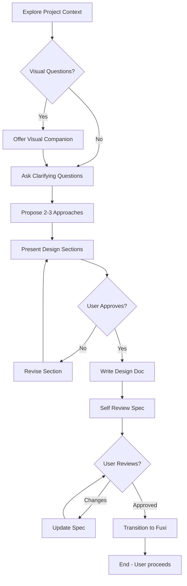

# Brainstorming (头脑风暴) - Design Clarifier

## Mode Indicator

Always show current mode in system prompt:
```
[MODE: brainstorming] (exploring|clarifying|proposing|designing|approved)
```

## When to Use

Use this skill **before** starting any implementation work:
- Creating new features
- Building components
- Adding functionality
- Modifying existing behavior
- Even for "simple" projects

This skill helps explore intent, understand requirements, and propose designs before writing code.

## Command

```
/brainstorm [optional initial request]
```

Examples:
- `/brainstorm` - Start with empty context, ask what user wants to build
- `/brainstorm add login feature` - Start with specific request

## Process Flow



## Hard Gate

<HARD-GATE>
Do NOT invoke any implementation skill, write any code, scaffold any project, or take any implementation action until you have presented a design and the user has approved it.
</HARD-GATE>

Every project goes through this process. "Simple" projects are where unexamined assumptions cause the most wasted work.

## Checklist

Complete these items in order:

1. **Explore project context** — Check files, docs, recent commits
2. **Offer visual companion** — If topic involves visual questions (own message, no other content)
3. **Ask clarifying questions** — One at a time, multiple choice preferred
4. **Propose 2-3 approaches** — With tradeoffs and recommendation
5. **Present design sections** — Get approval after each section
6. **Write design doc** — Save to `.sages/designs/YYYY-MM-DD-<topic>.md`
7. **Spec self-review** — Fix placeholders, contradictions, ambiguity inline
8. **User reviews written spec** — Wait for approval
9. **Transition to implementation** — Can invoke `/fuxi-start` (optional)

## Key Principles

| Principle | Description |
|-----------|-------------|
| One question at a time | Don't overwhelm with multiple questions |
| Multiple choice preferred | Easier to answer than open-ended |
| YAGNI | Remove unnecessary features from all designs |
| Explore alternatives | Always propose 2-3 approaches |
| Incremental validation | Get approval before moving on |
| Be flexible | Go back to clarify when needed |

## Phase Definitions

### 1. Exploring

Understand the current project state:
- Check project structure (files, directories)
- Review recent commits
- Read relevant documentation
- Identify existing patterns

**Output**: `ProjectContext` with structure, patterns, components

### 2. Clarifying

Ask questions to refine the idea:
- One question per message
- Multiple choice when possible
- Focus on: purpose, constraints, success criteria
- Detect if project is too large (needs decomposition)

**Output**: `IntentSpec` with clarified requirements

### 3. Proposing

Generate 2-3 approaches:
- Option A, B, C with tradeoffs
- Lead with recommendation
- Explain reasoning

**Output**: `Approach[]` with recommendation

### 4. Designing

Present design sections:
- Scale to complexity (few sentences to 200-300 words)
- Get approval after each section
- Cover: architecture, components, data flow, error handling

**Output**: `DesignSection[]` all approved

### 5. Approved

All design sections approved:
- Write design document
- Self-review inline
- Ask user to review
- Transition when approved

**Output**: Approved design document, transition decision

## Design Document Template

```markdown
# Design: <Topic>

## Overview
[Brief description of what we're building]

## Context
[Project context from exploration]
[Why this change is needed]

## Requirements
- [Requirement 1]
- [Requirement 2]

## Approach
[Chosen approach with reasoning]

## Alternative Approaches Considered
### Approach A: [Name]
- Pros: ...
- Cons: ...

### Approach B: [Name]
- ...

## Design Details

### Architecture
[How components fit together]

### Components
[Key components and their responsibilities]

### Data Flow
[How data moves through the system]

### Error Handling
[How errors are handled]

### Testing Strategy
[How to test this design]

## Open Questions
- [Question 1]
- [Question 2]

## Acceptance Criteria
- [Criterion 1]
- [Criterion 2]
```

## Integration with Fuxi

After design is approved, user can:
1. **Invoke Fuxi manually**: `/fuxi-start <plan-name>` with design context
2. **Request auto-transition**: Brainstorming can invoke `fuxi-start` with design loaded

The design document becomes input context for the MDD draft.

## Scope Detection

If project is too large, flag immediately:
- Multiple independent subsystems (chat + file storage + billing)
- Help decompose into sub-projects first
- Each sub-project gets own brainstorm → design → implement cycle

## Visual Companion (Optional)

When you anticipate visual questions (mockups, layouts, diagrams):
> "Some of what we're working on might be easier to explain with visuals. I can show mockups, diagrams, or comparisons in a browser. Want to try?"

**This MUST be its own message** - no other content with the offer.

## Anti-Patterns

### "This is too simple"

Every project goes through brainstorming. A todo list, a single-function utility, a config change — all of them.

### Skipping exploration

Always check project context first. Don't assume you know the codebase.

### Too many questions

If you're past 10 questions without moving to proposing, something's wrong. Either:
- User's requirements are unclear (flag this)
- You're asking unnecessary questions (simplify)

## Metrics (for skill improvement)

Track these for analysis:
- Questions asked before proposing
- Approaches proposed
- Approval iterations per section
- Time from start to approved
- Transition rate to Fuxi

## Related Skills

- **Fuxi**: MDD design draft creation (after brainstorming approval)
- **QiaoChui**: Task decomposition (implementation planning)
- **LuBan**: TDD execution (implementation)
- **GaoYao**: Quality audit (review)

## Examples

### Simple Feature Request

```
User: /brainstorm add dark mode
Agent: Exploring project context...
Agent: I see this is a TypeScript web app with React.
       One clarifying question: should dark mode apply to all users or per-user preference?

User: Per-user, stored in preferences
Agent: Proposed approaches:
       A. LocalStorage (simplest, not synced) - RECOMMENDED for MVP
       B. User profile in database (complex, syncs across devices)
       C. URL parameter (shareable, not persistent)

User: A sounds good
Agent: Presenting design section: Storage Layer...

[... continues with design flow ...]
```

### Complex Project

```
User: /brainstorm build a platform with chat, file storage, and billing

Agent: This project has 3 independent subsystems that should be decomposed:
       1. Chat system
       2. File storage
       3. Billing system

       Which should we brainstorm first? Or would you like me to create
       separate brainstorm sessions for each?
```

---

*Brainstorming skill for Four Sages workflow*
*Integrates with Fuxi, QiaoChui, LuBan, GaoYao*
