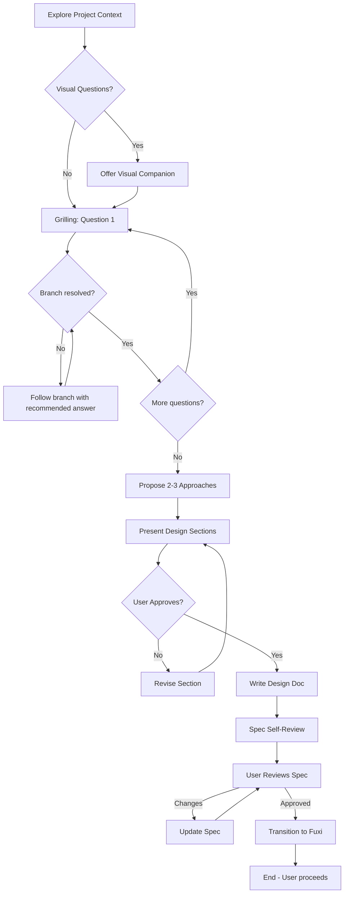

# Brainstorming - Design Clarifier

## Mode Indicator

Always show current mode in system prompt:
```
[MODE: brainstorming] (exploring|grilling|proposing|designing|approved)
```

## When to Use

Use this skill **before** starting any implementation work:
- Creating new features
- Building components
- Adding functionality
- Modifying existing behavior
- Even for "simple" projects

**This is a standalone common action** - it works with or without an active Fuxi workflow.

## Command

```
/brainstorm [optional initial request]
```

Examples:
- `/brainstorm` - Start with empty context, ask what user wants to build
- `/brainstorm add login feature` - Start with specific request

## Process Flow



## Grill-Me Integration

The **Grill-Me** protocol is now embedded in the questioning phase:

### Branch Resolution Protocol

1. **One question at a time** — Don't overwhelm
2. **Provide recommendation** — Lead with suggested answer
3. **Explore codebase first** — If the answer can be found by reading code, do that instead
4. **Resolve each branch** — Don't move on until the decision is locked
5. **Track dependencies** — Some decisions constrain others

### Question Template

```
[Question about specific topic]

Option A: [description] — Recommended
Option B: [description]  
Option C: [description]

Your call — A, B, C, or something different?
```

### Example

```
What should be the scope of dark mode?

A: Global toggle (simplest, applies to all users) — Recommended
B: Per-user preference stored in database (syncs across devices)
C: Per-user preference in LocalStorage (simpler, device-only)

Recommendation: A for MVP because [reasoning]
```

## Hard Gate

<HARD-GATE>
Do NOT invoke any implementation skill, write any code, scaffold any project, or take any implementation action until you have presented a design and the user has approved it. This applies to EVERY project regardless of perceived simplicity. A todo list, a single-function utility, a config change — all of them.
</HARD-GATE>

Every project goes through this process. "Simple" projects are where unexamined assumptions cause the most wasted work.

## Checklist

Complete these items in order:

1. **Explore project context** — Check files, docs, recent commits
2. **Offer visual companion** — If topic involves visual questions (own message, no other content)
3. **Grill: Resolve decision branches** — One question at a time with recommendations
4. **Propose 2-3 approaches** — With tradeoffs and recommendation
5. **Present design sections** — Get approval after each section
6. **Write design doc** — Save to `.sages/designs/YYYY-MM-DD-<topic>.md`
7. **Spec self-review** — 4-step inline check (see below)
8. **User reviews written spec** — Wait for approval
9. **Transition to implementation** — Can invoke `fuxi_design` (optional; auto-inits on first call)

## Key Principles

| Principle | Description |
|-----------|-------------|
| One question at a time | Don't overwhelm with multiple questions |
| Multiple choice preferred | Easier to answer than open-ended |
| Always recommend | For each question, provide suggested answer |
| Explore codebase first | If answer is in the code, read it instead |
| Resolve each branch | Don't move on until decision is locked |
| YAGNI | Remove unnecessary features from all designs |
| Incremental validation | Get approval before moving on |

## Design for Isolation

Break the system into smaller units that each have one clear purpose, communicate through well-defined interfaces, and can be understood and tested independently.

For each unit, you should be able to answer:
- **What does it do?** - Clear single responsibility
- **How do you use it?** - Well-defined interface/API
- **What does it depend on?** - Minimal dependencies

**Isolation checklist:**
- Can someone understand what a unit does without reading its internals?
- Can you change the internals without breaking consumers?
- Can each unit be tested independently?

If any answer is no, the boundaries need work. Smaller, well-bounded units are easier to reason about and modify reliably.

## Working in Existing Codebases

**Before proposing changes:**
- Explore the current structure and follow existing patterns
- Check coding style, naming conventions, and architecture patterns
- Identify files that will be affected by the proposed changes

**When existing code has problems** that affect the work (e.g., a file grown too large, unclear boundaries, tangled responsibilities):
- Include targeted improvements as part of the design
- Fix the problem as part of the feature, not as separate refactoring

**Don't propose unrelated refactoring.** Stay focused on what serves the current goal.

## Phase Definitions

### 1. Exploring

Understand the current project state:
- Check project structure (files, directories)
- Review recent commits
- Read relevant documentation
- Identify existing patterns

**Output**: `ProjectContext` with structure, patterns, components

### 2. Grilling

Resolve each decision branch:
- One question per message
- Provide recommendation + reasoning
- Explore codebase when applicable
- Track dependencies between decisions
- Continue until no unresolved branches

**Output**: `DecisionTree` with all branches resolved

### 3. Proposing

Generate 2-3 approaches:
- Option A, B, C with tradeoffs
- Lead with recommendation
- Explain reasoning

**Output**: `Approach[]` with recommendation

### 4. Designing

Present design sections:
- Scale to complexity (few sentences to 200-300 words)
- Get approval after each section
- Cover: architecture, components, data flow, error handling

**Output**: `DesignSection[]` all approved

### 5. Approved

All design sections approved:
- Write design document
- Spec self-review inline
- Ask user to review
- Transition when approved

**Output**: Approved design document, transition decision

## Design Document Template

```markdown
# Design: <Topic>

## Overview
[Brief description of what we're building]

## Context
[Project context from exploration]
[Why this change is needed]

## Decisions Resolved
[Key decisions made during grilling phase]
- [Decision 1]: [Resolution] — [Rationale]
- [Decision 2]: [Resolution] — [Rationale]

## Requirements
- [Requirement 1]
- [Requirement 2]

## Approach
[Chosen approach with reasoning]

## Alternative Approaches Considered
### Approach A: [Name]
- Pros: ...
- Cons: ...

### Approach B: [Name]
- ...

## Design Details

### Architecture
[How components fit together]

### Components
[Key components and their responsibilities]

### Data Flow
[How data moves through the system]

### Error Handling
[How errors are handled]

### Testing Strategy
[How to test this design]

## Open Questions
- [Question 1]
- [Question 2]

## Acceptance Criteria
- [Criterion 1]
- [Criterion 2]
```

## Spec Self-Review

After writing the spec document, perform this 4-step inline check:

| Step | Check | Action |
|------|-------|--------|
| 1 | **Placeholder scan** | Any "TBD", "TODO", incomplete sections, or vague requirements? Fix them. |
| 2 | **Internal consistency** | Do any sections contradict each other? Does architecture match feature descriptions? Fix. |
| 3 | **Scope check** | Is this focused enough for a single implementation plan, or does it need decomposition? |
| 4 | **Ambiguity check** | Could any requirement be interpreted two different ways? Make it explicit. |

Fix any issues inline. No need to re-review — just fix and move on.

## Trigger Modes

### Mode A: Standalone (No Fuxi Workflow Active)

When **no Fuxi workflow is running**, brainstorming is the **recommended first step**:

```
User: I want to add a login feature
Agent: 💡 Recommend brainstorming first: /brainstorm add login feature
      This helps explore intent and propose the best approach.
```

### Mode B: Auto-Transition (Fuxi Workflow Active)

When **Fuxi workflow is running** and design is approved:

```
✅ Design Approved!

**Request:** {request}
**Approach:** {chosen approach}
**Decisions Resolved:** {summary}
**Design:** .sages/designs/{date}-{topic}.md

→ Starting Fuxi workflow with design context...
```

### Transition Behavior

| Condition | Action |
|----------|--------|
| No Fuxi workflow + design approved | Suggest `/brainstorm` or auto-transition if user consents |
| Fuxi workflow active + design approved | Auto-invoke `fuxi_start` with design context |
| User says "defer"/"save"/"later" | Save to `.sages/designs/`, don't start Fuxi |
| User says "exit"/"cancel" | End without proceeding |

## Fuxi Integration

On auto-transition:
1. System creates Fuxi context from approved design
2. Invokes `fuxi_start` with design context
3. Fuxi creates MDD draft using Seven Planes analysis
4. **User is notified**: "Fuxi workflow started. Use `/fuxi-plan <score>` to proceed after review."

## Scope Detection & Decomposition

### Step 1: Assess Scope

Before asking detailed questions, assess if the project needs decomposition:

**Too large if:**
- Multiple independent subsystems (e.g., "build a platform with chat, file storage, billing")
- Domains differ significantly
- User expects multiple delivery milestones

### Step 2: Decomposition Process

If project is too large, help decompose:

1. **Identify independent pieces** — What are the subsystems?
2. **Map relationships** — How do they depend on each other?
3. **Determine order** — Which should be built first?

### Step 3: Choose First Sub-Project

Help user choose which sub-project to brainstorm first:
- Start with the foundation (what others depend on)
- Or start with the highest value/use
- Each sub-project gets its own: brainstorm → design → implement cycle

## Visual Companion (Optional)

When you anticipate visual questions (mockups, layouts, diagrams):
> "Some of what we're working on might be easier to explain with visuals. I can show mockups, diagrams, or comparisons in a browser. Want to try?"

**This MUST be its own message** - no other content with the offer.

## Anti-Patterns

| ❌ Don't | ✅ Do |
|----------|-------|
| "This is too simple" | Every project goes through brainstorming |
| Skip exploration | Always check project context first |
| Ask multiple questions at once | One question, wait for answer |
| Ask without recommendation | Always lead with suggested answer |
| Accept "whatever" answers | Push for explicit preference |
| Move on without resolution | Stay until branch is resolved |
| Too many questions (>10 before proposing) | Flag unclear requirements or simplify |

## Metrics (for skill improvement)

Track these for analysis:
- Questions asked before proposing
- Approaches proposed
- Approval iterations per section
- Time from start to approved
- Transition rate to Fuxi

## Related Skills

- **Grill-Me**: Standalone decision tree resolver (embedded in brainstorming)
- **Fuxi**: MDD design draft creation (after brainstorming approval)
- **QiaoChui**: Task decomposition (implementation planning)
- **LuBan**: TDD execution (implementation)
- **GaoYao**: Quality audit (review)

## Examples

### Simple Feature Request

```
User: /brainstorm add dark mode
Agent: [MODE: brainstorming] (exploring)
Agent: Exploring project context...
Agent: I see this is a TypeScript web app with React.

Agent: [MODE: brainstorming] (grilling)
Agent: First question: what should be the scope of dark mode?

Option A: Global toggle (simplest, applies to all users) — Recommended
Option B: Per-user preference stored in database (syncs across devices)
Option C: Per-user preference in LocalStorage (device-only)

Recommendation: A for MVP because [reasoning]
User: A sounds good
Agent: Locked: Global toggle. Next question: should it persist across sessions?

[... continues until all branches resolved ...]

Agent: [MODE: brainstorming] (proposing)
Agent: With decisions resolved, here are 3 approaches:

A. CSS custom properties + toggle button — Recommended for React
B. CSS classes + body data attribute
C. Theme provider with context

User: A
Agent: [MODE: brainstorming] (designing)
Agent: Presenting design section: Storage Layer...

[... continues with design flow ...]
```

### Complex Project (Decomposition)

```
User: /brainstorm build a platform with chat, file storage, and billing

Agent: This project has 3 independent subsystems that should be decomposed:
       1. Chat system (foundation - other features may depend on it)
       2. File storage (depends on user auth)
       3. Billing system (depends on user accounts)

       Recommended build order: 1 → 2 → 3
       Which should we brainstorm first? Or create separate sessions for each?
```

### Working in Existing Codebase

```
User: /brainstorm add user notification preferences
Agent: Exploring project context...
Agent: I see the existing notification system in src/notifications/.
       Current: monolithic NotificationService handling email, SMS, push.
       I notice the file is 800+ lines with mixed responsibilities.

       Design will include:
       - Split notification service by channel (email/sms/push)
       - Add UserPreferences model for per-user settings
       - Keep backward compatibility during transition

       First question: should preferences be per-channel or unified?

A: Per-channel (email, SMS, push separate) — Recommended
B: Unified (one toggle per notification type)

Recommendation: A because [isolation principle]
```

---

*Brainstorming skill for Four Sages workflow*
*Integrates Grill-Me protocol for decision tree resolution*
*Integrates with Fuxi, QiaoChui, LuBan, GaoYao*
