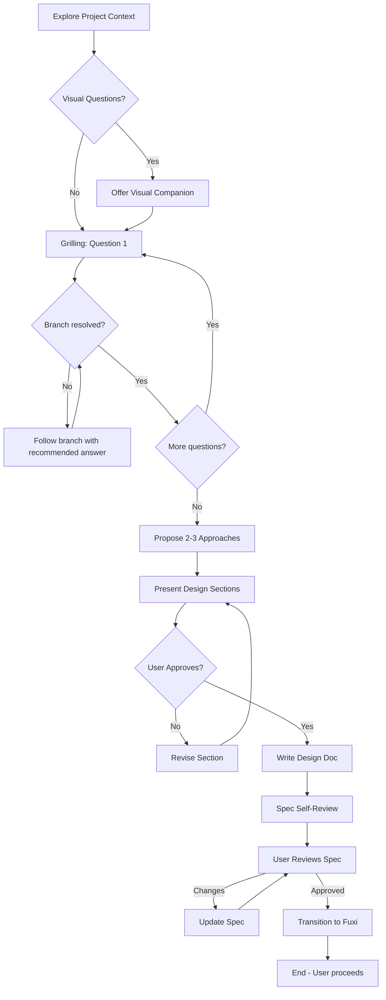

# Brainstorming - Design Clarifier

## Mode Indicator

Always show current mode in system prompt:
```
[MODE: brainstorming] (exploring|grilling|proposing|designing|approved)
```

## When to Use

Use this skill **before** starting any implementation work:
- Creating new features
- Building components
- Adding functionality
- Modifying existing behavior
- Even for "simple" projects

**This is a standalone common action** - it works with or without an active Fuxi workflow.

## Command

```
/brainstorm [optional initial request]
```

Examples:
- `/brainstorm` - Start with empty context, ask what user wants to build
- `/brainstorm add login feature` - Start with specific request

## Process Flow


```mermaid
flowchart TD
    A[Explore Project Context] --> B{Visual Questions?}
    B -->|Yes| C[Offer Visual Companion]
    B -->|No| D[Grilling: Question 1]
    C --> D
    D --> E{Branch resolved?}
    E -->|No| F[Follow branch with recommended answer]
    F --> E
    E -->|Yes| G{More questions?}
    G -->|Yes| D
    G -->|No| H[Propose 2-3 Approaches]
    H --> I[Present Design Sections]
    I --> J{User Approves?}
    J -->|No| K[Revise Section]
    K --> I
    J -->|Yes| L[Write Design Doc]
    L --> M[Spec Self-Review]
    M --> N[User Reviews Spec]
    N -->|Changes| O[Update Spec]
    O --> N
    N -->|Approved| P[Transition to Fuxi]
    P --> Q[End - User proceeds]
```

## Grill-Me Protocol (embedded in grilling phase)

Ask **one question per message** with a **recommendation**. If the answer can be found by reading the code, explore the codebase instead of asking. Track dependencies — some decisions constrain others. Don't move on until the current branch is locked.

Question template:

```
[Question about specific topic]

Option A: [description] — Recommended
Option B: [description]  
Option C: [description]

Your call — A, B, C, or something different?
```

## Hard Gate

<HARD-GATE>
Do NOT invoke any implementation skill, write any code, scaffold any project, or take any implementation action until you have presented a design and the user has approved it. This applies to EVERY project regardless of perceived simplicity. A todo list, a single-function utility, a config change — all of them.
</HARD-GATE>

Every project goes through this process. "Simple" projects are where unexamined assumptions cause the most wasted work.

## Checklist

Complete these items in order:

1. **Explore project context** — Check files, docs, recent commits
2. **Offer visual companion** — If topic involves visual questions (own message, no other content)
3. **Grill: Resolve decision branches** — One question at a time with recommendations
4. **Propose 2-3 approaches** — With tradeoffs and recommendation
5. **Present design sections** — Get approval after each section
6. **Write design doc** — Save to `.pi/orchestrator/designs/YYYY-MM-DD-<topic>.md`
7. **Spec self-review** — 4-step inline check (see below)
8. **User reviews written spec** — Wait for approval
9. **Transition to implementation** — Can invoke `goal_contract_create` to seed the orchestrator workflow (optional; auto-synthesizes a DAG from the design)

## Key Principles

| Principle | Description |
|-----------|-------------|
| One question at a time | Don't overwhelm with multiple questions |
| Multiple choice preferred | Easier to answer than open-ended |
| Always recommend | For each question, provide suggested answer |
| Explore codebase first | If answer is in the code, read it instead |
| Resolve each branch | Don't move on until decision is locked |
| YAGNI | Remove unnecessary features from all designs |
| Incremental validation | Get approval before moving on |

## Design for Isolation

Break the system into smaller units that each have one clear purpose, communicate through well-defined interfaces, and can be understood and tested independently.

For each unit, you should be able to answer:
- **What does it do?** - Clear single responsibility
- **How do you use it?** - Well-defined interface/API
- **What does it depend on?** - Minimal dependencies

**Isolation checklist:**
- Can someone understand what a unit does without reading its internals?
- Can you change the internals without breaking consumers?
- Can each unit be tested independently?

If any answer is no, the boundaries need work. Smaller, well-bounded units are easier to reason about and modify reliably.

## Working in Existing Codebases

**Before proposing changes:**
- Explore the current structure and follow existing patterns
- Check coding style, naming conventions, and architecture patterns
- Identify files that will be affected by the proposed changes

**When existing code has problems** that affect the work (e.g., a file grown too large, unclear boundaries, tangled responsibilities):
- Include targeted improvements as part of the design
- Fix the problem as part of the feature, not as separate refactoring

**Don't propose unrelated refactoring.** Stay focused on what serves the current goal.

## Phase Definitions (output of each)

1. **Exploring** — project state (files, recent commits, patterns). Output: `ProjectContext`.
2. **Grilling** — one question per message, recommend, explore code when possible. Output: `DecisionTree` (all branches resolved).
3. **Proposing** — 2-3 approaches with tradeoffs; lead with recommendation. Output: `Approach[]`.
4. **Designing** — present sections (architecture, components, data flow, error handling); approve each before next. Output: `DesignSection[]` all approved.
5. **Approved** — write design doc, self-review, ask user to review, transition to orchestrator. Output: Approved design doc.

## Design Document Template

Write the design doc to `.pi/orchestrator/designs/YYYY-MM-DD-<topic>.md` (see `pi/src/tools/brainstorming/index.ts:writeDesignDoc`):

```markdown
# Design: <Topic>

## Overview
[Brief description]

## Context
[Project context from exploration + why this change is needed]

## Decisions Resolved
- [Decision 1]: [Resolution] — [Rationale]
- [Decision 2]: [Resolution] — [Rationale]

## Requirements
- [Requirement 1]
- [Requirement 2]

## Approach
[Chosen approach with reasoning]

## Design Details
### Architecture
[How components fit together]
### Components
[Key components + responsibilities]
### Data Flow
[How data moves]
### Error Handling
[How errors are handled]
### Testing Strategy
[How to test]

## Acceptance Criteria
- [Criterion 1]
- [Criterion 2]
```

## Spec Self-Review

Before showing the spec to the user, scan inline for:

1. **Placeholders** — "TBD", "TODO", vague requirements? Fix.
2. **Internal consistency** — sections contradict each other? Architecture matches features? Fix.
3. **Scope** — focused enough for a single implementation plan, or needs decomposition?
4. **Ambiguity** — any requirement that could be interpreted two ways? Make it explicit.

Fix any issues inline. No need to re-review — just fix and move on.

## Trigger Modes

**Mode A — standalone (no orchestrator active)**: brainstorming is the **recommended first step** for any new feature/change. After approval, suggest `/orchestrate` or auto-transition to `goal_contract_create` if user consents.

**Mode B — auto-transition (orchestrator active)**: when design is approved, auto-invoke `goal_contract_create` with the design as rationale. The orchestrator then synthesizes a DAG via `dag_synthesize` for the design's tasks and notifies the user.

If user says "defer"/"save"/"later", save the design to `.pi/orchestrator/designs/` and don't start the orchestrator. "exit"/"cancel" ends without proceeding.

## Scope Detection & Decomposition

Before grilling, assess if the project needs decomposition. **Too large if** it has multiple independent subsystems (e.g., "platform with chat, file storage, billing"), domains differ significantly, or the user expects multiple delivery milestones.

If too large: identify independent pieces, map their dependencies, determine build order (foundation first or highest value first), and ask which sub-project to brainstorm first. Each sub-project gets its own `brainstorm → design → implement` cycle.

## Visual Companion (Optional)

When you anticipate visual questions (mockups, layouts, diagrams):
> "Some of what we're working on might be easier to explain with visuals. I can show mockups, diagrams, or comparisons in a browser. Want to try?"

**This MUST be its own message** - no other content with the offer.

## Anti-Patterns

| ❌ Don't | ✅ Do |
|----------|-------|
| "This is too simple" | Every project goes through brainstorming |
| Skip exploration | Always check project context first |
| Ask multiple questions at once | One question, wait for answer |
| Ask without recommendation | Always lead with suggested answer |
| Accept "whatever" answers | Push for explicit preference |
| Move on without resolution | Stay until branch is resolved |
| Too many questions (>10 before proposing) | Flag unclear requirements or simplify |

## Related Skills

- **Grill-Me**: Standalone decision tree resolver (embedded in brainstorming)
- **Orchestrator**: Goal contract + DAG synthesis + dispatch + audit (after brainstorming approval, auto-invoked via `goal_contract_create`)

## Example: Simple Feature

```
User: /brainstorm add dark mode
Agent: [MODE: brainstorming] (exploring)
Agent: Exploring project context... I see this is a TypeScript web app with React.

Agent: [MODE: brainstorming] (grilling)
Agent: First question: what should be the scope of dark mode?

Option A: Global toggle (simplest, applies to all users) — Recommended
Option B: Per-user preference stored in database (syncs across devices)
Option C: Per-user preference in LocalStorage (device-only)

Recommendation: A for MVP because [reasoning]
User: A sounds good
Agent: Locked: Global toggle. Next question: should it persist across sessions?

[... continues until all branches resolved ...]

Agent: [MODE: brainstorming] (proposing)
Agent: With decisions resolved, here are 3 approaches:

A. CSS custom properties + toggle button — Recommended for React
B. CSS classes + body data attribute
C. Theme provider with context

User: A
Agent: [MODE: brainstorming] (designing)
Agent: Presenting design section: Storage Layer...

[... continues with design flow ...]
```

### Complex Project (Decomposition)

```

For complex multi-subsystem projects, decompose first (see Scope Detection above) and brainstorm each sub-project in its own session.

---

*Brainstorming skill for the orchestrator workflow*
*Integrates Grill-Me protocol for decision tree resolution*
*Hands off approved designs to `goal_contract_create` to seed the orchestrator*
